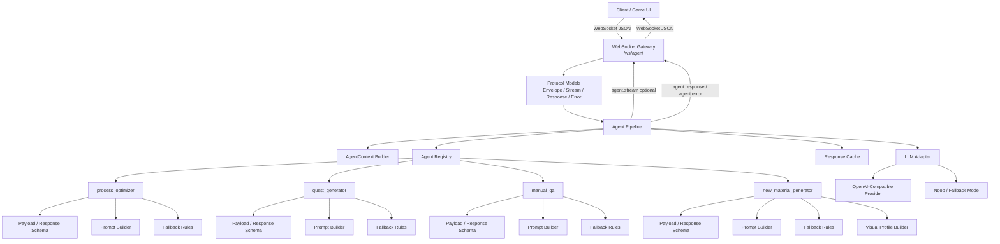
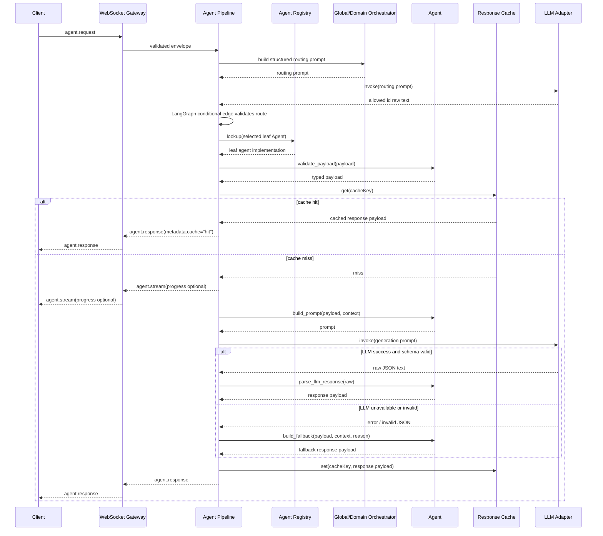
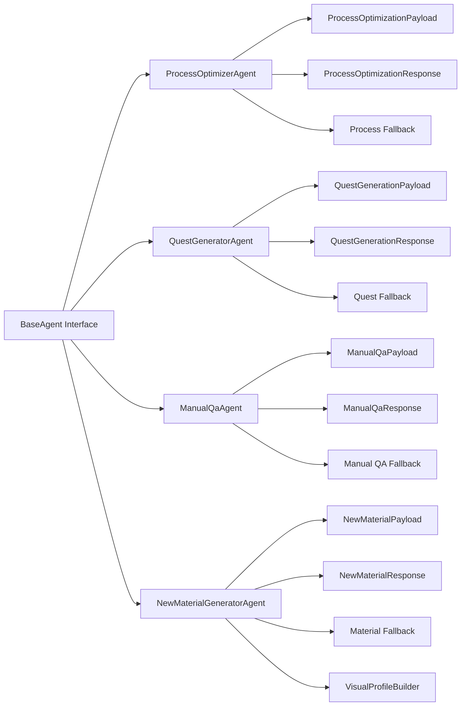

# AI Agent 파이프라인 구현 계획

## 1. 목적

이 문서는 `protocol_plans.md`와 `backend/docs/plans/server_implementation_plan.md`를 기반으로 서버 내부 AI Agent 실행 파이프라인을 구현하기 위한 계획이다.

서버는 클라이언트가 보낸 Agent별 요약 스냅샷을 받아 Agent를 실행하고, LLM 결과 또는 deterministic fallback 결과를 WebSocket 응답으로 반환한다. 기존 backend 구현과의 하위 호환은 고려하지 않는다.

## 2. 파이프라인 목표

AI Agent 파이프라인은 모든 Agent 요청이 동일한 처리 흐름을 타도록 만든다.

핵심 목표:

- Agent별 구현 차이를 공통 pipeline 뒤에 숨긴다.
- WebSocket gateway는 transport 처리만 담당한다.
- Agent는 payload 검증, prompt 구성, fallback 생성만 담당한다.
- Agent 실행 단계의 LLM 실패는 사용자 기능 실패로 노출하지 않고 fallback 응답으로 복구한다.
- routing 단계의 LLM decision 실패는 임의 fallback Agent를 고르지 않고 `ROUTING_UNAVAILABLE`로 종료한다.
- 모든 최종 응답은 schema 검증을 통과한 JSON만 클라이언트에 보낸다.

## 3. 책임 분리

```txt
WebSocket Gateway
 └─ raw message 수신 / JSON parse / send_json

Protocol Models
 └─ envelope / response / stream / error schema

Agent Pipeline
 └─ context 생성 / validation / cache / LLM / fallback / error mapping

Agent Registry
 └─ agent id -> agent implementation lookup

Agent Implementation
 └─ payload schema / prompt builder / response schema / fallback

LLM Adapter
 └─ provider 호출 / timeout / raw response 반환

Response Cache
 └─ agent request 결과 in-memory cache
```

## 4. 전체 Agent 구성도



## 5. Agent 요청 처리 흐름도



## 6. Agent 모듈 구성도



## 7. Public Message Flow

### 성공 흐름

```txt
client
 -> agent.request
 -> websocket gateway
 -> agent pipeline
 -> optional agent.stream
 -> agent.response
 -> client
```

### 오류 흐름

```txt
client
 -> invalid JSON / invalid envelope / unknown agent / invalid payload
 -> agent.error
 -> client
```

### LLM 실패 복구 흐름

```txt
client
 -> agent.request
 -> generation LLM timeout / provider error / invalid JSON / invalid schema
 -> deterministic fallback
 -> agent.response
 -> client
```

Agent 실행 단계의 LLM 실패는 `agent.error`가 아니라 정상 `agent.response`로 복구한다. 단, fallback 생성 결과까지 schema 검증에 실패하면 `agent.error`를 반환한다.

routing 단계는 예외다. top-level/domain leaf routing prompt는 허용 id 문자열 하나를 반환해야 하며, routing model이 응답하지 않거나 허용 id가 아니면 deterministic fallback agent를 임의로 고르지 않고 `agent.error` / `ROUTING_UNAVAILABLE`로 종료한다.

## 8. Pipeline 단계

```txt
1. AgentRequestEnvelope 수신
2. AgentContext 생성
3. top-level routing prompt 호출과 `selectedAgent` state 기록
4. LangGraph conditional edge로 top-level route 검증
5. 필요 시 domain leaf routing prompt 호출과 `selectedLeafAgent` state 기록
6. LangGraph conditional edge로 selected leaf Agent 검증
7. `selectedLeafAgent` id로 AgentRegistry lookup
8. agent별 payload schema 검증
9. cache key 생성
10. cache lookup
11. cache hit이면 cached response 반환
12. 필요 시 agent.stream(progress) 전송
13. generation prompt/context 생성
14. LLM adapter 호출
15. generation LLM raw output JSON parse
16. agent별 response schema 검증
17. cache write
18. agent.response 반환
19. 실패 시 fallback 또는 agent.error 반환
```

## 9. 핵심 타입

### AgentContext

```python
class AgentContext(BaseModel):
    request_id: str
    agent: str
    snapshot_type: str | None = None
    snapshot_hash: str | None = None
    cache_key: str | None = None
```

### Agent Interface

```python
class Agent(Protocol):
    agent_id: str

    def build_prompt(
        self,
        payload: dict[str, Any],
        context: AgentContext,
    ) -> str:
        ...

    def fallback(
        self,
        payload: dict[str, Any],
        context: AgentContext,
    ) -> AgentRunResult:
        ...
```

### Pipeline Result

```python
class AgentPipelineResult(BaseModel):
    response: AgentResponseEnvelope | AgentErrorEnvelope
    streams: list[AgentStreamEnvelope] = Field(default_factory=list)
```

WebSocket gateway는 `streams`를 먼저 전송하고, 마지막에 `response`를 전송한다.

## 10. LLM Adapter

### Interface

```python
class LLMAdapter(Protocol):
    def invoke(self, prompt: str) -> str | None:
        ...
```

### Environment Variables

```txt
OPENAI_API_KEY
OPENAI_MODEL
OPENAI_BASE_URL
LLM_TIMEOUT_SECONDS
```

기본값:

```txt
OPENAI_MODEL=gpt-4o-mini
LLM_TIMEOUT_SECONDS=20
```

generation 호출에서 `OPENAI_API_KEY`가 없으면 fallback을 사용한다. routing 호출에서 model decision이 없으면 임의 fallback Agent를 고르지 않고 `ROUTING_UNAVAILABLE`로 종료한다.

### Adapter 구현

- `OpenAICompatibleLLMAdapter`
  - OpenAI-compatible chat completions 또는 responses endpoint를 호출한다.
  - raw text를 반환한다. routing id 검증과 generation JSON 검증은 pipeline이 담당한다.
- `NoopLLMAdapter`
  - generation 테스트와 API key 없는 로컬 실행에서 fallback 경로를 강제한다.
- `FakeLLMAdapter`
  - unit test에서 routing id, generation success, timeout, invalid JSON을 재현한다.

## 11. Cache 정책

MVP cache는 in-memory로 구현한다.

Cache key:

```txt
agent + leaf_agent + payload + session_id + client_id + context.metadata
```

규칙:

- `agent`는 선택된 top-level Agent id다.
- `leaf_agent`는 실제 실행할 leaf Agent id다.
- payload와 context metadata는 JSON key를 정렬해 안정적으로 hash한다.
- `request_id`는 cache key에 포함하지 않는다.
- cache hit이면 LLM adapter와 fallback을 호출하지 않는다.
- cache hit 응답에는 `metadata.cache = "hit"`을 추가한다.
- cache miss 응답에는 별도 cache metadata를 추가하지 않는다.
- 프로세스 재시작 시 cache는 사라진다.

## 12. Streaming 정책

MVP에서 streaming은 선택 기능이다.

stream을 보내는 경우:

- LLM 호출을 시작하기 직전
- LLM 호출이 길어질 수 있는 Agent 요청

stream을 보내지 않는 경우:

- cache hit
- payload validation 실패
- unknown agent
- API key가 없어 fallback으로 바로 전환하는 경우

예시:

```json
{
  "type": "agent.stream",
  "requestId": "req_process_001",
  "agent": "process_optimizer",
  "event": "progress",
  "payload": {
    "message": "생산 요약을 분석 중입니다."
  }
}
```

최종 메시지는 항상 `agent.response` 또는 `agent.error` 하나다.

## 13. Error Mapping

| 상황 | 응답 |
|---|---|
| JSON parse 실패 | `agent.error` / `INVALID_JSON` |
| message가 object가 아님 | `agent.error` / `INVALID_MESSAGE` |
| envelope schema 실패 | `agent.error` / `VALIDATION_ERROR` |
| agent 누락 | `agent.error` / `VALIDATION_ERROR` |
| 미등록 agent | `agent.error` / `UNKNOWN_AGENT` |
| agent payload schema 실패 | `agent.error` / `VALIDATION_ERROR` |
| routing LLM decision 없음/허용 id 아님 | `agent.error` / `ROUTING_UNAVAILABLE` |
| generation LLM API key 없음 | fallback `agent.response` |
| generation LLM timeout | fallback `agent.response` |
| generation LLM provider error | fallback `agent.response` |
| generation LLM invalid JSON | fallback `agent.response` |
| generation LLM response schema 실패 | fallback `agent.response` |
| fallback response schema 실패 | `agent.error` / `INTERNAL_ERROR` |

## 14. Agent별 구현

### 14.1 `process_optimizer`

입력:

- `factorySummary.powerStatus`
- `factorySummary.bottleneckCandidates`
- `factorySummary.machineGroups`
- `factorySummary.itemFlows`
- `factorySummary.warnings`

LLM prompt 목표:

- 공정 병목을 한국어로 요약한다.
- 병목 목록을 구조화한다.
- 클라이언트가 UI에 표시할 수 있는 suggestion 목록을 만든다.

fallback:

- `bottleneckCandidates` 첫 항목을 기본 병목으로 사용한다.
- `itemFlows`에서 `consumedPerMinute > producedPerMinute`인 항목을 병목으로 추가한다.
- `powerStatus == "near_limit"`이면 전력 관련 suggestion을 추가한다.

### 14.2 `quest_generator`

입력:

- `progress.stage`
- `progress.unlockedMachines`
- `progress.unlockedRecipes`
- `progress.recentlyProducedItems`
- `progress.unusedSystems`
- `progress.currency`
- `progress.completedQuestIds`

LLM prompt 목표:

- 현재 진행도에 맞는 다음 퀘스트를 하나 생성한다.
- 퀘스트 objective와 reward를 구조화한다.
- 왜 이 퀘스트가 적절한지 reason을 포함한다.

fallback:

- `unusedSystems`가 있으면 해당 시스템을 사용하게 하는 퀘스트를 만든다.
- 최근 생산품이 있으면 다음 가공 단계 퀘스트를 만든다.
- 정보가 부족하면 stage 기반 탐색 퀘스트를 만든다.

### 14.3 `manual_qa`

입력:

- `question`
- `context.currentScreen`
- `context.selectedMachineId`
- `context.unlockedRecipes`
- `context.unlockedMachines`
- `context.playerStage`

LLM prompt 목표:

- 질문에 짧고 직접적인 답변을 만든다.
- 관련 item/machine id를 반환한다.
- 클라이언트가 실행할 수 있는 suggestedAction을 반환한다.

fallback:

- 질문에서 known item/machine 키워드를 찾는다.
- 해금 목록에 있으면 사용법을 안내한다.
- 해금 목록에 없으면 아직 해금되지 않았을 수 있다고 답한다.
- 키워드가 없으면 현재 화면 기준 일반 안내를 반환한다.

### 14.4 `new_material_generator`

입력:

- `machineType`
- `ruleVersion`
- `playerStage`
- `knownRecipeExists`
- `inputs[].itemId`
- `inputs[].amount`
- `inputs[].properties`

LLM prompt 목표:

- 새로운 material id, name, type, rarity, properties, description을 생성한다.
- recipe를 생성한다.
- `visualProfile`을 생성한다.

fallback:

- `knownRecipeExists == true`이면 `created = false`를 반환한다.
- 입력 재료 properties를 합쳐 material properties를 만든다.
- `gas`, `liquid`, `powder`, `metal`, `crystal` properties를 기준으로 type과 visual surface를 정한다.
- `playerStage`가 높을수록 rarity 후보를 올린다.
- `visual.status = "pending"`과 placeholder icon을 항상 포함한다.

## 15. 구현 순서

1. `protocol` 모델을 먼저 구현한다.
2. `AgentContext`, `BaseAgent`, `AgentPipelineResult`를 정의한다.
3. `AgentRegistry`를 만들고 네 agent id를 등록한다.
4. `ResponseCache`를 구현한다.
5. `LLMAdapter` interface와 `NoopLLMAdapter`, `FakeLLMAdapter`를 구현한다.
6. `AgentPipeline`을 구현한다.
7. `process_optimizer` agent를 구현한다.
8. `quest_generator` agent를 구현한다.
9. `manual_qa` agent를 구현한다.
10. `new_material_generator` agent와 `visualProfile` builder를 구현한다.
11. WebSocket gateway에서 pipeline을 호출하도록 연결한다.
12. unit test를 작성한다.
13. WebSocket integration test를 작성한다.

## 16. 테스트 계획

### Unit Tests

- registry가 네 agent id를 모두 찾는다.
- unknown agent는 `UNKNOWN_AGENT` error가 된다.
- invalid payload는 `VALIDATION_ERROR` error가 된다.
- generation LLM 성공 결과는 response schema 검증 후 반환된다.
- generation LLM timeout은 fallback response로 복구된다.
- generation LLM invalid JSON은 fallback response로 복구된다.
- routing LLM invalid decision은 `ROUTING_UNAVAILABLE`로 종료된다.
- fallback response도 schema 검증을 통과해야 한다.
- cache hit이면 LLM adapter가 호출되지 않는다.
- cache hit 응답에는 `metadata.cache = "hit"`이 들어간다.
- generation LLM API key가 없으면 fallback response가 반환된다.

### Agent Tests

- `process_optimizer`는 소비량이 생산량보다 큰 item을 병목으로 잡는다.
- `quest_generator`는 `unusedSystems` 기반 퀘스트를 우선 생성한다.
- `manual_qa`는 질문과 context 기반 답변을 생성한다.
- `new_material_generator`는 material, recipe, visualProfile을 항상 반환한다.

### WebSocket Tests

- `ping` -> `pong`
- `agent.request` -> `agent.response`
- LLM 경로 요청 -> optional `agent.stream` 후 `agent.response`
- invalid JSON -> `agent.error`
- unknown agent -> `agent.error`
- routing decision을 받을 수 있는 API key 없는 환경에서도 네 agent가 generation fallback으로 정상 응답한다.
- routing decision을 받을 수 없으면 `ROUTING_UNAVAILABLE`을 반환한다.

## 17. 완료 기준

- `ws://127.0.0.1:8000/ws/agent`에서 네 agent 요청이 모두 처리된다.
- routing decision을 받을 수 있으면 LLM API key가 없어도 generation fallback으로 정상 응답한다.
- routing decision을 받을 수 없으면 `ROUTING_UNAVAILABLE`을 반환한다.
- LLM API key가 있으면 LLM 응답을 사용하되 schema 검증을 통과한 결과만 반환한다.
- 서버는 LLM raw text를 클라이언트에 직접 보내지 않는다.
- cache hit이 LLM 호출을 건너뛰는 것이 테스트로 증명된다.
- 장비 설치, 배치 검증, tick 시뮬레이션은 서버에 구현되지 않는다.

## 18. 후속 확장

- RAG retriever 연결
- static game content DB 연결
- persistent cache
- request rate limit
- auth/session context
- 실제 image generation provider
- texture/icon storage
- `agent.stream` 기반 `visual.ready` 이벤트
- tracing과 structured logging
