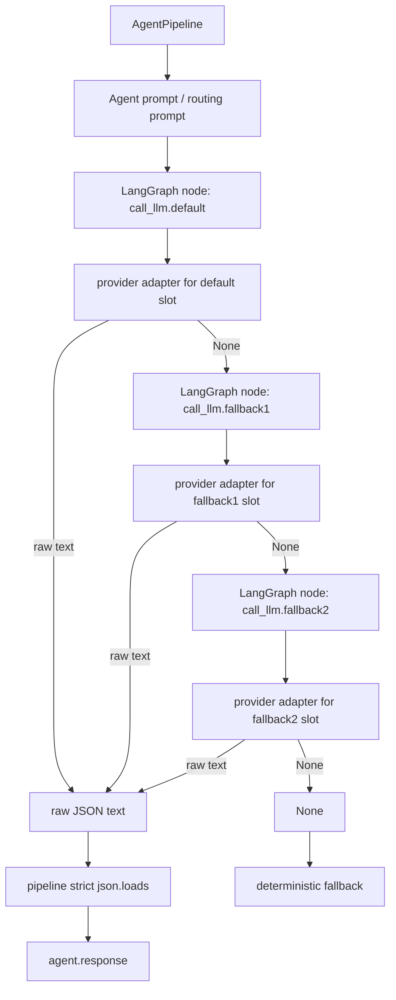

# LLM 구현 계획

## 1. 목적

현재 `backend/src/llm/adapter.py`는 fallback을 강제하는 placeholder다. 이 계획은 실제 LLM provider를 agent pipeline에 연결하되, provider 장애나 API key 부재가 게임 기능 실패로 번지지 않게 만드는 방향을 정의한다.

상세 sprint 실행 체크리스트는 별도 파일인 `backend/docs/plans/llm_implementation_sprint.md`에 둔다.

## 2. 핵심 결정

- LLM adapter 계약은 `invoke(prompt: str) -> str | None`으로 유지한다.
- env 미설정과 CI 기본 provider는 `none`이며, dev 모드에서는 기본 provider를 `local`로 둔다.
- `llm` 패키지는 LLM slot 설정과 provider별 1회 호출 adapter만 담당한다.
- `default -> fallback1 -> fallback2` 실행 순서는 LangGraph pipeline에서 제어한다.
- LLM slot이 모두 실패하면 LangGraph pipeline이 기존 deterministic fallback 응답으로 복구한다.
- provider error, timeout, API key 부재, 빈 응답은 LangGraph에서 다음 LLM fallback slot으로 넘긴다.
- LLM slot은 `none`, `google`, `openai`, `local` provider를 지원할 수 있는 구조로 둔다.
- Agent routing과 sub-agent routing은 계속 prompt 기반 LLM 결정으로 처리한다.
- keyword, if/else, score table 기반 agent 추론은 넣지 않는다.

질문 반영:

- LLM provider fallback 제어를 `llm` adapter 안에 넣지 않는다.
- `llm`은 설정 해석과 provider 호출만 한다.
- fallback 순서, attempt metadata, deterministic fallback 전환은 LangGraph graph node/edge가 담당한다.

## 3. Provider 범위 현황

목표 provider:

- `none`: 외부 API를 호출하지 않는 disabled slot이다.
- `google`: Gemini API용 provider. `google-genai` SDK를 사용한다.
- `openai`: GPT API용 provider. OpenAI-compatible adapter로 분리한다.
- `local`: 로컬 LLM provider. Ollama 또는 OpenAI-compatible local endpoint를 우선 대상으로 둔다.

초기 구현 순서:

1. slot 설정과 noop behavior
2. `google` slot
3. `openai` slot
4. `local` slot

각 provider는 같은 slot schema를 사용한다. 따라서 운영자는 기본 모델, fallback1, fallback2를 서로 다른 provider 또는 같은 provider의 다른 model로 구성할 수 있다.

예시:

```txt
default:  google / gemini-2.5-flash
fallback1: openai / <gpt-model>
fallback2: local / llama3.1:8b
```

dev 모드 예시:

```txt
default:  local / <local-model>
fallback1: none
fallback2: none
```

## 4. 목표 구조

```txt
backend/src/llm/
 ├─ adapter.py
 │   ├─ LlmAdapter protocol
 │   ├─ NoopLlmAdapter
 │   ├─ GoogleGenAiLlmAdapter
 │   ├─ OpenAiLlmAdapter
 │   ├─ LocalLlmAdapter
 │   └─ create_llm_adapter(slot)
 └─ settings.py
     ├─ LlmSettings
     └─ LlmModelSlot
```

Pipeline 연결:



## 5. 설정

환경변수:

```txt
FACTORY_LLM_DEFAULT_PROVIDER=none | google | openai | local
FACTORY_LLM_DEFAULT_MODEL=
FACTORY_LLM_DEFAULT_BASE_URL=
FACTORY_LLM_DEFAULT_API_KEY=

FACTORY_LLM_FALLBACK1_PROVIDER=none | google | openai | local
FACTORY_LLM_FALLBACK1_MODEL=
FACTORY_LLM_FALLBACK1_BASE_URL=
FACTORY_LLM_FALLBACK1_API_KEY=

FACTORY_LLM_FALLBACK2_PROVIDER=none | google | openai | local
FACTORY_LLM_FALLBACK2_MODEL=
FACTORY_LLM_FALLBACK2_BASE_URL=
FACTORY_LLM_FALLBACK2_API_KEY=

FACTORY_LLM_TIMEOUT_MS=20000
FACTORY_LLM_MAX_OUTPUT_TOKENS=2048
FACTORY_LLM_TEMPERATURE=0.2

OPENAI_API_KEY=
GEMINI_API_KEY=
GOOGLE_API_KEY=
```

기본값:

```txt
FACTORY_LLM_DEFAULT_PROVIDER=none
FACTORY_LLM_FALLBACK1_PROVIDER=none
FACTORY_LLM_FALLBACK2_PROVIDER=none
```

dev 모드 기본 설정:

```txt
ENVIRONMENT=development
FACTORY_LLM_DEFAULT_PROVIDER=local
FACTORY_LLM_DEFAULT_MODEL=<local-model>
FACTORY_LLM_DEFAULT_BASE_URL=http://localhost:11434/v1
FACTORY_LLM_FALLBACK1_PROVIDER=none
FACTORY_LLM_FALLBACK2_PROVIDER=none
```

dev 모드에서는 원격 API key 없이 로컬 LLM을 먼저 사용한다. 로컬 LLM이 꺼져 있거나 응답하지 않으면 LangGraph fallback 정책에 따라 `fallback1`, `fallback2`, deterministic fallback 순서로 복구한다.

slot별 API key lookup 순서:

- `google`: slot 전용 key, `GEMINI_API_KEY`, `GOOGLE_API_KEY`
- `openai`: slot 전용 key, `OPENAI_API_KEY`
- `local`: slot 전용 key가 있으면 사용하고, 없으면 key 없이 호출한다.

slot별 기본 model:

- `google`: `gemini-2.5-flash`
- `openai`: 코드에 특정 GPT 모델을 고정하지 않는다. `FACTORY_LLM_*_MODEL`을 요구한다.
- `local`: 코드에 특정 local 모델을 고정하지 않는다. `FACTORY_LLM_*_MODEL`과 `FACTORY_LLM_*_BASE_URL`을 요구한다.

## 6. LangGraph LLM fallback 정책

LangGraph pipeline은 LLM slot을 다음 순서로 실행한다.

1. `default`
2. `fallback1`
3. `fallback2`
4. deterministic fallback

다음 상태는 다음 LLM slot으로 넘어간다.

- provider disabled (`none`)
- API key 없음
- endpoint/base URL 없음
- timeout
- provider exception
- 빈 응답

다음 상태는 현재 sprint에서는 다음 LLM slot으로 넘기지 않고 pipeline schema error로 둔다.

- JSON이 아닌 응답
- JSON object가 아닌 응답

이유:

- model output 형식 오류를 조용히 숨기면 prompt/eval 문제가 발견되지 않는다.
- provider 장애 fallback과 prompt 품질 실패는 다르게 추적해야 한다.

Graph state에는 다음 정보를 남긴다.

- `llmSlot`: 성공한 slot 이름
- `llmProvider`: 성공한 provider 이름
- `llmModel`: 성공한 model 이름
- `llmAttempts`: slot별 호출 결과 목록

응답 metadata에는 최소한 다음 값을 포함한다.

- `llm: used`
- `llmSlot`
- `llmProvider`
- `llmModel`

## 7. Provider별 호출 정책

### 7.1 Google Gen AI

계획상 provider 호출 형태:

```python
from google import genai
from google.genai import types

client = genai.Client(api_key=settings.api_key)
response = client.models.generate_content(
    model=settings.model,
    contents=prompt,
    config=types.GenerateContentConfig(
        response_mime_type="application/json",
        max_output_tokens=settings.max_output_tokens,
        temperature=settings.temperature,
        http_options=types.HttpOptions(timeout=settings.timeout_ms),
    ),
)
raw_text = response.text
```

정책:

- provider에는 JSON 응답을 요청한다.
- adapter는 markdown code fence나 설명 문장을 보정하지 않는다.
- pipeline은 raw text를 strict JSON object로 검증한다.
- JSON 형식 오류는 prompt/eval 품질 문제로 드러나게 둔다.

### 7.2 OpenAI / GPT API

OpenAI provider는 별도 `OpenAiLlmAdapter`로 둔다.

정책:

- model 이름은 설정으로만 받는다.
- API key는 slot 전용 key 또는 `OPENAI_API_KEY`에서 읽는다.
- endpoint override가 필요하면 slot별 `BASE_URL`을 사용한다.
- response format은 JSON object만 반환하도록 provider config와 prompt 양쪽에서 요구한다.

### 7.3 Local LLM

Local provider는 OpenAI-compatible local endpoint를 1차 대상으로 둔다.

정책:

- `BASE_URL`은 필수다.
- API key는 선택이다.
- Ollama, llama.cpp server, vLLM처럼 OpenAI-compatible chat/completions 또는 responses 형태를 제공하는 로컬 서버를 우선 지원한다.
- 로컬 서버가 JSON mode를 지원하지 않으면 prompt로 JSON object 출력을 강제하고 pipeline strict parser로 검증한다.

## 8. 선행 수정

LLM wiring 전에 기존 review 이슈를 먼저 고정한다.

- malformed envelope error에서 `request_id`, `session_id`, `client_id`, `agent` correlation을 보존한다.
- cache hit 응답에서 원래 `llm: used` 또는 `fallback: true` metadata를 보존하고 `cache: hit`만 추가한다.

이유:

- LLM adapter를 붙이면 error/caching 경로가 더 자주 쓰인다.
- correlation과 metadata가 흔들리면 LLM 문제인지 pipeline 문제인지 구분하기 어려워진다.

## 9. 구현 단계

자세한 sprint 단위 작업은 `backend/docs/plans/llm_implementation_sprint.md`를 따른다.

요약:

1. Pipeline edge 이슈 테스트 고정 및 수정
2. LLM slot settings 추가
3. provider별 1회 호출 adapter 추가
4. `google-genai` 의존성 정리와 Google adapter 추가
5. OpenAI-compatible adapter 추가
6. Local OpenAI-compatible adapter 추가
7. LangGraph LLM fallback node/edge wiring
8. Prompt 기반 routing 테스트 보강
9. 문서와 결정 로그 갱신
10. 전체 테스트와 Ruff 검증

## 10. 검증 기준

필수 명령:

```bash
uv run --extra dev pytest
uv run --extra dev ruff check .
```

추가 확인:

```bash
FACTORY_LLM_DEFAULT_PROVIDER=none FACTORY_LLM_FALLBACK1_PROVIDER=none FACTORY_LLM_FALLBACK2_PROVIDER=none uv run --extra dev pytest tests/test_pipeline_edges.py -q
```

성공 기준:

- 외부 API key 없이 전체 테스트가 통과한다.
- fake client만으로 Google/OpenAI/local adapter 성공/실패 경로가 검증된다.
- LangGraph에서 default/fallback1/fallback2 순서가 테스트로 고정된다.
- LLM provider 장애는 `agent.error`가 아니라 fallback `agent.response`로 복구된다.
- 잘못된 explicit `agent`/`sub_agent`는 LLM으로 우회하지 않는다.
