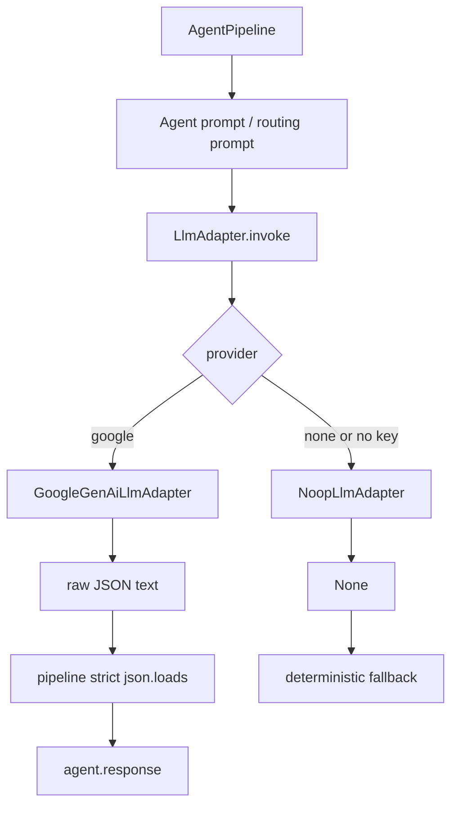

# LLM 구현 계획

## 1. 목적

현재 `backend/src/llm/adapter.py`는 fallback을 강제하는 placeholder다. 이 계획은 실제 LLM provider를 agent pipeline에 연결하되, provider 장애나 API key 부재가 게임 기능 실패로 번지지 않게 만드는 방향을 정의한다.

상세 sprint 실행 체크리스트는 별도 파일인 `backend/docs/plans/llm_implementation_sprint.md`에 둔다.

## 2. 핵심 결정

- LLM adapter 계약은 `invoke(prompt: str) -> str | None`으로 유지한다.
- 기본 provider는 `none`이며, 로컬/CI에서는 외부 API를 호출하지 않는다.
- 1차 실제 provider는 Google Gen AI Python SDK인 `google-genai`로 구현한다.
- 기존 `google-generativeai`, `langchain-google-genai`, `langchain`은 현재 코드에서 직접 사용하지 않으므로 LLM 구현 시 의존성을 정리한다.
- provider error, timeout, API key 부재, 빈 응답은 `None`으로 변환한다.
- pipeline은 `None`을 받으면 기존 deterministic fallback 응답으로 복구한다.
- Agent routing과 sub-agent routing은 계속 prompt 기반 LLM 결정으로 처리한다.
- keyword, if/else, score table 기반 agent 추론은 넣지 않는다.

## 3. 목표 구조

```txt
backend/src/llm/
 ├─ adapter.py
 │   ├─ LlmAdapter protocol
 │   ├─ NoopLlmAdapter
 │   ├─ GoogleGenAiLlmAdapter
 │   └─ create_llm_adapter(settings)
 └─ settings.py
     └─ LlmSettings
```

Pipeline 연결:



## 4. 설정

환경변수:

```txt
FACTORY_LLM_PROVIDER=none | google
FACTORY_LLM_MODEL=gemini-2.5-flash
FACTORY_LLM_TIMEOUT_MS=20000
FACTORY_LLM_MAX_OUTPUT_TOKENS=2048
FACTORY_LLM_TEMPERATURE=0.2
FACTORY_LLM_API_KEY=
GEMINI_API_KEY=
GOOGLE_API_KEY=
```

API key lookup 순서:

1. `FACTORY_LLM_API_KEY`
2. `GEMINI_API_KEY`
3. `GOOGLE_API_KEY`

## 5. Google Gen AI 호출 정책

계획상 provider 호출 형태:

```python
from google import genai
from google.genai import types

client = genai.Client(api_key=settings.api_key)
response = client.models.generate_content(
    model=settings.model,
    contents=prompt,
    config=types.GenerateContentConfig(
        response_mime_type="application/json",
        max_output_tokens=settings.max_output_tokens,
        temperature=settings.temperature,
        http_options=types.HttpOptions(timeout=settings.timeout_ms),
    ),
)
raw_text = response.text
```

정책:

- provider에는 JSON 응답을 요청한다.
- adapter는 markdown code fence나 설명 문장을 보정하지 않는다.
- pipeline은 raw text를 strict JSON object로 검증한다.
- JSON 형식 오류는 prompt/eval 품질 문제로 드러나게 둔다.

## 6. 선행 수정

LLM wiring 전에 기존 review 이슈를 먼저 고정한다.

- malformed envelope error에서 `request_id`, `session_id`, `client_id`, `agent` correlation을 보존한다.
- cache hit 응답에서 원래 `llm: used` 또는 `fallback: true` metadata를 보존하고 `cache: hit`만 추가한다.

이유:

- LLM adapter를 붙이면 error/caching 경로가 더 자주 쓰인다.
- correlation과 metadata가 흔들리면 LLM 문제인지 pipeline 문제인지 구분하기 어려워진다.

## 7. 구현 단계

자세한 sprint 단위 작업은 `backend/docs/plans/llm_implementation_sprint.md`를 따른다.

요약:

1. Pipeline edge 이슈 테스트 고정 및 수정
2. LLM settings 추가
3. `google-genai` 의존성 정리
4. Noop adapter와 factory 추가
5. Google Gen AI adapter 추가
6. Pipeline 기본 adapter wiring
7. Prompt 기반 routing 테스트 보강
8. 문서와 결정 로그 갱신
9. 전체 테스트와 Ruff 검증

## 8. 검증 기준

필수 명령:

```bash
uv run --extra dev pytest
uv run --extra dev ruff check .
```

추가 확인:

```bash
FACTORY_LLM_PROVIDER=none uv run --extra dev pytest tests/test_pipeline_edges.py -q
```

성공 기준:

- 외부 API key 없이 전체 테스트가 통과한다.
- fake client만으로 Google adapter 성공/실패 경로가 검증된다.
- LLM provider 장애는 `agent.error`가 아니라 fallback `agent.response`로 복구된다.
- 잘못된 explicit `agent`/`sub_agent`는 LLM으로 우회하지 않는다.
