# operator_guide RAG 아키텍처 요약

## 한 줄 요약

플레이어 질문이 들어오면 Orchestrator가 `operator_guide`를 선택하고, operator_guide 내부에서 질문 유형과 현재 상태 필요 여부를 판단한 뒤 PostgreSQL/pgvector RAG 검색 근거와 필요한 게임 상태만 사용해 LLM이 최종 답변을 생성한다.

## 전체 구조

```mermaid
flowchart TB
    subgraph routing["Routing / Agent Selection"]
        user["User Question<br/>- 질문 내용<br/>- 선택 컨텍스트<br/>- 현재 화면/객체"]
        qguide["Question Guide Policy<br/>- 지원 범위 확인<br/>- 좋은 질문 예시<br/>- 범위 밖 질문 안내"]
        orchestrator["LangGraph Orchestrator Router<br/>- process_optimizer<br/>- operator_guide<br/>- quest_agent<br/>- new_material_agent"]
        selected["operator_guide<br/>Selected Agent"]
        service["OperatorGuide Service 호출"]

        user --> qguide --> orchestrator --> selected --> service
    end

    subgraph runtime["operator_guide RAG Runtime"]
        middleware_in["Input Middleware<br/>- traceId 생성<br/>- 질문 정리<br/>- session/context 정리"]
        leaf["Leaf Agent Selection<br/>- equipment_question<br/>- resource_question<br/>- recipe_question<br/>- troubleshooting_question<br/>- unknown_question"]
        context_classifier["Context Need Classifier<br/>LLM structured JSON<br/>- requiresCurrentGameState<br/>- requiredStateScopes<br/>- reason"]
        state_tool["Current Game State Tool<br/>필요할 때만 호출<br/>- selected machine<br/>- inventory<br/>- power status<br/>- production line"]
        retriever["RAG Retriever Tool<br/>- query embedding<br/>- top_k search<br/>- source match boost<br/>- retrieval status"]
        pgvector["PostgreSQL + pgvector<br/>Manual RAG Index<br/>- equipment<br/>- resources<br/>- recipes<br/>- troubleshooting<br/>- action_policy"]
        formatter["Source Formatter Tool<br/>- sources<br/>- confidence signals<br/>- doc_id/title/source_file"]
        prompt["operator_guide System Prompt<br/>- retrieved context만 사용<br/>- 근거 없으면 추측 금지<br/>- 필요 시 추가 질문"]
        llm["LLM Answer Generator<br/>- GPT / Local LLM slot<br/>- fallback 가능"]
        validation["Response Validation Middleware<br/>- 응답 계약 검증<br/>- source 포함 확인<br/>- 근거 없는 정보 방지"]
        builder["Response Builder<br/>- final_answer<br/>- sources<br/>- recommended_actions<br/>- question_type<br/>- retrieval metadata"]

        service --> middleware_in --> leaf --> context_classifier
        context_classifier -->|현재 상태 필요| state_tool
        context_classifier -->|항상 검색| retriever
        state_tool --> retriever
        retriever --> pgvector --> formatter --> prompt --> llm --> validation --> builder
    end

    subgraph ingestion["Manual Knowledge Ingestion"]
        csv["data/game/*.csv<br/>원본 지식"]
        doc["ManualRagDocument<br/>row 단위 문서화"]
        embed["EmbeddingProvider<br/>OpenAI embedding 우선"]
        upsert["Ingestion Script<br/>- dry-run<br/>- content_hash 비교<br/>- insert/update/skip/deactivate"]
        csv --> doc --> embed --> upsert --> pgvector
    end

    subgraph final["Final Response"]
        pipeline["AgentPipeline<br/>최종 응답 조립"]
        ui["Unreal UI / Front<br/>JSON 응답 표시"]
        answer["Output 구성<br/>- Final Answer<br/>- Sources<br/>- Recommended Actions<br/>- Confidence<br/>- Metadata"]
        json["Final Answer JSON<br/>Unreal UI 전달"]

        builder --> pipeline --> ui --> answer --> json
    end
```



## 계층별 역할

### 1. Routing / Agent Selection

플레이어 질문을 먼저 전체 agent runtime으로 보낸다. Orchestrator는 질문 의도를 보고 `operator_guide`, `quest_agent`, `process_optimizer`, `new_material_agent` 중 처리할 agent를 선택한다.

`operator_guide`가 선택되면 게임 매뉴얼 기반 Q&A 흐름으로 진입한다.

### 2. operator_guide RAG Runtime

operator_guide 내부에서는 질문을 바로 LLM에 보내지 않는다.

먼저 Leaf Agent가 질문 유형을 나눈다.

```text
equipment_question
resource_question
recipe_question
troubleshooting_question
unknown_question
```

그 다음 Context Need Classifier가 현재 게임 상태가 필요한 질문인지 판단한다.

```text
"기어는 어떻게 만들어?" -> 현재 상태 필요 없음, RAG 검색만 수행
"철괴가 안 만들어져. 왜 그래?" -> 현재 상태 필요, 장비/자원/전력 상태 조회 후 RAG 검색
```

RAG Retriever Tool은 PostgreSQL/pgvector에서 관련 매뉴얼 문서를 검색하고, Source Formatter Tool은 검색 근거를 최종 응답 metadata에 맞게 정리한다.

### 3. LLM Answer Generation

LLM은 검색된 매뉴얼 근거와 필요한 경우 현재 게임 상태를 함께 받아 답변한다.

중요한 규칙은 다음과 같다.

```text
- 검색된 manual context만 사용한다.
- 근거가 부족하면 추측하지 않는다.
- 현재 상태가 필요한 질문이면 Current Game State Tool 결과를 함께 본다.
- confidence가 낮으면 확인 가능한 범위만 답하고 추가 질문을 제안한다.
```

### 4. Manual Knowledge Ingestion

CSV는 사람이 관리하는 원본 지식이다.

```text
data/game/*.csv
-> ManualRagDocument
-> EmbeddingProvider
-> PostgreSQL + pgvector
```

CSV가 수정되면 바로 DB가 바뀌는 것이 아니라, ingestion script를 실행해 RAG 인덱스를 갱신한다.

```powershell
uv run --env-file .env python scripts/ingest_manual_rag.py --dry-run
uv run --env-file .env python scripts/ingest_manual_rag.py
```

### 5. Final Response

최종 응답은 단순 텍스트가 아니라 JSON 형태로 반환한다.

```json
{
  "final_answer": "제련기가 멈췄다면 전력, 입력 자원, 출력 저장 공간을 순서대로 확인해 주세요.",
  "sources": [
    {
      "doc_id": "troubleshooting:issue_machine_stopped",
      "source_file": "troubleshooting_rules.csv",
      "title": "장비가 멈췄을 때"
    }
  ],
  "recommended_actions": [],
  "question_type": "troubleshooting_question",
  "confidence": "high",
  "metadata": {
    "selectedAgent": "operator_guide",
    "selectedLeafAgent": "troubleshooting",
    "retrieval": {
      "matched_documents": 3,
      "top_score": 0.86
    }
  }
}
```

## 실제 질문 처리 흐름

```text
1. 플레이어가 질문한다.
2. Orchestrator가 operator_guide를 선택한다.
3. operator_guide가 질문 유형을 분류한다.
4. LLM-based Context Need Classifier가 현재 상태 필요 여부를 판단한다.
5. 필요하면 Current Game State Tool을 호출한다.
6. RAG Retriever Tool이 PostgreSQL/pgvector에서 관련 매뉴얼을 검색한다.
7. Source Formatter Tool이 근거 문서를 정리한다.
8. LLM이 system prompt + 검색 근거 + 필요한 현재 상태를 보고 답변한다.
9. Response Validation Middleware가 근거 없는 답변을 막는다.
10. AgentPipeline이 Unreal UI로 보낼 JSON을 만든다.
```

## 발표용 30초 요약

operator_guide는 단순히 LLM에게 질문을 보내는 구조가 아니라, 게임 서버 안에서 동작하는 RAG 기반 agent runtime입니다. 플레이어 질문이 들어오면 Orchestrator가 먼저 적절한 agent를 선택하고, operator_guide 내부에서는 질문 유형과 현재 게임 상태 필요 여부를 판단합니다. 이후 PostgreSQL/pgvector에 저장된 CSV 기반 매뉴얼 문서를 검색하고, 검색된 근거와 필요한 현재 상태만 LLM에 전달해 답변을 생성합니다. 최종 응답에는 답변뿐 아니라 sources, confidence, selected agent, retrieval metadata가 포함되어 디버깅과 검증이 가능한 구조입니다.

## 핵심 구현 포인트

- CSV는 원본 지식, PostgreSQL/pgvector는 검색 인덱스다.
- RAG 검색 전용 Tool과 source 정리 Tool을 분리한다.
- 현재 상태 조회는 모든 질문에서 호출하지 않고 LLM classifier가 필요하다고 판단할 때만 호출한다.
- 질문 가이드는 모든 답변에 자동 출력하지 않고 Unreal UI의 별도 탭으로 제공한다.
- 범위 밖 질문은 짧게 안내하고 `open_question_guide_tab` 액션으로 질문 가이드 탭을 열 수 있게 한다.
- confidence는 LLM 감상이 아니라 검색 점수, source match, matched document 수를 기반으로 backend가 계산한다.
- fallback은 retrieval fallback과 model fallback을 분리한다.
- 응답에는 sources와 metadata를 포함해 왜 이 답변이 나왔는지 추적 가능하게 만든다.

## 작업 로그

- 2026-06-11: master plan 기반 발표/공유용 RAG 아키텍처 요약 문서를 작성했다.

## 트러블슈팅 로그

- 2026-06-11: 상세 sprint 문서와 중복되지 않도록 구현 일정 대신 runtime 흐름과 발표 요약에 집중했다.
