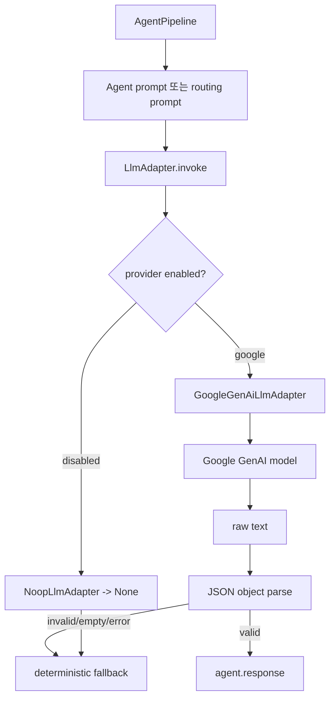

# LLM 구현 계획

## 1. 목적

현재 `backend/src/llm/adapter.py`는 `None`을 반환하는 placeholder이며, LangGraph pipeline은 이 값을 받아 deterministic fallback 경로로 복구한다.

이 문서는 실제 LLM provider 호출을 추가하기 위한 구현 계획이다. 목표는 Agent prompt 기반 routing과 leaf Agent 응답 생성을 실제 모델로 실행하되, provider 장애가 게임 기능 실패로 번지지 않도록 fallback 계약을 유지하는 것이다.

## 2. 현재 상태

현재 구조:

```txt
AgentPipeline
 ├─ OrchestratorAgent routing prompt
 ├─ ManualQaAgent / QuestGeneratorAgent sub-agent routing prompt
 ├─ leaf Agent prompt
 └─ LlmAdapter.invoke(prompt) -> str | None
```

현재 제약:

- `LlmAdapter.invoke()`는 동기 메서드이며 raw model output 문자열 또는 `None`을 반환한다.
- `None`이면 pipeline은 fallback response를 만든다.
- LLM raw output은 JSON string이어야 하며, JSON object가 아니면 `INVALID_LLM_RESPONSE`가 된다.
- Agent routing은 keyword/if-else 로직이 아니라 prompt 기반 LLM 결정으로 처리해야 한다.

## 3. 결정 사항

1차 구현은 provider 추상화를 유지하면서 Google GenAI adapter를 추가한다.

이유:

- 현재 `backend/pyproject.toml`에 `google-generativeai`, `langchain-google-genai`, `langchain`, `langgraph`가 이미 포함되어 있다.
- OpenAI SDK는 현재 의존성에 없다.
- 새 provider를 위해 의존성을 늘리기보다, 이미 선택된 의존성을 먼저 실제 adapter로 연결하는 편이 변경 범위가 작다.

단, pipeline은 특정 vendor에 묶이지 않도록 `LlmAdapter` 계약을 유지한다. 이후 OpenAI-compatible adapter가 필요하면 같은 interface 뒤에 추가한다.

## 4. 목표 구조

```txt
backend/src/llm/
 ├─ adapter.py
 │   ├─ LlmAdapter protocol/base
 │   ├─ NoopLlmAdapter
 │   ├─ GoogleGenAiLlmAdapter
 │   └─ create_llm_adapter(settings)
 ├─ settings.py
 │   └─ LlmSettings
 └─ json_output.py
     └─ JSON object 추출/검증 helper
```

Pipeline 연결:



## 5. 설정 계획

환경변수:

```txt
FACTORY_LLM_PROVIDER=none | google
FACTORY_LLM_MODEL=<provider model name>
FACTORY_LLM_TIMEOUT_SECONDS=20
FACTORY_LLM_MAX_OUTPUT_TOKENS=2048
GOOGLE_API_KEY=<optional>
```

기본값:

```txt
FACTORY_LLM_PROVIDER=none
FACTORY_LLM_TIMEOUT_SECONDS=20
FACTORY_LLM_MAX_OUTPUT_TOKENS=2048
```

규칙:

- 기본값은 `none`으로 둔다. 로컬 테스트와 CI는 외부 API 없이 fallback으로 동작해야 한다.
- `FACTORY_LLM_PROVIDER=google`인데 `GOOGLE_API_KEY`가 없으면 startup 실패가 아니라 `NoopLlmAdapter`로 내려가고 warning metadata만 남긴다.
- 모델명은 코드에 고정하지 않는다. `FACTORY_LLM_MODEL`로 주입한다.
- provider별 상세 옵션은 처음부터 과하게 열지 않는다. timeout, model, max output token만 먼저 둔다.

## 6. Adapter 계약

초기 계약은 현재 pipeline에 맞춰 유지한다.

```python
class LlmAdapter:
    def invoke(self, prompt: str) -> str | None:
        ...
```

반환 규칙:

- 성공: 모델이 생성한 raw string을 반환한다.
- timeout: `None`을 반환한다.
- provider error: `None`을 반환한다.
- API key 없음: `None`을 반환한다.
- 빈 응답: `None`을 반환한다.

예외를 밖으로 던지지 않는 이유:

- 현재 pipeline은 `None -> fallback` 계약을 가지고 있다.
- LLM 장애를 `agent.error`로 노출하지 않고 정상 fallback response로 복구해야 한다.
- WebSocket gateway가 provider 예외를 알 필요가 없다.

## 7. JSON 출력 정책

Agent prompt는 모두 JSON object만 반환하도록 요구한다.

Adapter는 provider 응답을 그대로 넘기되, pipeline의 `parse_llm_response`가 JSON object 검증을 수행한다. 다만 provider가 markdown code fence를 붙이는 경우를 막기 위해 prompt에는 다음 요구를 공통으로 넣는다.

```txt
JSON object만 반환하세요. markdown code fence, 설명 문장, 접두사, 접미사를 포함하지 마세요.
```

추가 helper는 2단계에서 검토한다.

- 1단계: 현재 pipeline처럼 `json.loads(raw)`만 허용한다.
- 2단계: 실제 provider가 code fence를 자주 반환하면 `json_output.py`에서 엄격한 object extraction을 추가한다.

처음부터 느슨한 extraction을 넣지 않는 이유:

- 모델 출력 형식 오류가 조용히 숨을 수 있다.
- 테스트와 eval에서 prompt 품질 문제를 발견하기 어렵다.

## 8. 구현 단계

### 8.1 설정 모델 추가

파일:

- `backend/src/llm/settings.py`
- `backend/.env.example`

작업:

- `LlmSettings`를 추가한다.
- 환경변수에서 provider, model, timeout, max output tokens를 읽는다.
- provider 값은 `none`, `google`만 허용한다.

검증:

- 기본값이면 provider가 `none`이 된다.
- 잘못된 provider 값이면 명확한 설정 오류가 난다.

### 8.2 Noop adapter 명시화

파일:

- `backend/src/llm/adapter.py`

작업:

- 현재 placeholder를 `NoopLlmAdapter`로 분리한다.
- 기본 `create_llm_adapter()`가 `none` 또는 설정 불충분 시 `NoopLlmAdapter`를 반환한다.

검증:

- API key 없이 기존 테스트가 모두 통과한다.
- fallback metadata가 유지된다.

### 8.3 Google GenAI adapter 추가

파일:

- `backend/src/llm/adapter.py`

작업:

- `GoogleGenAiLlmAdapter`를 추가한다.
- `google-generativeai` 또는 현재 의존성에 맞는 Google GenAI client를 사용한다.
- timeout과 max output token을 적용한다.
- provider 예외, timeout, 빈 응답은 `None`으로 변환한다.

검증:

- fake client로 성공 raw JSON을 반환하는 테스트를 작성한다.
- fake client provider error는 `None`이 되는지 확인한다.
- fake client empty response는 `None`이 되는지 확인한다.

### 8.4 Pipeline wiring

파일:

- `backend/src/agents/pipeline.py`
- `backend/src/app.py` 또는 pipeline factory 위치

작업:

- `AgentPipeline` 생성 시 `create_llm_adapter()`를 사용하도록 연결한다.
- 테스트에서는 fake adapter를 계속 주입할 수 있게 constructor injection을 유지한다.

검증:

- 명시적으로 fake adapter를 주입한 테스트는 외부 provider를 호출하지 않는다.
- default pipeline은 환경변수 없이 fallback으로 동작한다.

### 8.5 Routing eval fixture 추가

파일:

- `backend/tests/test_llm_adapter.py`
- `backend/tests/test_pipeline_edges.py`

작업:

- top-level orchestrator routing raw JSON을 fake adapter로 주입하는 테스트를 추가한다.
- manual/quest sub-agent routing raw JSON을 fake adapter로 주입하는 테스트를 추가한다.
- invalid routing JSON은 `ROUTING_UNAVAILABLE` 또는 기존 error 계약으로 종료되는지 확인한다.

검증:

- prompt 기반 routing 경로가 실제 LLM output으로 선택되는지 고정한다.
- keyword 기반 routing이 없어도 pipeline이 동작함을 테스트로 보인다.

## 9. 테스트 계획

필수 테스트:

- `NoopLlmAdapter.invoke()`는 항상 `None`을 반환한다.
- `create_llm_adapter()`는 기본 설정에서 `NoopLlmAdapter`를 만든다.
- Google adapter는 정상 provider 응답 raw text를 반환한다.
- Google adapter는 provider error를 `None`으로 변환한다.
- Google adapter는 timeout/empty response를 `None`으로 변환한다.
- API key가 없으면 외부 호출 없이 fallback response가 나온다.
- fake LLM이 valid JSON object를 반환하면 pipeline response metadata에 `llm: used`가 포함된다.
- fake LLM이 invalid JSON을 반환하면 fallback으로 복구되는지 확인한다.
- routing prompt 결과가 허용 agent id이면 해당 Agent로 이동한다.
- routing prompt 결과가 허용 sub_agent id이면 해당 leaf Agent로 이동한다.

검증 명령:

```bash
uv run --extra dev pytest
uv run --extra dev ruff check .
```

## 10. 구현 순서와 커밋 단위

권장 커밋 단위:

1. `test: LLM 설정과 noop adapter 계약 추가`
2. `feat: Google GenAI LLM adapter 추가`
3. `feat: pipeline 기본 LLM adapter wiring`
4. `test: prompt 기반 routing LLM 경로 보강`
5. `docs: LLM 설정과 운영 규칙 정리`

각 커밋은 테스트가 통과하는 상태여야 한다.

## 11. 보류 항목

초기 구현에 포함하지 않는다.

- streaming token forwarding
- multi-provider failover
- per-agent model selection
- retry/backoff 정책
- prompt version registry
- remote prompt template store
- RAG/vector search 연동

보류 이유:

- 현재 우선순위는 실제 LLM 호출을 pipeline에 안전하게 연결하는 것이다.
- 위 기능들은 provider 호출이 안정화된 뒤 eval과 운영 요구가 생기면 추가한다.

## 12. 주의할 점

- Agent나 sub-agent 선택을 keyword 로직으로 복구하지 않는다.
- 명시된 `agent`, `sub_agent`가 잘못된 경우 LLM으로 우회하지 않는다.
- LLM 장애는 fallback response로 복구한다.
- fallback metadata와 cache metadata 보존 문제는 기존 리뷰 피드백과 함께 먼저 고정해야 한다.
- 외부 API가 필요한 테스트는 unit test에서 fake client로 대체한다.
- CI와 로컬 기본값은 네트워크 없이 통과해야 한다.
