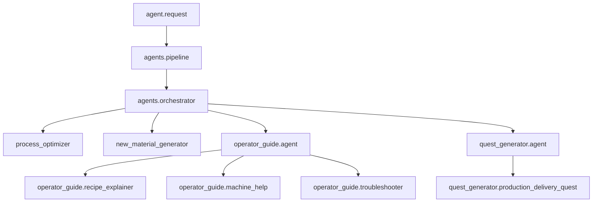

# Agent Roles

이 문서는 `backend/src/agents` 아래 Agent들의 책임 경계를 정의한다. 폴더 역할은 `FOLDER_ROLES.md`, 결정 변경 이력은 `DECISION_LOG.md`에 기록한다.

## 원칙

- Agent는 도메인 판단, prompt 구성, response payload 해석, deterministic fallback 정책을 가진다.
- Agent는 공통 `tools` tuple을 가질 수 있다. tool이 없으면 빈 tuple을 둔다.
- Agent는 WebSocket connection을 직접 읽거나 쓰지 않는다.
- Agent는 public message envelope 생성을 직접 소유하지 않는다.
- LLM 호출, cache, retry, 최종 envelope 생성은 `agents/pipeline/`가 담당한다.
- Agent 간 호출은 오케스트레이션 계층에서만 일어나며, leaf Agent가 다른 Agent를 직접 호출하지 않는다.

## Agent 계층

## 오케스트레이션 구분

서버 전체 오케스트레이터:

- `agents/orchestrator.py`

도메인 오케스트레이터:

- `agents/operator_guide/agent.py`
- `agents/quest_generator/agent.py`

Agent가 아닌 실행 구성요소:

- `agents/pipeline/`: LangGraph 기반 공통 실행 파이프라인 패키지
- `agents/router.py`: agent id를 구현체로 매핑하는 registry/router
- `agents/agent_catalog.py`: top-level routing prompt에 넣는 read-only routing support tool과 Agent capability catalog
- `agents/base.py`: Agent interface와 공통 타입

## top-level Agent 처리 기준

top-level Agent라고 해서 모두 오케스트레이터로 처리하지 않는다. 기준은 하위 실행 단위가 있는지다.

용어:

- `Global Orchestrator`: 서버 전체 요청을 어떤 top-level Agent가 처리할지 결정하는 최상위 오케스트레이터다. 현재는 `agents/orchestrator.py`다.
- `Domain Orchestrator`: 특정 도메인 안에서 하위 서브 에이전트나 내부 실행 전략을 고르는 중간 계층 Agent다. 현재는 `operator_guide`, `quest_generator`다.
- `Leaf Agent`: 더 이상 하위 Agent를 고르지 않고 prompt/schema/fallback 계약을 제공하는 실행 Agent다. 현재 top-level leaf는 `process_optimizer`, `new_material_generator`다.

한국어 문서에서는 `Domain Orchestrator`를 `도메인 오케스트레이터`라고 부른다. `중간 에이전트` 같은 계층 위치 표현은 책임을 드러내지 못하므로 공식 용어로 쓰지 않는다.

- 하위 서브 에이전트나 내부 전략 중 하나를 선택해야 하면 도메인 오케스트레이터로 처리한다.
- 하위 실행 단위가 없고 `build_prompt()`, response schema, `fallback()` 정책만 제공하면 leaf Agent로 처리한다.
- leaf Agent도 직접 LLM을 호출하거나 envelope를 만들지 않는다. pipeline이 Agent 계약을 실행한다.
- top-level routing 결과는 항상 `selectedAgent`로 기록하고, leaf인지 도메인 오케스트레이터인지는 LangGraph edge가 다음 node를 선택하면서 드러낸다.
- `operator_guide`, `quest_generator`는 내부 서브 에이전트가 있으므로 도메인 오케스트레이터다.
- `process_optimizer`, `new_material_generator`는 현재 내부 서브 에이전트가 없으므로 leaf top-level Agent다.

따라서 top-level Agent를 "오케스트레이터처럼" 처리해야 하는 경우는 그 Agent가 다시 하위 Agent를 선택하는 책임을 가질 때뿐이다.

## `agents/orchestrator.py`

역할: 서버 전체 요청을 어떤 최상위 Agent가 처리할지 선택한다.

선택 방식:

- 기본 선택은 `orchestrator.py`가 만든 routing prompt의 LLM 응답으로만 한다.
- 명시적인 `agent` 값이 요청에 있으면 prompt hint로만 전달하고, 선택 확정은 LLM 응답으로만 한다.
- keyword, if/else, score table 같은 코드 로직으로 Agent를 추론하지 않는다.
- LLM routing 결과가 없거나 허용 목록 밖이면 임의 fallback 선택을 하지 않고 routing error로 종료한다.
- routing prompt는 `[ROLE]`, `[TASK]`, `[ALLOWED_AGENT_IDS]`, `[AGENT_CAPABILITIES]`, `[REQUEST_HINT]`, `[REQUEST_CONTEXT]`, `[REQUEST_PAYLOAD]`, `[OUTPUT_CONTRACT]` 섹션을 가진 structured prompt로 만든다.
- `[AGENT_CAPABILITIES]`는 `agents.agent_catalog.AgentCatalogTool`이 `RoutingSupportTool` 인터페이스로 제공한다. 이는 LLM tool calling이 아니라 오케스트레이터가 deterministic하게 호출하는 routing prompt 보강용 tool이다.
- 출력 계약은 `TOP_LEVEL_AGENT_IDS` 중 하나의 id 문자열만 허용하며 JSON, markdown, 설명, reason, 따옴표, 코드블록은 허용하지 않는다.

입력:

- 검증된 `agent.request`
- user/session context
- 명시된 `agent` 값 또는 자연어 요청

출력:

- `selectedAgent` state
- observability용 `routingPrompt`
- observability용 `routingRaw`

선택 가능한 Agent:

- `process_optimizer`
- `operator_guide`
- `quest_generator`
- `new_material_generator`

소유하지 않는 책임:

- WebSocket 송수신
- cache lookup/write
- LLM retry
- 최종 `agent.response` envelope 생성
- 각 도메인 내부 서브 에이전트 선택

직접 서브 에이전트까지 분기하지 않는 이유:

- `orchestrator.py`가 `operator_guide.recipe_explainer`, `quest_generator.production_delivery_quest` 같은 leaf Agent까지 직접 고르면 도메인별 세부 정책이 서버 전체 오케스트레이터로 새어 나온다.
- 도메인별 서브 에이전트 선택 기준은 서로 다르다. 운영자 가이드는 질문 의도와 화면 context가 중요하고, 퀘스트 생성은 PostgreSQL의 창고/진행/최근 퀘스트 상황과 생산/납품 후보 균형이 중요하다.
- leaf Agent가 늘어날 때마다 서버 전체 오케스트레이터를 수정하게 되면 변경 범위가 커진다.
- 따라서 `orchestrator.py`는 최상위 Agent만 선택하고, 세부 분기는 도메인 오케스트레이터가 맡는다.

예외:

- 도메인이 leaf Agent 하나만 가진다면 도메인 오케스트레이터 없이 `orchestrator.py`가 바로 해당 Agent를 선택해도 된다.
- 여러 도메인을 가로지르는 긴급 fallback이나 안전 차단 정책은 `orchestrator.py`에서 처리할 수 있다.

## `agents/process_optimizer.py`

역할: 공장 상태를 기반으로 공정 최적화 제안을 만든다.

입력:

- 설비 상태
- 생산량/처리량 지표
- 병목 후보
- 레시피와 자원 흐름 snapshot

출력:

- 병목 요약
- 우선순위가 있는 개선 액션
- 예상 효과
- 사용자가 확인할 근거 데이터

주요 판단:

- 어떤 설비나 공정이 병목인지
- 생산량, 비용, 안정성 중 무엇을 우선할지
- 즉시 실행 가능한 액션과 장기 개선안을 어떻게 나눌지

소유하지 않는 책임:

- 실제 게임 상태 변경
- 액션 실행
- 퀘스트 생성
- 운영자 가이드

## `agents/new_material_generator.py`

역할: 현재 게임 상태와 설계 제약에 맞는 신규 재료 후보를 생성한다.

입력:

- 현재 unlock 상태
- 기존 재료 목록
- 생산 체인 제약
- 밸런스 목표

출력:

- 신규 재료 후보
- 속성, 희귀도, 생산/소비처
- 밸런스 근거
- 관련 레시피 후보

주요 판단:

- 기존 재료와 역할이 중복되지 않는지
- 생산 체인을 과도하게 복잡하게 만들지 않는지
- 초반/중반/후반 progression 중 어디에 들어갈지

소유하지 않는 책임:

- 최종 밸런스 확정
- DB write
- 퀘스트 자동 생성
- 시각 asset 생성

## `agents/operator_guide/agent.py`

역할: 운영자 가이드 도메인 오케스트레이터다.

도메인 오케스트레이터의 공통 책임:

- 도메인 내부 하위 Agent 후보 목록을 소유한다.
- structured routing prompt 계약을 만든다.
- 요청 payload와 context 중 하위 Agent 선택에 필요한 정보만 prompt에 전달한다.
- 모델이 반환해야 하는 하위 Agent id 출력 계약을 명확히 한다.
- 하위 Agent 선택 결과를 pipeline state의 `selectedLeafAgent`로 넘길 수 있게 한다.

하위 Agent 결과 통합이 필요한 경우:

- 기본 구조는 하위 Agent 하나를 선택해 실행하므로 통합 단계가 없다.
- 한 요청에서 여러 하위 Agent를 실행해야 하는 fan-out 구조가 생기면 도메인 오케스트레이터가 통합 계약을 소유한다.
- 이때도 도메인 오케스트레이터가 직접 LLM을 호출하지 않고, pipeline이 child 실행 결과를 모은 뒤 domain merge node를 실행한다.
- 도메인 오케스트레이터는 merge prompt, merge schema, 충돌 해결 기준, 결과 우선순위 같은 도메인 통합 정책만 제공한다.
- 단순히 여러 결과를 이어 붙이는 수준이면 별도 도메인 통합 단계를 만들지 않는다.

소유하지 않는 책임:

- leaf Agent의 최종 답변 생성
- LLM 호출 실행
- cache, retry, fallback node 제어
- public `agent.response` / `agent.error` envelope 생성
- leaf Agent response parsing

따라서 도메인 오케스트레이터는 두껍게 만들지 않는다. 도메인 공통 정책이나 multi-agent 결과 통합 요구가 실제로 생기기 전까지는 하위 Agent 선택 prompt와 허용 목록만 가진 얇은 계층으로 둔다.

선택 방식:

- 기본 선택은 `operator_guide/agent.py`가 만든 routing prompt의 LLM 응답으로만 한다.
- 명시적인 `sub_agent` 값이 요청에 있으면 그 값을 검증해서 사용한다.
- 질문 keyword를 코드에서 직접 분류하지 않는다.
- LLM routing 결과가 없거나 허용 목록 밖이면 임의 fallback 선택을 하지 않고 routing error로 종료한다.
- routing prompt는 structured prompt로 작성하고, 출력은 허용된 `operator_guide.*` leaf Agent id 문자열 하나만 허용한다.
- JSON, markdown, 설명, reason, 따옴표, 코드블록은 routing output으로 허용하지 않는다.

입력:

- 사용자 질문
- 현재 화면 또는 시스템 context
- 매뉴얼 검색 결과 또는 참조 가능한 domain context

출력:

- `selectedLeafAgent`
- 서브 에이전트에 넘길 normalized question
- 답변 정규화 metadata

선택 가능한 서브 에이전트:

- `recipe_explainer`
- `machine_help`
- `troubleshooter`

주요 판단:

- routing prompt는 질문이 레시피 설명인지, 장비 도움말인지, 문제 해결인지 판단하도록 지시한다.
- 질문이 모호할 때는 LLM router가 현재 화면 context를 판단 근거로 사용한다.
- LLM router가 허용된 `sub_agent`를 반환하지 못하면 기본 sub-agent로 복구하지 않고 routing error로 종료한다.

소유하지 않는 책임:

- 직접 답변 생성
- 퀘스트 생성
- 공정 최적화
- WebSocket 송수신

## `agents/operator_guide/recipe_explainer.py`

역할: 레시피와 생산 체인을 설명한다.

입력:

- 레시피 id 또는 재료/생산품 이름
- 현재 unlock 상태
- 사용자의 질문 문장

출력:

- 필요한 입력 재료
- 생산 결과
- 선행 조건
- 추천 사용처
- 초보자용 설명 또는 상세 설명

## `agents/operator_guide/machine_help.py`

역할: 설비, UI, 조작, 상태 표시를 설명한다.

입력:

- 설비 id 또는 화면 context
- 사용자의 질문 문장
- 현재 설비 상태

출력:

- 설비 목적
- 주요 상태값 의미
- 사용 방법
- 관련 레시피 또는 연결 설비

## `agents/operator_guide/troubleshooter.py`

역할: 생산 중단, 병목, 오류 상태의 원인을 진단한다.

입력:

- 문제 증상
- 관련 설비 상태
- 최근 이벤트
- 자원 흐름 snapshot

출력:

- 가능한 원인 목록
- 우선순위가 있는 확인 단계
- 즉시 시도할 해결 방법
- 추가로 필요한 정보

## `agents/quest_generator/agent.py`

역할: 퀘스트 생성 도메인 오케스트레이터다.

선택 방식:

- 기본 선택은 `quest_generator/agent.py`가 만든 routing prompt의 LLM 응답으로만 한다.
- 명시적인 `sub_agent` 값이 요청에 있으면 그 값을 검증해서 사용한다.
- 진행도, 이벤트, quest type을 코드 if/else로 직접 분류하지 않는다.
- LLM routing 결과가 없거나 허용 목록 밖이면 임의 fallback 선택을 하지 않고 routing error로 종료한다.
- routing prompt는 structured prompt로 작성하고, 출력은 허용된 `quest_generator.*` leaf Agent id 문자열 하나만 허용한다.
- JSON, markdown, 설명, reason, 따옴표, 코드블록은 routing output으로 허용하지 않는다.

입력:

- 플레이어 진행도
- PostgreSQL에 저장된 현재 창고 상태
- PostgreSQL에 저장된 최근 생성/완료 퀘스트
- 현재 공장 상태
- 최근 이벤트
- 명시된 quest type 또는 sub_agent
- 생산/납품 후보 균형

출력:

- `selectedLeafAgent`
- 서브 에이전트에 넘길 normalized quest context
- 선택 근거 metadata

선택 가능한 서브 에이전트:

- `production_delivery_quest`

주요 판단:

- 현재 허용 leaf는 통합 생산/납품 퀘스트 생성기 하나이므로, 도메인 오케스트레이터는 허용된 leaf id 검증과 prompt 계약을 얇게 유지한다.
- `quest_type`, 진행도, 최근 이벤트는 LLM router가 참고할 수 있는 입력 신호지만, public 응답 타입은 `production`, `delivery`로 제한한다.
- 코드가 `quest_type`, 진행도, 최근 이벤트를 if/else로 분류해서 제거된 경제/무역 leaf로 보내지 않는다.
- 명시적으로 사용할 수 있는 값은 검증된 `sub_agent`뿐이며, `quest_type`은 직접 라우팅 값으로 사용하지 않는다.

소유하지 않는 책임:

- 퀘스트 payload 직접 생성
- LLM 호출
- cache 정책
- 최종 envelope 생성

## `agents/quest_generator/production_delivery_quest.py`

역할: PostgreSQL의 현재 상황을 읽어 생산 퀘스트와 납품 퀘스트를 합산 5개 생성한다.

입력:

- PostgreSQL 창고 보유량
- PostgreSQL 최근 생성/완료 퀘스트 기록
- 해금된 레시피와 사용 가능한 장비
- CSV 기준 데이터인 `resources.csv`, `recipes.csv`, `equipment.csv`
- 프론트 창고 item id와 CSV resource id 매핑 정보

출력:

- `production`, `delivery` 타입만 포함한 5개 퀘스트
- 각 퀘스트의 완료 조건
- `target_item_id`, `quantity` objective
- 후보 생성과 fallback 여부를 설명하는 metadata

주요 판단:

- 생산 후보는 부족하거나 다음 생산 체인에 필요한 아이템을 우선한다.
- 납품 후보는 PostgreSQL 창고에 충분히 쌓인 아이템을 우선한다.
- 기본 조합은 생산 3개, 납품 2개로 하되 후보 부족 시 다른 타입으로 채운다.
- 같은 응답 안에서 동일 `target_item_id`를 중복 생성하지 않는다.
- PostgreSQL 조회 실패나 후보 부족 시 deterministic fallback으로 5개를 유지한다.

소유하지 않는 책임:

- PostgreSQL schema migration 자체
- Unreal 창고 아이템 차감 실행
- 보상 지급
- 경제/무역 퀘스트 생성

## 제외된 퀘스트 타입

현재 퀘스트 에이전트가 생성하는 public quest type은 `production`, `delivery`뿐이다.

제외 대상:

- `economy`: 재고/효율 개선은 납품 후보 점수에 일부 반영할 수 있지만 public quest type이나 leaf Agent로 노출하지 않는다.
- `trade`: 무역 대상과 거래 규칙이 확정되지 않았으므로 현재 leaf Agent로 열지 않는다.
- `tutorial`, `exploration`: 현재 퀘스트 에이전트 범위가 아니다.

현재 원칙:

- `quest_generator.economy_quest`, `quest_generator.trade_quest`, `quest_generator.tutorial_quest`, `quest_generator.exploration_quest`는 허용 leaf Agent가 아니다.
- 제거된 leaf id가 명시 요청되면 `INVALID_SUB_AGENT`로 처리한다.
- 경제/무역 관련 요청을 production/delivery로 조용히 흡수하지 않는다. 필요하면 별도 설계와 응답 계약을 문서화한 뒤 허용 목록에 추가한다.

## 실행 구성요소

### `agents/pipeline/`

역할: Agent 실행을 LangGraph로 연결하는 공통 파이프라인이다.

구성:

- `runtime.py`: pipeline public API와 LangGraph node 구현
- `graph_edges.py`: node 연결과 conditional edge predicate
- `llm_fallback.py`: default/fallback1/fallback2 LLM slot 호출
- `state.py`: graph state 타입
- `utils.py`: cache key, fallback, validation error helper

담당:

- envelope 검증 이후 graph state 구성
- top-level Agent routing 호출
- sub-orchestrator routing 호출
- cache lookup/write
- prompt build
- LLM adapter 호출
- fallback 생성
- response schema 검증
- 최종 `agent.response` 또는 `agent.error` envelope 반환

Agent가 아닌 이유:

- 도메인 판단의 주체가 아니다.
- 전문 Agent별 정책을 직접 소유하지 않는다.
- 실행 순서와 공통 실패 처리를 소유한다.

### `agents/router.py`

역할: agent id를 구현체로 매핑한다.

담당:

- agent registry 구성
- agent id 검증
- 구현체 lookup

Agent가 아닌 이유:

- 의도 분석을 하지 않는다.
- payload를 해석하지 않는다.
- LLM prompt나 fallback을 만들지 않는다.

### `agents/base.py`

역할: Agent 구현체가 따라야 하는 공통 interface와 타입을 정의한다.

담당:

- Agent id 타입
- 공통 request context 타입
- prompt build contract
- response parse contract
- fallback contract

Agent가 아닌 이유:

- 실행 인스턴스가 아니다.
- 요청을 처리하지 않는다.
- 도메인 판단이나 orchestration을 하지 않는다.
