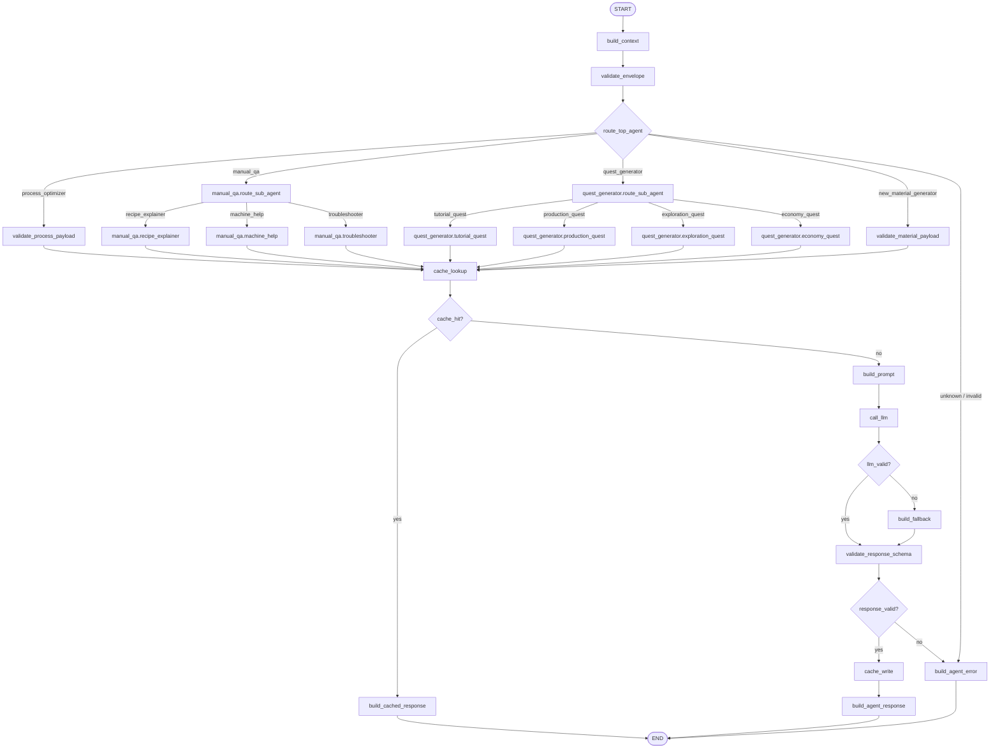

# `backend/src` 폴더 역할

이 문서는 새 서버 구조에서 `backend/src` 아래 각 폴더가 맡는 책임을 정리한다.

## 최상위 구성

```txt
backend/src
 ├─ app.py
 ├─ websocket
 ├─ protocol
 ├─ agents
 ├─ llm
 ├─ cache
 └─ visual
```

## `app.py`

FastAPI application entrypoint다.

역할:

- FastAPI app 생성
- `GET /health` 등록
- WebSocket router 등록
- uvicorn 실행 대상 app 제공

하지 않는 일:

- Agent 실행 로직
- LLM 호출
- 요청 payload 검증 세부 로직

## `websocket`

WebSocket transport 계층이다.

역할:

- `/ws/agent` endpoint 제공
- WebSocket 연결 accept/close 관리
- raw text message 수신
- JSON parse 결과를 protocol/pipeline 계층으로 전달
- `agent.stream`, `agent.response`, `agent.error`, `pong` 송신

하지 않는 일:

- Agent별 비즈니스 로직
- LLM prompt 생성
- fallback 생성
- cache 판단

대표 파일:

- `gateway.py`: WebSocket endpoint
- `connection.py`: 연결 관리 helper

## `protocol`

클라이언트와 서버가 주고받는 public message schema 계층이다.

역할:

- `agent.request` envelope 정의
- `agent.stream` envelope 정의
- `agent.response` envelope 정의
- `agent.error` envelope 정의
- `ping` / `pong` message 정의
- protocol error code와 error payload 정의

하지 않는 일:

- Agent routing
- LLM 호출
- Agent별 domain payload 해석

대표 파일:

- `messages.py`: WebSocket message model
- `errors.py`: error code와 error payload model

## `agents`

AI Agent 실행 계층이다.

역할:

- Agent 공통 interface 정의
- Agent registry와 router 제공
- 공통 Agent pipeline 제공
- Agent별 payload schema 검증
- Agent별 prompt 생성
- Agent별 LLM response parsing
- Agent별 deterministic fallback 생성

포함 Agent:

- `orchestrator`
- `process_optimizer`
- `quest_generator`
- `manual_qa`
- `new_material_generator`

대표 파일:

- `base.py`: Agent interface와 공통 타입
- `router.py`: agent id 기반 registry/router
- `pipeline.py`: validation/cache/LLM/fallback 처리 흐름
- `orchestrator.py`: 요청 의도 분석과 전문 Agent 선택을 담당하는 오케스트레이터 Agent
- `process_optimizer.py`: 공정 최적화 Agent
- `quest_generator/`: 퀘스트 생성 Agent와 서브 에이전트
- `manual_qa/`: 매뉴얼 Q&A Agent와 서브 에이전트
- `new_material_generator.py`: 신물질 생성 Agent

`manual_qa/` 내부:

- `agent.py`: 매뉴얼 Q&A 요청을 서브 에이전트로 분기하는 상위 Agent
- `recipe_explainer.py`: 레시피 설명 서브 에이전트
- `machine_help.py`: 장비 도움말 서브 에이전트
- `troubleshooter.py`: 문제 해결 서브 에이전트

`quest_generator/` 내부:

- `agent.py`: 퀘스트 생성 요청을 서브 에이전트로 분기하는 상위 Agent
- `tutorial_quest.py`: 튜토리얼 퀘스트 서브 에이전트
- `production_quest.py`: 생산 퀘스트 서브 에이전트
- `exploration_quest.py`: 탐험 퀘스트 서브 에이전트
- `economy_quest.py`: 경제 퀘스트 서브 에이전트

## `llm`

LLM provider adapter 계층이다.

역할:

- OpenAI-compatible LLM 호출 adapter 제공
- API key가 없을 때 fallback 경로로 전환할 수 있는 no-op adapter 제공
- 테스트용 fake adapter 제공
- LLM timeout과 provider error를 pipeline이 처리할 수 있는 형태로 변환
- Agent prompt helper 제공

하지 않는 일:

- WebSocket message 송신
- Agent별 fallback 판단
- 클라이언트 응답 envelope 생성

대표 파일:

- `adapter.py`: LLM adapter interface 및 provider 구현
- `prompts.py`: 공통 prompt helper

## `cache`

Agent 응답 cache 계층이다.

역할:

- in-memory response cache 제공
- `agent + snapshotHash + normalizedPayloadHash` 기반 cache key 생성 지원
- cache hit/miss 판단
- cache hit metadata 구성 지원

MVP 제약:

- 프로세스 재시작 시 cache는 사라진다.
- persistent cache는 후속 단계에서 구현한다.

대표 파일:

- `response_cache.py`: in-memory response cache

## `visual`

신물질 비주얼 프로파일 생성 계층이다.

역할:

- `new_material_generator`가 사용할 `visualProfile` 생성
- material type, rarity, properties 기반 색상/표면/패턴/형태 힌트 결정
- placeholder visual 응답 구성 지원

MVP 제약:

- 실제 이미지 생성은 하지 않는다.
- texture/icon 파일 저장소는 다루지 않는다.
- `visual.ready` 이벤트는 후속 단계에서 구현한다.

대표 파일:

- `profile.py`: material visual profile builder

## 의존 방향

권장 의존 방향:

```txt
websocket -> protocol
websocket -> agents.pipeline
agents.pipeline -> agents.router
agents.pipeline -> cache
agents.pipeline -> llm
agents.orchestrator -> agents.router
agents.new_material_generator -> visual
```

피해야 할 의존:

- `protocol`이 `agents`를 import하지 않는다.
- `llm`이 `websocket`을 import하지 않는다.
- `cache`가 Agent별 구현을 import하지 않는다.
- Agent module이 WebSocket connection object를 직접 다루지 않는다.
- `agents/orchestrator.py`는 실행 흐름을 직접 소유하지 않고, 어떤 전문 Agent를 사용할지 결정하는 역할만 맡는다.

## 구현 원칙

- transport, protocol, pipeline, agent domain logic을 분리한다.
- LLM raw text는 클라이언트로 직접 보내지 않는다.
- Agent별 최종 payload는 항상 schema validation을 통과해야 한다.
- LLM 실패는 fallback `agent.response`로 복구한다.
- 요청 envelope나 payload 자체가 잘못된 경우에만 `agent.error`를 반환한다.

## LangGraph 구성도

LangGraph는 `agents/pipeline.py` 내부 실행 흐름을 표현하는 데 사용한다. WebSocket 연결 자체는 LangGraph에 넣지 않고, 검증된 `agent.request` 하나를 graph input으로 넣는다.



### LangGraph State

```txt
AgentGraphState
 ├─ envelope
 ├─ context
 ├─ selectedAgent
 ├─ selectedSubAgent
 ├─ typedPayload
 ├─ cacheKey
 ├─ cachedPayload
 ├─ prompt
 ├─ llmRaw
 ├─ fallbackReason
 ├─ responsePayload
 ├─ streams
 └─ error
```

### 노드 책임

- `build_context`: `requestId`, `agent`, `snapshotType`, `snapshotHash`로 실행 context를 만든다.
- `validate_envelope`: public message envelope를 검증한다.
- `route_top_agent`: `orchestrator` 또는 명시된 `agent` 값으로 최상위 Agent를 선택한다.
- `manual_qa.route_sub_agent`: 질문 의도를 보고 매뉴얼 서브 에이전트를 선택한다.
- `quest_generator.route_sub_agent`: 진행도와 이벤트를 보고 퀘스트 서브 에이전트를 선택한다.
- `cache_lookup`: cache key로 이전 response payload를 찾는다.
- `build_prompt`: 선택된 Agent 또는 sub-agent prompt를 만든다.
- `call_llm`: LLM adapter를 호출한다.
- `build_fallback`: LLM 실패 또는 API key 없음 상태에서 deterministic fallback을 만든다.
- `validate_response_schema`: 최종 payload가 Agent response schema를 만족하는지 검증한다.
- `cache_write`: 검증된 payload를 cache에 저장한다.
- `build_agent_response`: `agent.response` envelope를 만든다.
- `build_agent_error`: `agent.error` envelope를 만든다.
