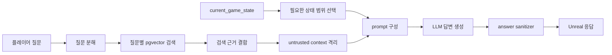

# Operator Guide Agent

Factory Space의 `operator_guide`는 플레이어의 공장 운영 질문에 게임 데이터와 현재 공장 상태를 근거로 답변하는 RAG 기반 가이드 에이전트입니다.

단순히 LLM이 기억한 내용으로 답하지 않습니다. CSV 게임 데이터를 검색 가능한 문서로 변환하고, 질문별 검색 근거와 필요한 공장 상태만 프롬프트에 넣어 답변을 생성합니다. 검색 문서와 사용자 입력은 신뢰할 수 없는 데이터로 취급하며, 최종 응답은 후처리를 거쳐 내부 식별자 노출을 제한합니다.

## 해결하려는 문제

- 고정 매뉴얼만으로는 현재 공장 상태를 반영한 진단이 어렵습니다.
- LLM 단독 답변은 게임에 없는 장비·레시피를 만들어낼 수 있습니다.
- 한 문장에 여러 질문이 들어오면 하나의 검색 결과만으로 답하기 어렵습니다.
- 검색 문서나 사용자 입력에 포함된 지시문이 시스템 프롬프트처럼 해석될 수 있습니다.
- `equipment_id`와 같은 내부 식별자가 플레이어 답변에 노출될 수 있습니다.

## 실행 흐름

1. 플레이어 질문을 하나 이상의 하위 질문으로 분해합니다.
2. 각 하위 질문에 맞는 RAG 문서를 PostgreSQL·pgvector에서 검색합니다.
3. 검색 결과의 신뢰도와 출처 메타데이터를 함께 보관합니다.
4. 질문 해결에 필요한 경우에만 `current_game_state`의 관련 범위를 선택합니다.
5. 검색 문서를 지시문이 아닌 `untrusted context`로 감쌉니다.
6. 검색 근거와 공장 상태를 구조화해 LLM 프롬프트를 만듭니다.
7. 최종 답변에서 내부 ID와 플레이어에게 불필요한 표현을 제거합니다.
8. 진행 이벤트는 `agent.progress`, 최종 결과는 `agent.response`로 분리합니다.

## RAG 데이터 구성

원천 데이터는 [`data/game`](../../../../data/game)의 6개 CSV, 총 242개 레코드입니다.

| 데이터 | 레코드 수 | 용도 |
| --- | ---: | --- |
| `equipment.csv` | 22 | 장비 기능과 동작 조건 |
| `recipes.csv` | 40 | 제작 입력·출력과 필요 장비 |
| `resources.csv` | 67 | 자원 설명과 연결 레시피 |
| `troubleshooting_rules.csv` | 20 | 고장·정체 원인과 점검 순서 |
| `action_policy.csv` | 25 | 상황별 권장 행동 |
| `tutorial.csv` | 68 | 튜토리얼 단계와 안내 문구 |

각 CSV 레코드를 장비·레시피·자원 등의 의미 단위 문서로 변환합니다. 고정 길이로 문장을 자르는 대신 도메인 레코드 단위를 유지해 서로 연관된 정보가 분리되는 문제를 줄였습니다.

임베딩은 기본 1536차원을 사용하며, 도메인 메타데이터와 벡터를 PostgreSQL·pgvector에서 함께 관리합니다.

## 주요 구성요소

| 파일 | 역할 |
| --- | --- |
| [`service.py`](service.py) | 질문 처리, 검색, 프롬프트 구성 흐름을 연결하는 중심 서비스 |
| [`question_decomposer.py`](question_decomposer.py) | 복합 질문을 검색 가능한 하위 질문으로 분해 |
| [`multi_question_rag_retriever.py`](multi_question_rag_retriever.py) | 질문별 검색 결과와 신뢰도를 하나의 context로 결합 |
| [`rag_documents.py`](rag_documents.py) | CSV 레코드를 의미 단위 RAG 문서로 변환 |
| [`rag_embedding.py`](rag_embedding.py) | OpenAI 또는 로컬 임베딩 provider 구성 |
| [`rag_store.py`](rag_store.py) | PostgreSQL·pgvector 저장과 유사도 검색 |
| [`prompt_builder.py`](prompt_builder.py) | 검색 근거와 현재 공장 상태를 LLM 입력으로 구성 |
| [`retrieved_context_guard.py`](retrieved_context_guard.py) | 검색 문서를 신뢰할 수 없는 자료로 격리 |
| [`answer_sanitizer.py`](answer_sanitizer.py) | 내부 ID와 플레이어 비노출 표현을 최종 답변에서 제거 |

## 안전장치

### Prompt Injection 방어

검색 문서와 플레이어 입력을 명령으로 신뢰하지 않습니다. 검색 결과는 `retrieved_context_guard.py`에서 자료 영역으로 격리하며, 시스템 규칙 변경이나 내부 프롬프트 공개 요청을 따르지 않도록 프롬프트 경계를 둡니다.

### 내부 식별자 제거

LLM 답변 이후 `answer_sanitizer.py`를 적용합니다. `equipment_id`, `recipe_id`처럼 Unreal 내부 구현에 필요한 식별자가 플레이어 문장에 섞이지 않도록 후처리합니다.

### 낮은 검색 신뢰도 처리

검색 결과가 약하거나 질문이 모호하면 근거 없는 단정 대신 추가 확인이 필요한 응답으로 분기할 수 있도록 검색 신뢰도와 질문 유형을 함께 관리합니다.

## 검증 근거

- [Prompt Injection guard 테스트](../../../tests/test_operator_guide_prompt_injection_guard.py)
- [복합 질문 RAG 검색 테스트](../../../tests/test_operator_guide_multi_question_rag_retriever.py)
- [RAG runtime 통합 테스트](../../../tests/test_operator_guide_rag_runtime_integration.py)
- [답변 sanitizer 테스트](../../../tests/test_operator_guide_answer_sanitizer.py)
- [WebSocket endpoint 테스트](../../../tests/test_websocket_endpoint.py)
- [RAG 검색 품질 평가 보고서](../../../docs/rag_evaluation_report.md)

평가 보고서에 기록된 6개 대표 질문에서는 최종 통과율 100%, 문서 매칭 대상 4개 질문의 Hit@1·Hit@5가 모두 100%였습니다. 이 수치는 제한된 평가 세트의 결과이며, 실제 운영 품질 전체를 의미하지는 않습니다.

## 포트폴리오 핵심 요약

> CSV 기반 게임 데이터를 도메인 레코드 단위 RAG 문서로 변환하고 PostgreSQL·pgvector에 저장했습니다. 복합 질문은 하위 질문으로 분해해 각각 근거를 검색하고, 필요한 현재 공장 상태와 함께 답변 context로 구성했습니다. 검색 문서는 untrusted context로 격리하고 최종 답변은 sanitizer를 거쳐 내부 식별자 노출을 방지했습니다.

