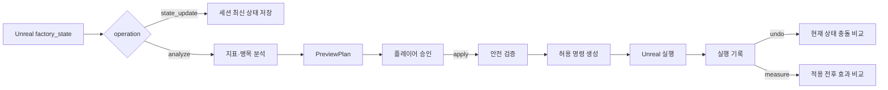
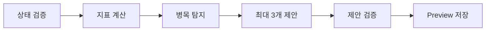
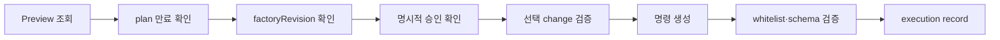

# Process Optimizer Agent

Factory Space의 `process_optimizer`는 Unreal이 보낸 공장 상태를 분석해 병목과 개선안을 제안하고, 플레이어가 승인한 변경만 구조화된 명령으로 준비하는 LangGraph 기반 최적화 에이전트입니다.

핵심 설계는 LLM의 설명 책임과 코드의 판단 책임을 분리한 것입니다. 공장 지표 계산, 승인 확인, plan 만료, `factoryRevision`, 명령 schema, Undo 충돌은 Python 코드가 검증합니다. LLM은 검증된 Preview 결과를 플레이어가 이해하기 쉬운 문장으로 보강하는 역할만 담당합니다.

## 해결하려는 문제

- 현재 생산량·전력·자원 상태를 반영하지 않는 정적 추천은 실제 병목을 찾기 어렵습니다.
- AI 제안을 즉시 실행하면 사용자가 검토하지 않은 공장 변경이 발생할 수 있습니다.
- Preview 이후 공장 상태가 바뀌면 오래된 계획이 현재 월드와 충돌할 수 있습니다.
- 자연어 또는 LLM 출력이 그대로 명령이 되면 허용하지 않은 조작이 생성될 수 있습니다.
- 실행 후 상태가 다시 바뀐 경우 단순 Undo가 플레이어의 변경을 덮어쓸 수 있습니다.

## 전체 실행 구조

공개 WebSocket 경로의 `agent: "process_optimizer"` 요청은 [`graph.py`](graph.py)의 v2 LangGraph를 사용합니다. [`agent.py`](agent.py)는 초기 v1 참고 구현이며 현재 주요 Unreal 실행 경로가 아닙니다.

## Operation별 흐름

### `state_update`

Unreal이 주기적으로 보낸 최신 `factory_state`와 `factoryRevision`을 세션 메모리에 저장합니다. 이 요청에서는 분석, Preview 생성, 명령 생성 또는 LLM 호출을 수행하지 않습니다.

### `analyze`

전력, 자원, 장비 가동률, 입력 부족, 출력 적체, 컨베이어 혼잡을 코드로 계산합니다. 분석 결과는 최대 3개의 변경 제안으로 제한해 플레이어가 검토할 수 있는 Preview로 반환합니다. 이 단계에서는 실행 명령을 생성하지 않습니다.

### `apply`

플레이어의 명시적 승인 후에만 실행 준비 단계로 이동합니다. Preview 생성 시점과 Apply 시점의 `factoryRevision`이 다르거나 plan이 만료되면 명령을 만들지 않습니다.

검증이 끝난 제안만 Unreal 명령으로 변환하며, 다음 7종만 허용합니다.

- `set_recipe`
- `set_machine_enabled`
- `connect_conveyor`
- `disconnect_conveyor`
- `move_machine`
- `place_machine`
- `remove_machine`

응답의 `execute_ready`는 실행 완료가 아니라 Unreal이 최종 실행할 수 있도록 백엔드 검증을 마쳤다는 의미입니다.

### `undo`

실행 기록의 `after` 상태와 Unreal이 보낸 현재 대상 상태를 비교합니다. 적용 이후 플레이어가 해당 장비나 연결을 다시 변경했다면 충돌로 판단하고 전체 Undo 명령 준비를 중단합니다.

Undo는 현재 대상 상태 비교를 중심으로 동작합니다. 최신 요청 revision과 실행 기록 revision을 별도 gate에서 엄격하게 비교하는 기능은 제한적이므로, 이를 Apply의 `factoryRevision` 검증과 동일하게 설명하지 않습니다.

### `measure`

적용 전후의 입력 부족, 출력 적체, 컨베이어 혼잡, 평균 가동률을 비교합니다. 최소 관찰 시간과 production cycle 조건이 충족되지 않으면 성급하게 효과를 판정하지 않습니다.

현재 측정은 장기 생산량·비용·에너지 효율 전체를 평가하는 시뮬레이터가 아니라, 제공된 snapshot의 주요 병목 지표를 비교하는 기능입니다.

## 주요 구성요소

| 파일 | 역할 |
| --- | --- |
| [`graph.py`](graph.py) | `analyze`, `apply`, `undo`, `measure` 노드와 실행 순서를 조립 |
| [`nodes.py`](nodes.py) | 각 LangGraph 단계의 실제 검증과 상태 변경 구현 |
| [`graph_state.py`](graph_state.py) | 그래프 노드가 공유하는 요청·지표·제안·명령 상태 |
| [`middleware.py`](middleware.py) | 요청 검증, `state_update`, 누락 상태 보완 |
| [`analyzer.py`](analyzer.py) | 공장 지표와 병목을 결정론적으로 계산 |
| [`suggestion.py`](suggestion.py) | 분석 결과를 최대 3개의 Preview 제안으로 변환 |
| [`commands.py`](commands.py) | 7종 명령 whitelist와 Pydantic schema 검증 |
| [`preview_store.py`](preview_store.py) | PreviewPlan 저장, 5분 만료와 revision 확인 |
| [`execution_record.py`](execution_record.py) | Undo·측정을 위한 변경 전후 상태 기록 |
| [`undo.py`](undo.py) | 현재 상태 충돌 확인과 역방향 명령 생성 |
| [`effect_measurement.py`](effect_measurement.py) | 관찰 조건과 적용 전후 효과 비교 |
| [`prompts.py`](prompts.py) | 검증된 Preview의 플레이어용 설명만 보강 |

## 안전 설계

| 위험 | 통제 방법 |
| --- | --- |
| 승인 없는 실행 | `approval == true`가 아니면 명령 생성 차단 |
| 오래된 Preview | 5분 plan 만료 검증 |
| 상태 버전 충돌 | Apply 직전 `factoryRevision` 재검증 |
| 임의 명령 생성 | 7종 command whitelist와 명령별 schema 검증 |
| 선택하지 않은 변경 실행 | Preview 안의 change ID인지 재검증 |
| 중복 실행 | plan·change 기준 execution record 확인 |
| 위험한 Undo | 기록된 after 상태와 현재 대상 상태가 다르면 중단 |
| 성급한 효과 판정 | 최소 관찰 시간과 production cycle 검증 |

## 검증 근거

최적화 에이전트의 graph·pipeline·smoke 관련 최근 검증 기록은 82개 테스트 통과입니다.

- [Graph 분기 테스트](../../../tests/test_process_optimizer_graph.py)
- [Apply·revision 테스트](../../../tests/test_process_optimizer_apply.py)
- [명령 whitelist·schema 테스트](../../../tests/test_process_optimizer_commands.py)
- [Undo 충돌 테스트](../../../tests/test_process_optimizer_undo.py)
- [효과 측정 테스트](../../../tests/test_process_optimizer_effect_measurement.py)
- [Smoke 테스트](../../../tests/test_process_optimizer_smoke.py)
- [포트폴리오 지표와 테스트 명령](../../../../docs/process_optimizer/process_optimizer_portfolio_metrics.md)

## 포트폴리오 핵심 요약

> 공장 snapshot을 코드로 분석해 최대 3개의 변경안을 Preview로 제공하고, 플레이어의 명시적 승인 후에만 실행 명령을 생성하도록 LangGraph 흐름을 분리했습니다. Apply 직전 plan 만료와 factoryRevision을 확인하고 7종 command whitelist와 schema 검증을 통과한 명령만 Unreal에 전달합니다. Undo는 실행 기록의 after 상태와 현재 대상을 비교해 충돌 시 복구 명령 생성을 차단합니다.

