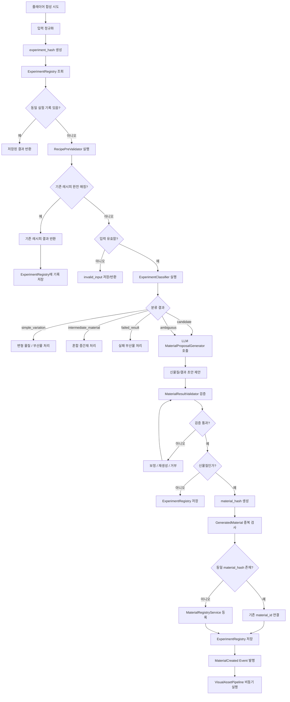

# 신물질 생성 Agent 최종 기획서

## 1. 개요

**신물질 생성 Agent**는 플레이어가 기존 Recipe Table에 없는 조합, 장비, 수량, 공정 조건으로 실험을 시도했을 때, 해당 조합을 분석하여 다음 중 하나의 결과를 반환하는 시스템이다.

- 기존 레시피 결과
- 기존 레시피 변형 결과
- 혼합 중간재
- 실패 부산물
- 미확인 물질
- 신규 물질
- 신규 물질의 아이콘/텍스처 생성 요청

이 시스템의 핵심은 **LLM이 모든 것을 최종 판단하지 않는 것**이다.  
LLM은 신물질 후보나 애매한 실험 결과에 대해 **의미 해석과 결과 초안 제안**을 담당한다.  
최종 확정은 코드 기반 Validator와 DB 상태를 기준으로 처리한다.

---

## 2. 핵심 결론

최종 구조는 다음과 같다.

```text
코드가 사실과 규칙을 판정한다.
LLM이 의미와 결과를 제안한다.
코드가 최종 검증하고 확정한다.
한번 판단한 실험 조합은 저장하고 다음 판단에 재사용한다.
```

즉 LLM은 최종 심판이 아니라 **실험 결과를 해석하는 기획자 역할**이다.

---

## 3. 전체 처리 흐름



---

## 4. Hash 설계

신물질 생성 시스템에서는 Hash를 2종류로 나눈다.

| Hash | 생성 시점 | 목적 |
|---|---|---|
| `experiment_hash` | 합성 시도 직후 | 같은 실험 조합을 다시 했는지 조회 |
| `material_hash` | 신물질 결과 확정 후 | 같은 신물질 결과가 이미 존재하는지 중복 검사 |

---

## 5. experiment_hash

`experiment_hash`는 **입력 조합의 식별자**이다.

목적:

```text
이 실험을 전에 해봤는가?
```

주의:

```text
experiment_hash 없음
= 처음 보는 실험

처음 보는 실험
≠ 신물질
```

즉 `experiment_hash`는 신물질 판정용이 아니라 **재현성/캐시/실험 기록 조회용**이다.

### 5.1 experiment_hash 생성 기준

정규화 대상:

- MachineType
- InputItem 목록
- InputQty
- 온도
- 압력
- 촉매
- 에너지 투입량
- 지역/환경 조건
- 장비 등급
- 연구 레벨 포함 여부는 정책에 따라 결정

예시:

```text
Smelter|copper_ingot:1|iron_ingot:1|temp:default|pressure:default|catalyst:none
```

입력 순서는 정렬한다.

```text
Smelter + iron_ingot x1 + copper_ingot x1
Smelter + copper_ingot x1 + iron_ingot x1
```

위 두 조합은 같은 `experiment_hash`를 가져야 한다.

---

## 6. material_hash

`material_hash`는 **확정된 신물질 결과의 식별자**이다.

목적:

```text
이 신물질 결과가 이미 존재하는가?
```

다른 실험 조합이 같은 물질을 만들 수 있으므로 `experiment_hash`와 별도로 필요하다.

예시:

```text
Synthesizer + iron_ingot + copper_ingot
→ iron_copper_alloy

Synthesizer + iron_powder + copper_powder
→ iron_copper_alloy
```

이 경우:

```text
experiment_hash는 다름
material_hash는 같을 수 있음
```

### 6.1 material_hash 생성 기준

정규화 대상:

- 물질 카테고리
- 주요 구성 원소/재료
- 핵심 속성
- 희귀도
- 위험성
- 활용처 핵심 태그
- 안정성 등급
- 물질 계열

예시:

```text
category:alloy
base:iron+copper
rarity:common
strength:6.5
conductivity:5.8
risk:oxidation
usage:wire,frame
```

---

## 7. Recipe Table 기준 판단 정책

현재 Recipe Table은 다음 컬럼을 기준으로 한다.

```text
RecipeName, MachineType,
InputItem1, InputQty1, InputItem2, InputQty2, InputItem3, InputQty3,
OutputItem1, OutputQty1, OutputItem2, OutputQty2,
CraftingTime
```

신물질 판단은 `OutputItem`에 없는지만 보고 결정하지 않는다.  
`InputItem`으로만 존재하는 원재료도 기존 아이템이기 때문이다.

### 7.1 known_items 구성

Recipe Table에서 모든 입력 아이템과 출력 아이템을 합쳐 기존 아이템 목록을 만든다.

```text
known_items = 모든 InputItem + 모든 OutputItem
```

예시:

| 분류 | 예시 |
|---|---|
| 입력 전용 원재료 | `iron_ore`, `wood`, `coal`, `sand`, `sulfur_ore` |
| 출력 생산물 | `iron_ingot`, `iron_powder`, `glass`, `charcoal`, `coal_dust` |
| 특수 아이템 | `ssr_ingot`, `ssr_ore`, `ssr_test`, `ssr_result`, `ssr_trash` |

### 7.2 Recipe Key 정규화

기존 레시피 완전 매칭은 다음 키를 기준으로 한다.

```text
MachineType + sorted(InputItem:InputQty)
```

예시:

```text
Smelter|iron_ore:2
Grinder|iron_ingot:1
Grinder|ssr_ingot:3|ssr_ore:2|ssr_test:1
```

이 키가 Recipe Table에 있으면 기존 레시피로 판단한다.

### 7.3 판단 우선순위

```text
1. experiment_hash 조회
2. 기존 레시피 완전 매칭
3. 미등록 아이템 검사
4. 기존 레시피 유사도 검사
5. 장비별 실험 분류
6. 후보/애매한 조합만 LLM 호출
7. Validator 검증
8. material_hash 중복 검사
9. DB 저장
```

장비 정책상 합금/복합재/신물질 후보 판단은 주로 `Synthesizer`에서 발생한다.  
`Smelter`와 `Grinder`는 기존 Recipe Table 기반의 기초 가공 또는 중간재 생성에 집중한다.


---

## 8. LLM 사용 정책

LLM을 완전히 배제하면 창의적 실험 해석이 약해진다.  
반대로 LLM에게 최종 판정권을 주면 기존 레시피와 밸런스가 흔들린다.

따라서 LLM은 **MaterialProposalGenerator**로 사용한다.

### 8.1 LLM이 하면 안 되는 일

| 항목 | 이유 |
|---|---|
| 기존 레시피 완전 매칭 | 코드가 100% 정확함 |
| known_items 검사 | DB/테이블 검사가 정확함 |
| MachineType 존재 여부 | 코드 검증 대상 |
| InputQty 유효성 | 코드 검증 대상 |
| 기존 출력 반환 | 레시피 테이블 기준 |
| DB 저장 여부 최종 결정 | Validator/Service 책임 |
| 밸런스 최종 승인 | 코드 기반 검증 필요 |

### 8.2 LLM이 잘하는 일

| 항목 | 설명 |
|---|---|
| 실험 조합 의미 해석 | 이 조합이 어떤 성격인지 해석 |
| 신물질 이름 생성 | 세계관에 맞는 이름 생성 |
| 물질 설명 생성 | 발견 배경, 외형, 특징 작성 |
| 속성 초안 생성 | 강도, 전도성, 안정성 등 |
| 위험성 제안 | 폭발성, 산화, 불안정성 등 |
| 활용처 후보 생성 | 제작, 발전, 운송, 연구 등 |
| 후속 레시피 후보 제안 | 이후 공정 활용 후보 |
| visual_prompt 생성 | 아이콘/텍스처 생성 프롬프트 |

### 8.3 LLM 호출 조건

LLM은 모든 실험에 호출하지 않는다.

| 분류 | LLM 호출 |
|---|---|
| `existing_recipe` | 안 함 |
| `invalid_input` | 안 함 |
| `simple_variation` | 보통 안 함 |
| `intermediate_material` | 선택 |
| `failed_result` | 보통 안 함 |
| `candidate` | 호출 |
| `ambiguous` | 호출 |

---

## 9. Agent / Service 구성

```text
MaterialCreationAgent
 ├─ ExperimentRegistryService
 ├─ RecipePreValidator
 ├─ ExperimentClassifier
 ├─ ExperimentSimilarityService
 ├─ LLM MaterialProposalGenerator
 ├─ MaterialResultValidator
 ├─ MaterialRegistryService
 ├─ MaterialEventPublisher
 └─ VisualAssetPipeline
```

---

## 10. 구성요소별 역할

### 10.1 MaterialCreationAgent

전체 흐름을 조율하는 Orchestrator이다.

역할:

- 합성 시도 수신
- 입력 정규화 요청
- experiment_hash 생성 요청
- 기존 실험 기록 조회 요청
- RecipePreValidator 실행
- ExperimentClassifier 실행
- LLM 호출 여부 결정
- Validator 실행
- Registry 저장 요청
- 이벤트 발행 요청

직접 하지 않는 일:

- LLM 프롬프트 세부 생성
- DB 직접 insert/update
- 아이콘/텍스처 직접 생성
- Asset Storage 직접 접근

### 10.2 ExperimentRegistryService

실험 조합과 결과를 저장/조회한다.

역할:

- `experiment_hash` 조회
- 동일 실험 결과 반환
- 실패 실험 저장
- 기존 레시피 실험 기록 저장
- 신물질 생성 실험 저장
- 유사 실험 조회를 위한 인덱스 제공

중요 정책:

- 성공 결과뿐 아니라 실패 결과도 저장한다.
- 동일 조합은 저장된 결과를 우선 반환한다.
- LLM 재호출을 줄이고 재현성을 보장한다.

### 10.3 RecipePreValidator

Recipe Table 기반으로 결정적 검증을 수행한다.

역할:

- Recipe Key 생성
- 기존 레시피 완전 매칭 검사
- MachineType 존재 여부 검사
- InputItem 존재 여부 검사
- InputQty 유효성 검사
- known_items 구성

### 10.4 ExperimentClassifier

기존 레시피가 아닌 실험을 1차 분류한다.

| classification | 설명 |
|---|---|
| `simple_variation` | 기존 레시피의 수량 부족/초과 등 단순 변형 |
| `intermediate_material` | 혼합 분말 등 중간재 |
| `failed_result` | 실패 부산물 |
| `candidate` | 신물질 후보 |
| `ambiguous` | 코드만으로 애매한 조합 |

### 10.5 ExperimentSimilarityService

기존 실험 기록과 유사한 조합을 조회한다.

역할:

- 같은 MachineType 실험 조회
- 같은 주재료 계열 실험 조회
- 수량만 다른 실험 조회
- 기존 신물질의 파생 후보 탐색
- LLM 호출 시 참고 컨텍스트 제공

예시:

```text
기존 기록:
Synthesizer + iron_ingot + copper_ingot
→ iron_copper_alloy

새 조합:
Synthesizer + iron_powder + copper_powder

판단 참고:
기존 iron_copper_alloy의 분말 기반 변형 후보
```

### 10.6 LLM MaterialProposalGenerator

후보 또는 애매한 실험 결과에 대해 물질 결과 초안을 제안한다.

입력:

- 실험 조합
- RecipePreValidator 결과
- ExperimentClassifier 결과
- 유사 실험 기록
- 기존 Recipe Table 일부
- 플레이어 진행도
- 세계관 톤
- 밸런스 가이드

출력 예시:

```json
{
  "proposal_type": "new_material",
  "confidence": 0.82,
  "reason": "Synthesizer에서 철과 구리 ingot을 조합하는 합성 공정이므로 합금 물질로 보는 것이 자연스럽다.",
  "result": {
    "id_hint": "iron_copper_alloy",
    "name": "철동 합금",
    "category": "alloy",
    "rarity": "common",
    "description": "철의 강도와 구리의 전도성을 함께 가진 기본 합금.",
    "properties": {
      "strength": 6.5,
      "conductivity": 5.8,
      "stability": 7.2,
      "reactivity": 2.1
    },
    "risks": ["oxidation"],
    "usage": ["초급 전선", "내구성 프레임"],
    "next_recipe_candidates": ["reinforced_wire", "conductive_frame"],
    "visual_prompt": "iron copper alloy ingot, reddish brown metal, sci-fi factory item icon"
  }
}
```

### 10.7 MaterialResultValidator

LLM 결과 또는 분류 결과를 최종 검증한다.

역할:

- JSON Schema 검증
- decision enum 검증
- 기존 물질명 중복 검사
- `material_hash` 중복 검사
- 희귀도/성능 검증
- 생산 난이도 검증
- 위험성 검증
- 금지 결과 필터링
- 후속 레시피 과다 생성 제한
- 필요 시 보정 또는 재생성 요청

### 10.8 MaterialRegistryService

검증된 신물질을 DB에 등록한다.

역할:

- material_id 생성
- material_hash 생성/저장
- 신물질 정보 저장
- 생성 조건 연결
- discovery log 저장
- 도감 등록
- visual_status 초기화

초기 상태:

```text
generation_status = created
visual_status = pending
```

### 10.9 MaterialEventPublisher

신물질 생성 이후 후처리 이벤트를 발행한다.

발행 이벤트:

```text
MaterialCreated
```

구독 가능 시스템:

- VisualAssetPipeline
- QuestGenerationAgent
- ResearchSystem
- MarketSystem
- FactoryOptimizationAgent
- MaterialEncyclopediaSystem

### 10.10 VisualAssetPipeline

신물질의 아이콘, 2D 텍스처, 썸네일을 생성한다.

중요 정책:

- 신물질 생성 이후 비동기로 실행한다.
- 텍스처 생성 실패는 신물질 생성 실패가 아니다.
- 실패 시 기본 카테고리 아이콘을 사용한다.
- 완료 후 `visual_asset_key`, `texture_asset_key`, `thumbnail_asset_key`를 업데이트한다.

---

## 11. 장비별 판단 정책

합금, 복합재, 신물질 생성은 `Smelter`가 아니라 `Synthesizer`에서 수행한다.

`Smelter`는 기초 열처리 장비로 제한한다.  
`Grinder`는 재료를 분말화하여 `Synthesizer`에 투입 가능한 중간재를 만드는 역할이다.  
`Synthesizer`는 2개 이상의 재료를 조합하여 합금, 복합재, 신물질을 생성하는 핵심 장비이다.

| MachineType | 기본 역할 | 신물질 생성 적합도 | 정책 |
|---|---|---:|---|
| `Smelter` | 광석 제련, 유리 제작, 탄화 | 낮음 | 기존 Recipe Table 기반의 기초 열처리만 수행 |
| `Grinder` | 분쇄, 가루화 | 낮음 | 분말/가루/혼합 중간재 생성 |
| `Synthesizer` | 합성, 조합, 안정화 | 매우 높음 | 합금, 복합재, 신물질 생성 담당 |
| 특수 합성 장비 | 고급 합성/실험 | 높음 | 후반부 희귀 신물질 생성 |

중요 정책:

```text
기존 Recipe Table에 없는 2개 이상의 재료 조합이더라도
MachineType이 Synthesizer가 아니면 신물질 후보로 바로 판단하지 않는다.
```

추천 공정 흐름:

```text
iron_ore
→ Smelter
→ iron_ingot
→ Grinder
→ iron_powder
→ Synthesizer
→ iron_copper_alloy
```

장비별 예시:

| 입력 | 처리 |
|---|---|
| `Smelter + iron_ore x2` | 기존 제련 레시피 |
| `Smelter + iron_ingot x1 + copper_ingot x1` | 장비 부적합 / 실패 / 실험 불가 |
| `Grinder + iron_ingot x1` | `iron_powder` 생성 |
| `Grinder + iron_ingot x1 + copper_ingot x1` | 혼합 금속 분말 또는 실패 |
| `Synthesizer + iron_ingot x1 + copper_ingot x1` | 합금 신물질 후보 |
| `Synthesizer + iron_powder x1 + copper_powder x1` | 합금/복합재 신물질 후보 |
| `Synthesizer + glass x1 + copper_powder x1` | 전도성 유리 후보 |

---

## 12. 예시 판단

| 입력 | 판단 | 결과 |
|---|---|---|
| `Smelter + iron_ore x2` | 기존 레시피 | `iron_ingot x1` |
| `Smelter + iron_ore x1` | 단순 변형 | 불완전 제련물/실패 |
| `Smelter + iron_ingot x1 + copper_ingot x1` | 장비 부적합 | 합금 생성 불가 / 실패 |
| `Grinder + iron_ingot x1` | 기존 레시피 | `iron_powder x2` |
| `Grinder + iron_ingot x1 + copper_ingot x1` | 중간재 또는 실패 | 혼합 금속 분말 |
| `Synthesizer + iron_ingot x1 + copper_ingot x1` | 신물질 후보 | 철동 합금 후보 |
| `Synthesizer + iron_powder x1 + copper_powder x1` | 신물질 후보 | 분말 기반 철동 합금 후보 |
| `Synthesizer + glass x1 + copper_powder x1` | 신물질 후보 | 전도성 유리 후보 |
| `Grinder + ssr_ingot x3 + ssr_ore x2 + ssr_test x1` | 기존 레시피 | `ssr_result + ssr_trash` |
| `Synthesizer + ssr_result x1 + titanium_powder x1` | 애매한 실험 | LLM 제안 후 검증 |

---

## 13. DB 설계

### 13.1 generated_experiments

실험 조합과 결과를 저장한다.

```sql
CREATE TABLE generated_experiments (
    id TEXT PRIMARY KEY,
    experiment_hash TEXT UNIQUE NOT NULL,

    machine_type TEXT NOT NULL,
    inputs_json TEXT NOT NULL,
    normalized_inputs_json TEXT NOT NULL,
    process_conditions_json TEXT,

    classification TEXT NOT NULL,
    result_type TEXT NOT NULL,

    material_id TEXT,
    output_items_json TEXT,
    failure_reason TEXT,

    similar_experiments_json TEXT,

    llm_used BOOLEAN DEFAULT FALSE,
    llm_prompt_hash TEXT,
    llm_model TEXT,
    llm_confidence REAL,

    created_by TEXT,
    created_at DATETIME DEFAULT CURRENT_TIMESTAMP,
    updated_at DATETIME DEFAULT CURRENT_TIMESTAMP
);
```

### 13.2 generated_materials

확정된 신물질 정보를 저장한다.

```sql
CREATE TABLE generated_materials (
    id TEXT PRIMARY KEY,
    material_hash TEXT UNIQUE NOT NULL,

    name TEXT NOT NULL,
    category TEXT NOT NULL,
    rarity TEXT NOT NULL,
    description TEXT,

    properties_json TEXT NOT NULL,
    risks_json TEXT,
    usage_json TEXT,
    recipe_candidates_json TEXT,

    source_experiment_hash TEXT,
    generation_status TEXT DEFAULT 'created',

    visual_status TEXT DEFAULT 'pending',
    visual_prompt TEXT,
    visual_asset_key TEXT,
    texture_asset_key TEXT,
    thumbnail_asset_key TEXT,
    fallback_icon TEXT,
    visual_error TEXT,

    balance_score REAL,
    is_approved BOOLEAN DEFAULT FALSE,

    created_at DATETIME DEFAULT CURRENT_TIMESTAMP,
    updated_at DATETIME DEFAULT CURRENT_TIMESTAMP
);
```

### 13.3 generated_material_discoveries

플레이어별 발견 이력을 저장한다.

```sql
CREATE TABLE generated_material_discoveries (
    id TEXT PRIMARY KEY,
    material_id TEXT NOT NULL,
    player_id TEXT NOT NULL,
    experiment_hash TEXT NOT NULL,
    discovered_at DATETIME DEFAULT CURRENT_TIMESTAMP
);
```

---

## 14. API 예시

### 14.1 합성 시도 요청

```http
POST /experiments/material-creation
```

```json
{
  "machine_type": "Synthesizer",
  "inputs": [
    {
      "item_id": "iron_ingot",
      "qty": 1
    },
    {
      "item_id": "copper_ingot",
      "qty": 1
    }
  ],
  "process_conditions": {
    "temperature": "default",
    "pressure": "default",
    "catalyst": null
  },
  "player_id": "player_001",
  "generate_visual_asset": true
}
```

### 14.2 기존 레시피 응답

```json
{
  "result_type": "existing_recipe",
  "experiment_hash": "exp_...",
  "recipe_name": "Smelt_Iron",
  "outputs": [
    {
      "item_id": "iron_ingot",
      "qty": 1
    }
  ]
}
```

### 14.3 신물질 생성 응답

```json
{
  "result_type": "new_material",
  "experiment_hash": "exp_...",
  "material_id": "mat_iron_copper_alloy",
  "material_hash": "mat_hash_...",
  "name": "철동 합금",
  "rarity": "common",
  "generation_status": "created",
  "visual_status": "pending",
  "fallback_icon": "materials/default/alloy.png",
  "message": "새로운 물질이 발견되었습니다. 아이콘과 텍스처는 생성 중입니다."
}
```

### 14.4 저장된 실험 재사용 응답

```json
{
  "result_type": "cached_experiment",
  "experiment_hash": "exp_...",
  "cached": true,
  "material_id": "mat_iron_copper_alloy",
  "name": "철동 합금"
}
```

### 14.5 시각 리소스 상태 조회

```http
GET /materials/{material_id}/visual-status
```

```json
{
  "material_id": "mat_iron_copper_alloy",
  "visual_status": "visual_ready",
  "visual_asset_key": "materials/iron_copper_alloy/icon.png",
  "texture_asset_key": "materials/iron_copper_alloy/texture.png",
  "thumbnail_asset_key": "materials/iron_copper_alloy/thumbnail.png"
}
```

---

## 15. Rule / LLM / Validator 역할 분리

| 단계 | 담당 | 설명 |
|---|---|---|
| 입력 정규화 | 코드 | 입력 순서/수량/조건 정규화 |
| experiment_hash 생성 | 코드 | 실험 기록 조회용 |
| 기존 실험 조회 | 코드 | 동일 조합 재사용 |
| 기존 레시피 매칭 | 코드 | Recipe Table 기준 |
| known_items 검사 | 코드 | 미등록 아이템 차단 |
| 실험 분류 | 코드 + 일부 룰 | 변형/중간재/후보/애매함 |
| 의미 해석 | LLM | 후보 조합 해석 |
| 결과 초안 생성 | LLM | 이름/설명/속성/위험성 |
| 결과 검증 | 코드 | Schema, 중복, 밸런스 |
| material_hash 생성 | 코드 | 신물질 중복 방지 |
| DB 저장 | 코드 | 실험/물질 기록 저장 |
| 텍스처 생성 | 이미지 파이프라인 | 비동기 후처리 |

---

## 16. MVP 범위

### MVP 포함

- Recipe Table 로딩
- known_items 구성
- Recipe Key 정규화
- experiment_hash 생성
- ExperimentRegistry 조회/저장
- 기존 레시피 완전 매칭
- 미등록 아이템 검사
- ExperimentClassifier 1차 분류
- 후보/애매한 조합에만 LLM 호출
- LLM 결과 JSON Schema 검증
- MaterialResultValidator
- material_hash 생성
- generated_materials 저장
- generated_experiments 저장
- MaterialCreated Event 발행
- VisualAssetPipeline 비동기 실행
- 텍스처 생성 실패 시 기본 아이콘 적용

### MVP 제외

- 복잡한 화학 시뮬레이션
- 완전 자동 후속 레시피 밸런싱
- 자동 3D 모델 생성
- 전역 멀티플레이 신물질 공유
- 실시간 경제 가격 자동 조정
- 이미지 품질 평가 Agent
- 신물질 기반 연구 트리 자동 확장

---

## 17. 밸런스 정책

- 기존 레시피는 LLM이 변경할 수 없다.
- 같은 `experiment_hash`는 저장된 결과를 우선 반환한다.
- 같은 `material_hash`는 중복 신물질로 등록하지 않는다.
- LLM 결과는 반드시 Validator를 통과해야 한다.
- 신물질 성능은 희귀도, 위험성, 생산 난이도와 함께 조정한다.
- 후속 레시피는 확정이 아니라 후보 상태로 저장한다.
- 텍스처 생성 실패는 신물질 생성 실패로 처리하지 않는다.
- 실패한 실험도 기록으로 남겨 이후 판단에 활용한다.

---

## 18. 최종 요약

```text
experiment_hash는 실험 조합 기록용이다.
material_hash는 신물질 결과 중복 방지용이다.

hash 조회 실패는 신물질이라는 뜻이 아니다.
처음 보는 실험이라는 뜻일 뿐이다.

기존 레시피와 입력 유효성은 코드가 판단한다.
신물질 후보의 의미 해석과 결과 초안은 LLM이 제안한다.
최종 확정은 Validator와 DB 상태가 결정한다.

한번 만들어낸 조합은 반드시 저장하고,
다음 실험 판단에서 동일/유사 조합의 참고 자료로 사용한다.
```

---

## 19. 한 줄 정리

**신물질 생성 Agent는 실험 조합을 기록하고 재사용하면서, 코드 기반 검증과 LLM 기반 해석을 조합해 새로운 물질을 안전하게 생성·검증·등록하는 동적 콘텐츠 생성 시스템이다.**
