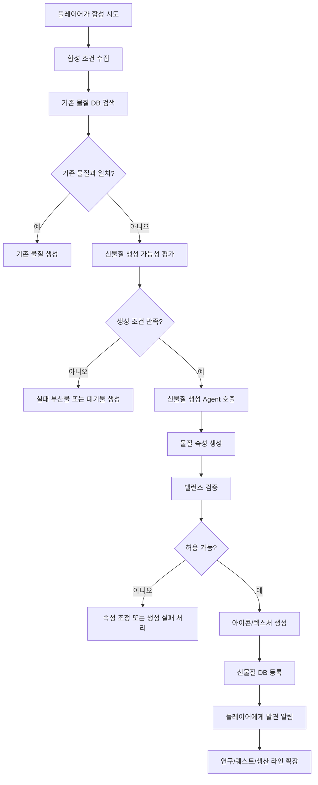
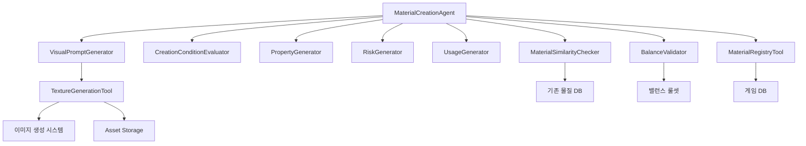
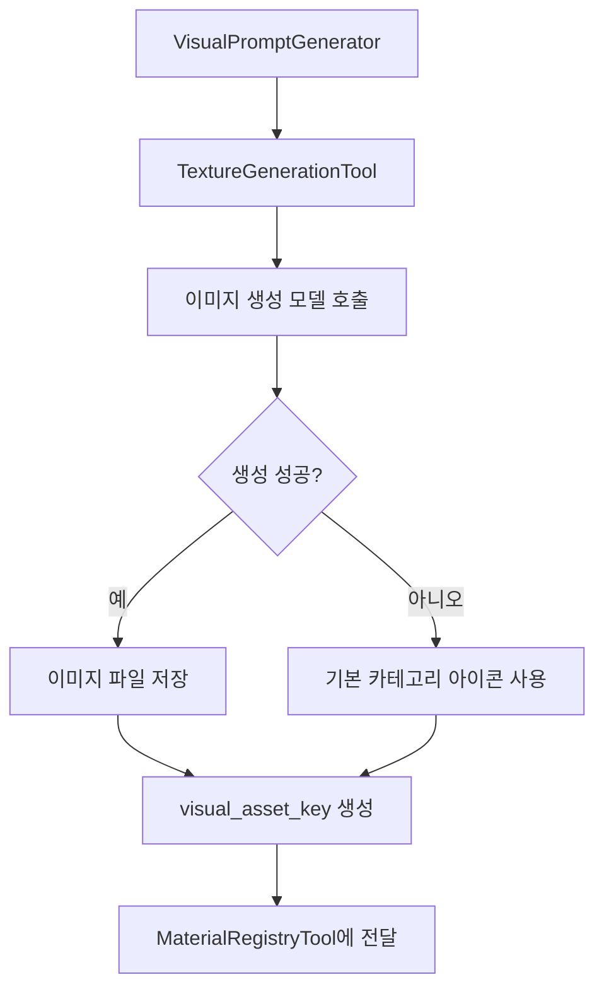

# 신물질 생성 Agent 기획서

## 1. 개요

**신물질 생성 Agent**는 플레이어가 기존 게임 내에 존재하지 않는 조합, 공정, 환경 조건을 통해 새로운 물질을 합성했을 때, 해당 결과를 분석하여 **신규 물질을 자동 생성**하는 AI Agent이다.

이 Agent는 단순히 이름만 붙이는 기능이 아니라, 합성 조건을 기반으로 물질의 성질, 용도, 희귀도, 위험성, 생산 난이도, 후속 공정 활용처, 아이콘/텍스처 리소스까지 생성하여 게임 내 확장성과 탐험성을 강화한다.

---

## 2. 기획 의도

공장 자동화 게임에서 플레이어는 보통 정해진 레시피와 자원을 따라 생산 라인을 구축한다.  
하지만 신물질 생성 Agent를 도입하면 플레이어가 실험적인 조합을 시도했을 때 예상하지 못한 결과물이 등장할 수 있다.

이를 통해 다음과 같은 재미를 제공한다.

- 정해진 공정만 따르는 것이 아닌 **실험 중심 플레이**
- 플레이어마다 다른 결과물을 발견하는 **개인화된 탐험 경험**
- 신물질을 활용한 **새로운 생산 루프와 전략**
- 희귀 물질 발견을 통한 **성취감과 수집 욕구**
- 퀘스트, 연구, 거래, 장비 제작으로 이어지는 **콘텐츠 확장성**
- 신물질마다 다른 아이콘/텍스처를 제공하는 **시각적 발견 경험**

---

## 3. 핵심 역할

신물질 생성 Agent는 다음 역할을 수행한다.

### 3.1 신규 합성 결과 판단

플레이어가 특정 재료와 공정을 조합했을 때, 기존 데이터베이스에 등록된 물질인지 확인한다.

기존 물질과 일치하지 않는 경우, Agent는 해당 조합이 신물질 생성 조건을 만족하는지 판단한다.

판단 기준 예시는 다음과 같다.

- 입력 재료 조합
- 사용한 가공 장비
- 온도, 압력, 에너지 투입량
- 반응 시간
- 촉매 사용 여부
- 행성/지역 환경 조건
- 기존 물질과의 유사도
- 게임 밸런스상 허용 가능 여부

---

### 3.2 신물질 정보 생성

신규 물질로 판단되면 Agent는 다음 정보를 생성한다.

| 항목 | 설명 |
|---|---|
| 물질명 | 게임 세계관에 맞는 신규 물질 이름 |
| 분류 | 금속, 합금, 결정체, 액체, 기체, 유기물, 에너지 물질 등 |
| 설명 | 물질의 외형, 특징, 발견 배경 |
| 주요 성질 | 강도, 전도성, 반응성, 안정성, 밀도 등 |
| 위험성 | 폭발성, 독성, 부식성, 방사성, 불안정성 등 |
| 희귀도 | 일반, 희귀, 고급, 특수, 전설 등 |
| 생산 난이도 | 낮음, 보통, 높음, 실험적 |
| 활용처 | 장비 제작, 발전, 고급 부품, 연구, 거래 등 |
| 후속 레시피 후보 | 이후 공정에서 활용 가능한 조합 |
| 아이콘/텍스처 키워드 | 시각 리소스 생성을 위한 프롬프트 정보 |
| visual_asset_key | 생성된 아이콘 또는 텍스처 리소스 참조 키 |

---

## 4. 동작 흐름



---

## 5. 입력 데이터

신물질 생성 Agent는 다음 데이터를 입력으로 받는다.

```json
{
  "input_materials": [
    {
      "material_id": "iron_ore",
      "amount": 10
    },
    {
      "material_id": "helium_crystal",
      "amount": 2
    }
  ],
  "machine_type": "high_pressure_synthesizer",
  "process_type": "compression_synthesis",
  "temperature": 850,
  "pressure": 320,
  "energy_input": 500,
  "catalyst": "plasma_seed",
  "planet_environment": {
    "gravity": "low",
    "magnetic_storm": true,
    "atmosphere": "helium_rich"
  },
  "player_progress": {
    "research_level": 4,
    "unlocked_categories": ["alloy", "crystal", "energy_material"]
  }
}
```

---

## 6. 출력 데이터

Agent는 생성 결과를 다음 형태로 반환한다.

```json
{
  "result_type": "new_material",
  "material": {
    "id": "storm_helium_alloy",
    "name": "스톰 헬륨 합금",
    "category": "energy_alloy",
    "rarity": "rare",
    "description": "자기장 폭풍 환경에서 고압 합성된 헬륨 결정 기반 합금. 높은 에너지 전도율을 가지지만 불안정한 진동 특성을 가진다.",
    "properties": {
      "density": 3.4,
      "conductivity": 8.7,
      "stability": 5.2,
      "reactivity": 6.8,
      "heat_resistance": 7.5
    },
    "risks": ["magnetic_instability", "overheat_reaction"],
    "usage": [
      "고효율 발전기 코어",
      "자기장 차폐 장치",
      "고급 운송 드론 부품"
    ],
    "next_recipe_candidates": [
      "storm_core",
      "magnetic_shield_plate",
      "helium_drive_module"
    ],
    "visual_prompt": "blue silver alloy, glowing helium veins, unstable magnetic aura, sci-fi factory material icon",
    "visual_asset_key": "materials/storm_helium_alloy/icon.png",
    "texture_asset_key": "materials/storm_helium_alloy/texture.png"
  }
}
```

---

## 7. 주요 기능

### 7.1 기존 물질 유사도 검사

새로운 조합이 들어왔을 때 기존 물질과 너무 유사하면 신물질로 등록하지 않는다.

예를 들어 다음과 같은 경우는 기존 물질 변형으로 처리한다.

- 입력 재료가 거의 동일함
- 공정 조건 차이가 미미함
- 기존 물질의 하위 등급으로 볼 수 있음
- 게임 밸런스상 별도 물질로 분리할 필요가 없음

---

### 7.2 신물질 생성 확률 계산

모든 실패 조합이 신물질이 되면 게임 밸런스가 무너질 수 있다.  
따라서 Agent는 조건에 따라 신물질 생성 확률을 계산한다.

영향 요소:

- 희귀 재료 사용 여부
- 특수 장비 사용 여부
- 고온/고압 등 극한 조건 여부
- 플레이어 연구 레벨
- 행성 고유 환경
- 촉매 사용 여부
- 이미 발견한 신물질 수

---

### 7.3 물질 속성 자동 생성

Agent는 합성 조건을 바탕으로 물질 속성을 생성한다.

예시:

- 고온 공정 → 내열성 증가
- 고압 공정 → 밀도 증가
- 전기 에너지 과다 투입 → 전도성 증가, 안정성 감소
- 헬륨 환경 → 경량화, 에너지 반응성 증가
- 자기장 폭풍 환경 → 자기장 관련 특성 부여

---

### 7.4 밸런스 검증

생성된 물질은 바로 확정되지 않고 밸런스 검증 단계를 거친다.

검증 항목:

- 기존 물질보다 지나치게 강력하지 않은가?
- 초반 플레이에서 고급 자원 대체재가 되지 않는가?
- 생산 난이도와 성능이 적절한가?
- 위험성 또는 유지 비용이 충분히 부여되었는가?
- 후속 레시피가 과도하게 많지 않은가?
- 생성된 아이콘/텍스처가 물질 성격과 맞는가?

---

### 7.5 아이콘/텍스처 생성

신물질이 확정되면 Agent는 물질의 성질과 외형 설명을 바탕으로 아이콘 또는 2D 텍스처를 생성한다.

생성 대상:

| 대상 | 설명 |
|---|---|
| Material Icon | 인벤토리, 도감, 알림 UI에서 사용하는 대표 아이콘 |
| 2D Texture | 신물질 표면 느낌을 표현하는 기본 텍스처 |
| Thumbnail | 연구소, 거래소, 퀘스트 UI에서 사용하는 축소 이미지 |

생성 규칙:

- 금속 계열: 광택, 스크래치, 결정 입자 표현
- 결정 계열: 투명도, 발광, 균열, 결정면 표현
- 액체 계열: 점성, 흐름, 반사 표현
- 기체/에너지 계열: 입자, 오라, 발광 효과 표현
- 위험 물질: 경고 색상, 불안정한 패턴, 균열 표현

---

### 7.6 게임 DB 등록

검증을 통과한 신물질은 게임 DB에 등록된다.

등록 항목:

- material_id
- name
- category
- rarity
- description
- properties
- risks
- recipe_source
- discovered_by
- discovered_at
- visual_asset_key
- texture_asset_key
- thumbnail_asset_key
- usage_candidates
- balance_score

---

## 8. 플레이어 경험

플레이어가 신물질을 발견하면 다음과 같은 연출을 제공한다.

### 발견 알림

> 새로운 물질이 발견되었습니다.  
> **스톰 헬륨 합금**  
> 자기장 폭풍 속에서 생성된 불안정한 고효율 에너지 합금입니다.

### 선택지

- 연구소에 등록
- 임시 보관
- 생산 라인에 적용
- 거래소에 샘플 판매
- 추가 실험 진행

---

## 9. 게임 시스템 연계

### 9.1 연구 시스템

신물질은 즉시 완전히 활용되지 않고 연구를 통해 용도를 해금할 수 있다.

예시:

- 1단계: 물질 분석
- 2단계: 안정화 연구
- 3단계: 부품 제작 가능
- 4단계: 고급 장비 레시피 해금

---

### 9.2 퀘스트 시스템

신물질 발견은 퀘스트 생성 Agent와 연계된다.

예시 퀘스트:

- 신물질 샘플 10개 생산
- 신물질 안정성 테스트
- 신물질을 활용한 발전기 제작
- 특정 NPC 세력에 납품
- 위험 반응 사고 해결

---

### 9.3 공정 최적화 Agent

신물질이 등록되면 공정 최적화 Agent는 해당 물질의 생산 라인을 분석한다.

분석 항목:

- 병목 공정
- 에너지 소모량
- 부산물 처리
- 장비 배치 최적화
- 생산량 대비 위험도

---

### 9.4 거래 시스템

희귀 신물질은 거래소에서 높은 가치를 가질 수 있다.

가격 결정 요소:

- 희귀도
- 생산 난이도
- 위험성
- 세력 선호도
- 현재 수요
- 대체재 존재 여부

---

## 10. 실패 결과

신물질 생성 조건을 만족하지 못하면 다음 결과 중 하나가 발생한다.

| 결과 | 설명 |
|---|---|
| 폐기물 | 활용 가치가 낮은 부산물 |
| 불안정 물질 | 보관 위험이 있는 실패 생성물 |
| 폭발/사고 | 장비 손상 또는 생산 라인 정지 |
| 기존 물질 | 이미 존재하는 물질이 생성됨 |
| 데이터 부족 | 연구 레벨 부족으로 분석 실패 |
| 텍스처 생성 실패 | 기본 카테고리 아이콘으로 대체 |

실패도 단순 패널티가 아니라 다음 실험을 위한 힌트로 활용한다.

예시:

> 반응은 실패했지만, 높은 압력 조건에서 결정 구조가 일시적으로 안정화되는 현상이 관측되었습니다.

---

## 11. Agent 내부 구성



---

## 12. Agent 세부 모듈

### 12.1 MaterialSimilarityChecker

기존 물질과의 유사도를 검사한다.

역할:

- 재료 조합 비교
- 속성 유사도 비교
- 카테고리 유사도 비교
- 이름 중복 방지
- 기존 물질의 변형인지 판단

---

### 12.2 CreationConditionEvaluator

신물질 생성 가능성을 평가한다.

역할:

- 합성 조건 점수화
- 연구 레벨 검증
- 환경 조건 반영
- 촉매 효과 반영
- 실패/성공 확률 계산

---

### 12.3 PropertyGenerator

신물질의 핵심 성질을 생성한다.

역할:

- 물리 속성 생성
- 화학적 반응성 생성
- 안정성 수치 생성
- 장비 활용 적합성 생성

---

### 12.4 RiskGenerator

위험 요소를 생성한다.

역할:

- 폭발성
- 독성
- 부식성
- 방사성
- 자기장 불안정성
- 고온 반응성

---

### 12.5 UsageGenerator

활용처를 생성한다.

역할:

- 제작 가능 부품 후보
- 발전/운송/방어/연구 활용처
- 후속 레시피 후보
- 퀘스트 연계 후보

---

### 12.6 BalanceValidator

생성 결과가 게임 밸런스를 해치지 않는지 검증한다.

역할:

- 희귀도 대비 성능 검증
- 생산 난이도 검증
- 기존 자원 대체 가능성 검토
- 초반/중반/후반 콘텐츠 영향 분석
- 생성 이미지의 과도한 품질 편차 검토

---

### 12.7 VisualPromptGenerator

신물질의 아이콘 또는 텍스처 생성을 위한 프롬프트를 만든다.

역할:

- 색상 키워드 생성
- 형태 키워드 생성
- 발광/금속/결정/액체 등 재질 키워드 생성
- UI 아이콘용 설명 생성
- 2D 텍스처용 설명 생성

---

### 12.8 TextureGenerationTool

신물질의 시각 표현을 위해 아이콘 또는 2D 텍스처 이미지를 생성한다.

역할:

- `visual_prompt`를 기반으로 이미지 생성 요청
- UI 아이콘용 정사각형 이미지 생성
- 재질 표현용 2D 텍스처 이미지 생성
- 생성된 이미지 파일 저장
- 게임 클라이언트에서 참조 가능한 `visual_asset_key` 발급
- 실패 시 기본 카테고리 아이콘으로 대체

생성 흐름:



출력 예시:

```json
{
  "visual_asset_key": "materials/storm_helium_alloy/icon.png",
  "texture_asset_key": "materials/storm_helium_alloy/texture.png",
  "thumbnail_asset_key": "materials/storm_helium_alloy/thumbnail.png",
  "generation_status": "success"
}
```

---

### 12.9 MaterialRegistryTool

검증이 완료된 신물질을 DB에 등록한다.

역할:

- material_id 생성
- 물질 정보 저장
- 발견 이력 저장
- 레시피 소스 저장
- 아이콘/텍스처 경로 저장
- 플레이어 도감 등록

---

## 13. 데이터 저장 구조 예시

```sql
CREATE TABLE generated_materials (
    id TEXT PRIMARY KEY,
    name TEXT NOT NULL,
    category TEXT NOT NULL,
    rarity TEXT NOT NULL,
    description TEXT,
    properties_json TEXT NOT NULL,
    risks_json TEXT,
    usage_json TEXT,
    recipe_source_json TEXT NOT NULL,
    visual_prompt TEXT,
    visual_asset_key TEXT,
    texture_asset_key TEXT,
    thumbnail_asset_key TEXT,
    discovered_by TEXT,
    discovered_at DATETIME DEFAULT CURRENT_TIMESTAMP,
    balance_score REAL,
    is_approved BOOLEAN DEFAULT FALSE
);
```

---

## 14. API 예시

### 요청

```http
POST /agents/material-generation
```

```json
{
  "input_materials": ["iron_ore", "helium_crystal"],
  "machine_type": "high_pressure_synthesizer",
  "process_conditions": {
    "temperature": 850,
    "pressure": 320,
    "energy_input": 500
  },
  "catalyst": "plasma_seed",
  "environment_id": "hermes_moon_storm_zone",
  "player_id": "player_001",
  "generate_texture": true
}
```

### 응답

```json
{
  "status": "created",
  "material_id": "storm_helium_alloy",
  "name": "스톰 헬륨 합금",
  "rarity": "rare",
  "visual_asset_key": "materials/storm_helium_alloy/icon.png",
  "texture_asset_key": "materials/storm_helium_alloy/texture.png",
  "message": "새로운 물질이 발견되었습니다."
}
```

---

## 15. 밸런스 정책

신물질 생성은 플레이어에게 강한 보상을 제공하지만, 무제한 생성되면 게임 시스템이 복잡해지고 밸런스가 무너질 수 있다.

따라서 다음 정책을 적용한다.

- 동일 조건 반복 시 같은 결과 생성
- 매우 유사한 조합은 기존 물질 변형으로 처리
- 플레이어 연구 레벨에 따라 생성 가능한 등급 제한
- 희귀 물질은 높은 생산 비용 또는 위험성 부여
- 자동 생성된 물질은 내부 검증 후 확정
- 서버 기준 seed를 사용하여 결과 재현성 보장
- 멀티플레이 환경에서는 전역 등록 여부를 별도 정책으로 결정
- 텍스처 생성 실패 시 신물질 생성 자체는 실패시키지 않고 기본 아이콘으로 대체
- 생성 이미지 품질이 낮을 경우 재생성 또는 카테고리 기본 리소스 사용

---

## 16. MVP 범위

초기 버전에서는 모든 기능을 구현하지 않고, 다음 범위까지만 구현한다.

### MVP 포함

- 기존 물질 DB 검색
- 신물질 생성 조건 평가
- 물질명/설명/분류/희귀도 생성
- 기본 속성 생성
- 위험성 1~2개 생성
- 활용처 후보 생성
- 신물질 아이콘/텍스처 생성 프롬프트 생성
- 아이콘 또는 2D 텍스처 이미지 생성 요청
- 생성된 텍스처 저장 및 `visual_asset_key` 연결
- DB 등록
- 플레이어 발견 알림

### MVP 제외

- 자동 3D 모델 생성
- 복잡한 화학 시뮬레이션
- 전역 멀티플레이 물질 공유
- 실시간 경제 가격 자동 조정
- 완전 자동 후속 레시피 밸런싱

---

## 17. 확장 방향

향후 다음 기능으로 확장할 수 있다.

- 신물질 기반 특수 장비 자동 생성
- 신물질 도감 시스템
- 세력별 신물질 선호도
- 신물질 거래 시장
- 위험 물질 사고 이벤트
- 플레이어 간 신물질 거래
- 행성별 고유 물질 생성
- 고급 신물질 텍스처 스타일 변형
- 연구 트리 자동 확장
- 퀘스트 생성 Agent와 자동 연계

---

## 18. 기대 효과

신물질 생성 Agent를 통해 플레이어는 단순히 정해진 생산 라인을 따라가는 것이 아니라, 직접 실험하고 발견하는 경험을 얻게 된다.

이는 공장 자동화 게임에 다음 가치를 더한다.

- 반복 생산 중심 게임에 탐험성과 발견 요소 추가
- 플레이어별 고유한 성장 경험 제공
- AI Agent 기반 동적 콘텐츠 생성
- 신물질별 고유 아이콘/텍스처를 통한 시각적 차별화
- 장기 플레이 동기 강화
- 연구, 퀘스트, 경제, 장비 제작 시스템과 자연스럽게 연결

---

## 19. 한 줄 요약

**신물질 생성 Agent는 플레이어의 실험적 합성 결과를 바탕으로 새로운 물질과 시각 리소스를 생성하고, 이를 게임의 연구·생산·퀘스트·경제 시스템으로 확장시키는 동적 콘텐츠 생성 Agent이다.**
