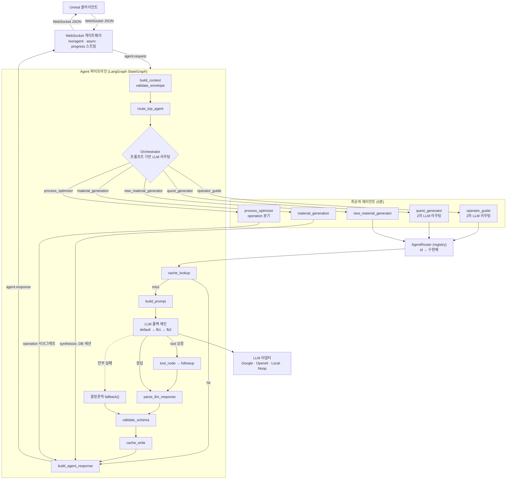
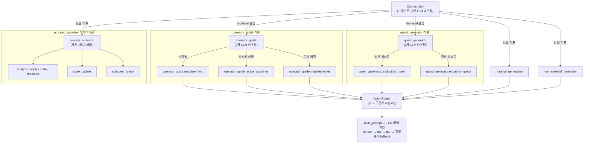
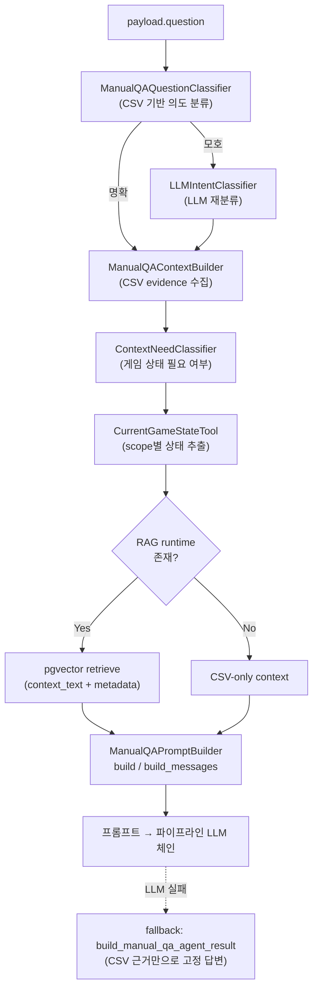
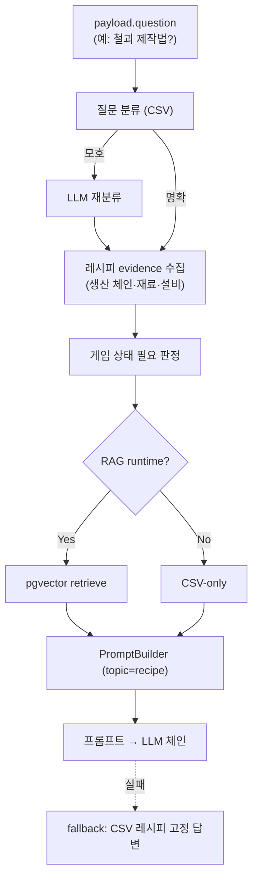
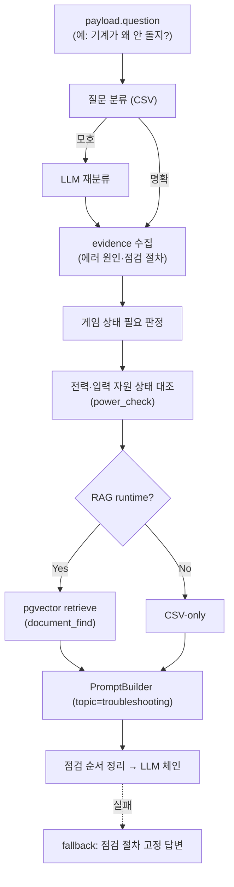
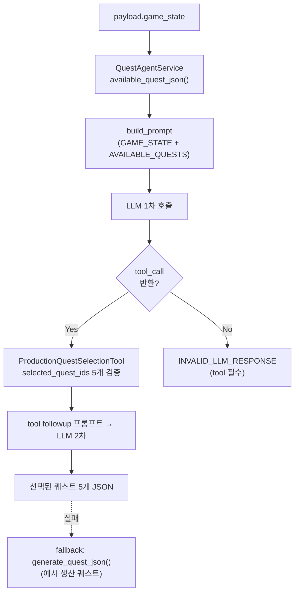
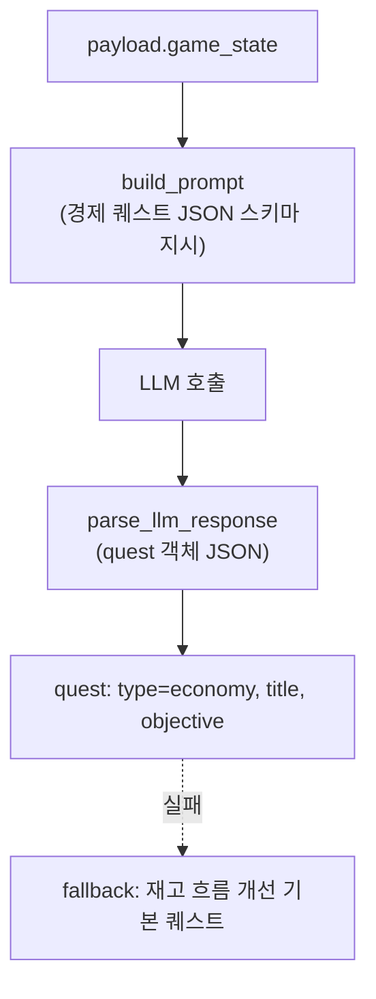
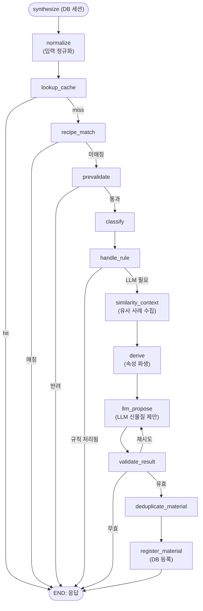
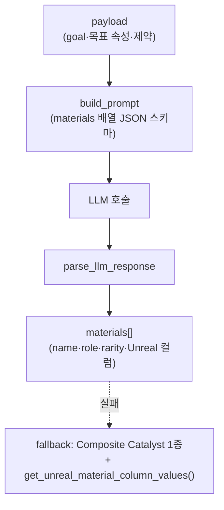

# AI Agent 아키텍처

Factory Space 백엔드의 AI Agent 실행 구조를 정리한 문서입니다. Unreal 클라이언트가 WebSocket으로 보낸 요청을 목적별 AI agent로 라우팅하고, 응답과 action을 다시 Unreal로 전달합니다.

- Source root: `backend/src`
- 핵심 원칙: agent/sub-agent 선택은 keyword/if-else가 아니라 **프롬프트 기반 LLM 결정** (`backend/AGENTS.md`)

---

## 1. 전체 아키텍처

### 흐름 요약

1. **전송** — Unreal이 WebSocket(`/ws/agent`)으로 `agent.request` 전송. 게이트웨이가 비동기 스레드로 파이프라인을 실행하고 `agent.progress`를 실시간 스트리밍.
2. **파이프라인** — LangGraph `StateGraph`가 `build_context → validate → route → cache → prompt → LLM → parse → validate → cache_write → response` 순으로 진행.
3. **2단계 라우팅** — Orchestrator가 LLM으로 최상위 5종 중 하나 선택 → `operator_guide`/`quest_generator`는 다시 2차 LLM 라우팅으로 리프 선택.
4. **탄력성** — 캐시 히트 시 LLM 생략, LLM은 3-슬롯 폴백 체인, 전부 실패 시 결정론적 `fallback()`으로 무중단.
5. **특수 경로** — `material_generation`은 LLM 체인 대신 DB 세션 기반 자체 서브그래프, `process_optimizer`는 operation별 자체 서브그래프로 직행.

### 주요 파일

| 계층 | 파일 |
|---|---|
| 게이트웨이 | `backend/src/websocket_gateway/gateway.py` |
| 파이프라인 | `backend/src/agents/pipeline/runtime.py`, `graph_edges.py` |
| 오케스트레이터 | `backend/src/agents/orchestrator.py`, `agent_catalog.py` |
| 라우터 | `backend/src/agents/router.py` |
| LLM 어댑터 | `backend/src/llm/adapter.py` |
| 공통 계약 | `backend/src/agents/base.py`, `backend/src/protocol/` |

---

## 2. 리프 라우팅 구조

- **2차 LLM 라우팅** — `operator_guide`(3개 리프), `quest_generator`(2개 리프)만 sub-agent를 다시 LLM으로 선택. payload에 `sub_agent`가 명시되면 생략.
- **단일 리프** — `material_generation`, `new_material_generator`는 top-level 결정 즉시 확정. `material_generation`은 `synthesize_material` 노드에서 DB 트랜잭션으로 직접 처리.
- **process_optimizer** — 리프 라우팅이 아니라 payload의 `operation` 값에 따라 분기 (`graph_edges.py`의 `route_process_optimizer`).
- **AgentRouter 등록 대상**은 리프 7종뿐 (`router.py`). `orchestrator`/`operator_guide`/`quest_generator`는 라우팅 전용이라 registry에 없음.

### 리프 클래스 매핑

| Leaf id | 클래스 | 파일 |
|---|---|---|
| `operator_guide.machine_help` | `MachineHelpAgent` | `operator_guide/machine_help.py` |
| `operator_guide.recipe_explainer` | `RecipeExplainerAgent` | `operator_guide/recipe_explainer.py` |
| `operator_guide.troubleshooter` | `TroubleshooterAgent` | `operator_guide/troubleshooter.py` |
| `quest_generator.production_quest` | `ProductionQuestAgent` | `quest_generator/production_quest.py` |
| `quest_generator.economy_quest` | `EconomyQuestAgent` | `quest_generator/economy_quest.py` |
| `material_generation` | `MaterialCreationAgent` | `material_generation/agent.py` |
| `new_material_generator` | `NewMaterialGeneratorAgent` | `new_material_generator.py` |

---

## 3. 리프 에이전트 개별 구조

operator_guide 계열 3종은 동일한 `ManualQAService` RAG 흐름을 `topic`만 바꿔 공유합니다.

### 3.1 `operator_guide.machine_help` — 장비 설명 (topic=machine)

> progress: `rag_search` → `state_check` → `logic_format`

### 3.2 `operator_guide.recipe_explainer` — 레시피 설명 (topic=recipe)

> progress: `rag_search` → `state_check` → `logic_format`

### 3.3 `operator_guide.troubleshooter` — 문제 해결 (topic=troubleshooting)

> progress(5단계): `rag_search` → `state_check` → `power_check` → `document_find` → `step_arrange` (다른 두 리프보다 진단 단계가 세분화됨)

### 3.4 `quest_generator.production_quest` — 생산 퀘스트 (tool 기반)

> 유일하게 `tools`를 가진 리프. 파이프라인이 tool 성공 호출을 강제 검증 (`runtime.py`).

### 3.5 `quest_generator.economy_quest` — 경제 퀘스트 (직접 생성)

> tool 없이 단일 LLM 호출로 JSON 직접 생성 (production_quest와 대비되는 단순 경로).

### 3.6 `material_generation` — 신물질 합성 (DB 서브그래프)

파이프라인 LLM 체인을 타지 않고 `synthesize()`가 자체 LangGraph(`material_subgraph`)를 DB 세션과 함께 실행합니다.

> 캐시 → 레시피 매칭 → 사전검증 → 분류 → 규칙 우선, 규칙으로 안 되면 LLM 제안 후 검증·중복제거·DB 등록. LLM은 마지막 수단.

### 3.7 `new_material_generator` — 신소재 후보 생성 (제약 기반)

> `material_generation`(구체 레시피→단일 합성, DB)와 달리 **구체 레시피 없이 제약만으로 후보 목록**을 LLM 생성. DB 미접근.

---

## 4. 리프별 아키텍처 유형 요약

| 리프 | 추론 방식 | 특징 |
|---|---|---|
| machine_help / recipe_explainer / troubleshooter | RAG + LLM | 공유 `ManualQAService`, `topic`만 상이. troubleshooter만 진단 progress 5단계 |
| production_quest | LLM + Tool | 유일한 tool 보유, tool 호출 강제 |
| economy_quest | LLM 단독 | JSON 직접 생성 |
| material_generation | Rule→LLM 하이브리드 + DB | 자체 서브그래프, LLM은 최후 수단 |
| new_material_generator | LLM 단독 | 제약 기반 후보 생성, DB 미접근 |

세 가지 추론 패턴(RAG / LLM / 규칙-하이브리드)이 동일한 `Agent` 계약(`build_prompt` / `fallback`) 뒤에 통일돼 있어, 파이프라인은 리프의 내부 방식을 몰라도 됩니다. 이것이 `backend/AGENTS.md`의 "추론 방식과 목적 분리" 원칙이 구현된 모습입니다.
