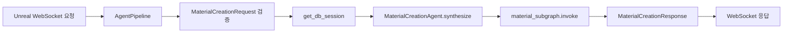
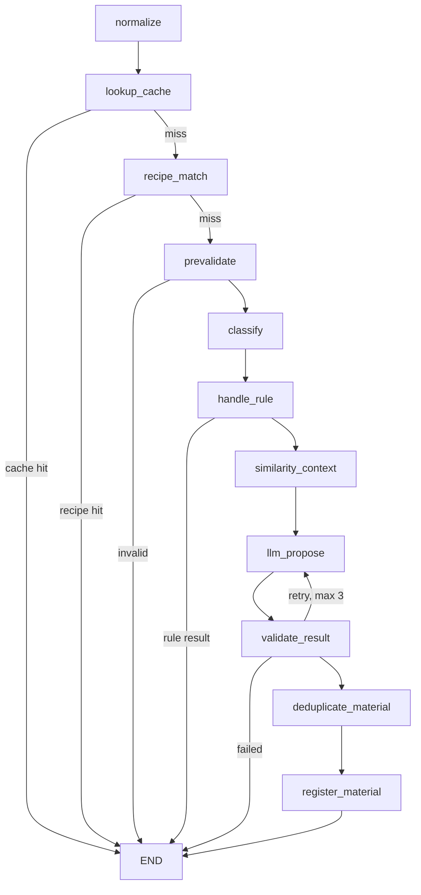
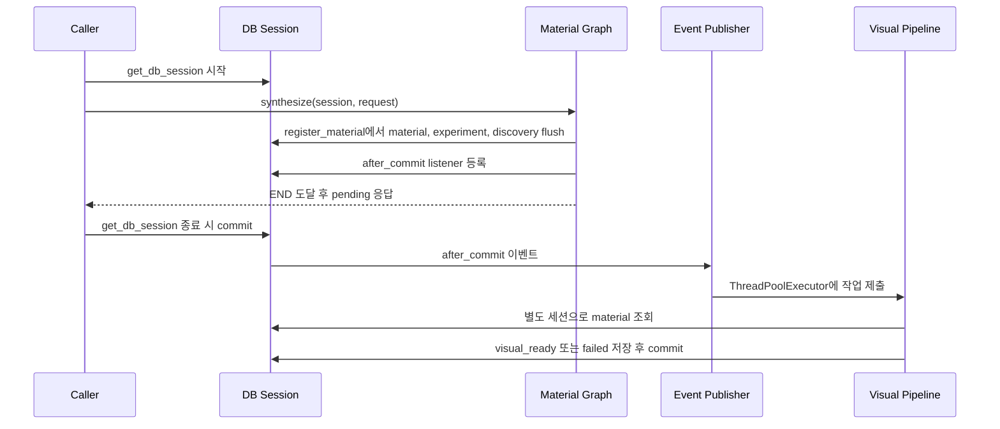

# 신물질 생성 Agent 현재 구조

| 항목 | 내용 |
| --- | --- |
| 문서 기준일 | 2026-06-14 |
| Agent ID | `material_generation` |
| 구현 위치 | `backend/src/agents/material_generation/` |
| 정식 호출 경로 | WebSocket `AgentPipeline` |
| 보조 호출 경로 | REST `/api/v1/experiments/material-creation` |

이 문서는 기획이나 목표 구조가 아니라 현재 소스 코드에 구현된 구조를 설명한다. 향후 일반 레시피와 생성 레시피를 통합하는 목표 구조는 [레시피 저장소 통합 설계](../02_work_plans/recipe_storage_unification_design.md)를 따른다.

<!-- AUTO-GENERATED: START - source: backend/src -->

## 1. 전체 구조

```text
backend/src/
├── app.py                              # FastAPI lifespan과 executor 생명주기
├── agents/
│   ├── pipeline/
│   │   ├── graph_edges.py              # material_generation 최상위 분기
│   │   ├── runtime.py                  # 요청 검증, DB 세션, agent 호출
│   │   └── state.py                    # 최상위 route 타입
│   └── material_generation/
│       ├── agent.py                    # MaterialCreationAgent 진입점
│       ├── graph.py                    # LangGraph 노드와 엣지 조립
│       ├── graph_state.py              # 그래프 상태 계약
│       ├── nodes.py                    # 그래프 노드 구현
│       ├── routing.py                  # 조건부 라우팅 함수
│       ├── schemas.py                  # 요청, 응답, LLM 제안 모델
│       ├── normalizer.py               # 입력 정규화와 hash 생성
│       ├── recipe_repository.py        # 현재 일반 레시피 조회와 캐시
│       ├── prevalidator.py             # 입력 아이템과 장비 사전 검증
│       ├── classifier.py               # 실험 유형 결정론적 분류
│       ├── similarity.py               # 유사 실험 조회
│       ├── proposal_generator.py       # LLM 제안과 fallback 생성
│       ├── result_validator.py         # LLM 결과 보정과 정책 검증
│       ├── events.py                   # 비주얼 작업 executor 관리
│       ├── visual_pipeline.py          # 비주얼 상태와 asset key 갱신
│       ├── router.py                   # 개발 및 조회용 REST API
│       └── registry/
│           ├── experiment_registry.py  # 실험 저장과 중복 병합
│           └── material_registry.py    # 물질 및 발견 이력 저장
└── db/
    ├── engine.py                       # 동기 SQLAlchemy 세션 경계
    └── models.py                       # 현재 DB 모델
```

`graph.py`는 그래프 조립만 담당한다. 실행 로직은 `nodes.py`, 분기 판단은 `routing.py`에 분리되어 있다.

## 2. 요청 진입 경로

### 2.1 WebSocket 정식 경로



`runtime.py`는 payload에서 다음 값을 구성한다.

- `machine_type`
- `inputs`
- `process_conditions`
- WebSocket envelope의 `session_id`를 사용한 `player_id`
- 기본값이 `true`인 `generate_visual_asset`

### 2.2 REST 보조 경로

| Method | Path | 역할 |
| --- | --- | --- |
| `POST` | `/api/v1/experiments/material-creation` | 합성 요청 실행 |
| `GET` | `/api/v1/materials/{material_id}/visual-status` | 비주얼 상태와 asset key 조회 |

두 호출 경로는 모두 동기 SQLAlchemy 세션과 같은 `MaterialCreationAgent`를 사용한다.

## 3. LangGraph 실행 흐름



| 노드 | 책임 | 조기 종료 조건 |
| --- | --- | --- |
| `normalize` | 입력 아이템 병합·정렬, `experiment_hash` 생성 | 없음 |
| `lookup_cache` | 동일 실험 hash 결과 재사용 | 기존 실험 발견 |
| `recipe_match` | 현재 `recipes` 캐시에서 장비와 입력 완전 일치 조회 | 일반 레시피 일치 |
| `prevalidate` | 알려진 아이템, 수량, 장비 입력 검증 | 유효하지 않은 입력 |
| `classify` | 실험을 결정론적으로 분류 | 없음 |
| `handle_rule` | 단순 변형, 중간재, 금지 장비 결과 처리 | 룰 기반 결과 확정 |
| `similarity_context` | 같은 장비와 겹치는 입력의 과거 성공 실험 조회 | 없음 |
| `llm_propose` | LLM 물질 제안 생성, 실패 시 fallback 사용 가능 | 없음 |
| `validate_result` | 속성 범위와 정책 검증, 최대 3회 재시도 | 재시도 소진 후 실패 |
| `deduplicate_material` | `material_hash`로 기존 물질 재사용 여부 결정 | 없음 |
| `register_material` | 물질, 실험, 플레이어 발견 이력 flush | 그래프 종료 |

신규 생성 결과의 실행 순서는 `register_material`에서 세 레코드를 `flush`한 뒤 LangGraph가 `END`에 도달하고, 호출자가 `get_db_session()` 컨텍스트를 빠져나갈 때 트랜잭션을 `commit`하는 방식이다. 따라서 저장 SQL은 `END` 전에 실행되지만 영속성 확정은 `END` 후에 이루어진다.

## 4. Hash와 중복 처리

| 값 | 입력 | 용도 |
| --- | --- | --- |
| `experiment_hash` | 장비, 정규화 입력, 공정 조건 | 동일한 실험 요청의 결과 캐시 |
| `material_hash` | 검증된 물질 결과 속성 | 의미상 같은 생성 물질의 중복 등록 방지 |

같은 실험이면 `lookup_cache`에서 즉시 응답한다. 다른 실험이 같은 물질 결과를 만들면 `deduplicate_material`에서 기존 물질을 재사용하되 새 실험과 발견 이력은 기록한다.

## 5. 트랜잭션과 비주얼 후처리



비주얼 작업은 다음 조건을 모두 만족할 때만 제출한다.

- 새 물질이다.
- `generate_visual_asset=true`다.
- 요청 트랜잭션 commit이 성공했다.

`generate_visual_asset=false`이면 초기 `visual_status`는 `skipped`다. 작업 실패는 합성 트랜잭션을 되돌리지 않으며 `visual_status=failed`, `visual_error`, `fallback_icon`으로 격리한다.

## 6. Executor 생명주기

FastAPI lifespan이 비주얼 executor를 소유한다.

```text
app startup  -> MaterialEventPublisher.reset_executor(wait=False)
app running  -> 신규 비주얼 작업 제출
app shutdown -> MaterialEventPublisher.shutdown_executor(wait=True)
```

종료 처리는 `finally`에서 실행된다. 같은 프로세스에서 앱 lifespan이 다시 시작되면 executor도 다시 생성된다. 종료 이후 들어온 작업은 실행하지 않고 경고 로그를 남긴다.

테스트에서는 `StaticPool`과 `check_same_thread=False`를 사용해 인메모리 SQLite 연결을 작업 스레드와 공유한다. `VisualAssetPipeline.session_factory`를 테스트 세션 팩토리로 교체하고 작업 완료 후 복원한다.

## 7. 현재 DB 구조

| 테이블 | 역할 | 주요 식별자 |
| --- | --- | --- |
| `recipes` | CSV에서 적재한 일반 레시피 | 정수 `id`, 고유 `recipe_name` |
| `generated_experiments` | 모든 합성 시도와 결과 | 문자열 `id`, 고유 `experiment_hash` |
| `generated_materials` | 생성 물질 속성과 비주얼 상태 | 문자열 `id`, 고유 `material_hash` |
| `generated_material_discoveries` | 플레이어별 물질 발견 이력 | 문자열 `id`, `material_id`, `player_id` |

현재 `recipes`는 입력 3개와 출력 2개의 고정 컬럼 구조다. `generated_materials.recipe_candidates_json`은 문자열 후보 목록을 보관하지만 실행 가능한 일반 레시피로 등록하지 않는다.

일반·생성 레시피를 `recipes`, `recipe_inputs`, `recipe_outputs`로 통합하는 구조는 아직 구현 전이며 [레시피 저장소 통합 설계](../02_work_plans/recipe_storage_unification_design.md)의 후속 작업이다.

## 8. 응답 유형

| `result_type` | 의미 |
| --- | --- |
| `existing_recipe` | 일반 레시피와 완전히 일치 |
| `new_material` | 신규 또는 기존 생성 물질 결과 확정 |
| `cached_experiment` | 동일 `experiment_hash` 결과 재사용 |
| `failed_result` | 장비 정책 또는 제안 검증 실패 |
| `invalid_input` | 사전 입력 검증 실패 |

신규 물질 응답의 `visual_status`는 `pending` 또는 `skipped`다. 완료 상태는 별도 조회 API 또는 이후 동일 실험 조회에서 확인한다.

## 9. 검증 명령

```bash
cd backend
UV_CACHE_DIR=/tmp/uv-cache uv run pytest
UV_CACHE_DIR=/tmp/uv-cache uv run ruff check .
UV_CACHE_DIR=/tmp/uv-cache uv run ruff format --check .
```

핵심 회귀 테스트는 다음을 포함한다.

- 일반 레시피 일치
- 장비 정책 실패
- 신규 물질과 실험 캐시 재사용
- API 요청 commit 후 별도 세션에서 생성 물질 조회
- 동일 실험 재요청 시 생성 물질 중복 행 방지
- LLM 검증 최대 3회 재시도
- 비주얼 생성 비활성화
- commit 이후 비주얼 상태 갱신
- executor 영구 종료 후 작업 차단
- 연속된 두 앱 lifespan에서 executor 재시작

## 10. 소스 정본

| 관심사 | 정본 파일 |
| --- | --- |
| 요청·응답 계약 | `backend/src/agents/material_generation/schemas.py` |
| 그래프 구성 | `backend/src/agents/material_generation/graph.py` |
| 노드 동작 | `backend/src/agents/material_generation/nodes.py` |
| 분기 조건 | `backend/src/agents/material_generation/routing.py` |
| DB 모델 | `backend/src/db/models.py` |
| 트랜잭션 경계 | `backend/src/db/engine.py` |
| executor 생명주기 | `backend/src/app.py`, `backend/src/agents/material_generation/events.py` |
| 비주얼 상태 갱신 | `backend/src/agents/material_generation/visual_pipeline.py` |
| 회귀 테스트 | `backend/tests/agents/material_generation/` |

<!-- AUTO-GENERATED: END -->
