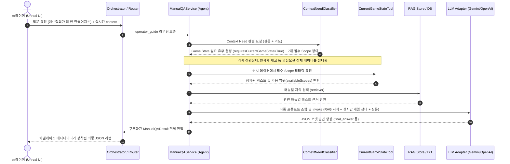

# RAG 에이전트 최종 아키텍처 및 포트폴리오 가이드 (Portfolio Guide)

본 문서는 `operator_guide` RAG(Retrieval-Augmented Generation) 에이전트의 전체 아키텍처 흐름, 실무 관점에서의 핵심 기술적 장점 및 검증된 신뢰성 데이터를 상세히 설명하는 포트폴리오 설명서입니다.

---

## 1. 아키텍처 데이터 흐름 (Data Architecture Flow)

플레이어가 게임 플레이 중 질문을 던졌을 때부터 최종 답안이 클라이언트(Unreal Engine)에 닿을 때까지의 데이터 파이프라인 흐름은 다음과 같습니다.

### 1.1. 개념 아키텍처 흐름

### 1.2. 단계별 처리 설명
1. **질문 및 상황 수신**: 플레이어가 게임 UI에서 입력한 자연어 질문과 함께 현재 바라보는 기계의 전력/재고 등의 상황 정보(`current_game_state`)가 챗봇 게이트웨이에 들어옵니다.
2. **에이전트 판단 및 데이터 격리 (ContextNeedClassifier & Tool)**:
   - 질문이 단순 매뉴얼 질문("기어는 어떻게 만들어?")이면 불필요하게 기계 상태를 조회하지 않아 토큰 낭비를 원천 차단합니다.
   - 문제 해결성 질문("철괴가 왜 안 만들어져?")인 경우, **7대 핵심 스코프**에 해당하는 데이터만 선별하여 프롬프트 컨텍스트에 주입합니다.
3. **RAG 검색 연동**: 에이전트는 기계 매뉴얼 데이터베이스(RAG Store)에서 관련 수리 절차나 제작법 내용을 지능적으로 검색합니다.
4. **LLM 조합 추론 및 응답**: 수집된 정적 매뉴얼(RAG)과 실시간 정황(Game State)을 결합하여, LLM이 현재 공장의 구체적인 문제점(예: "제련기에 철광석이 부족합니다")을 추론하여 친절한 NPC 어조로 답합니다.

---

## 2. 실무형 RAG 에이전트로서의 핵심 강점 (Key Strengths)

단순히 "질문하고 답변하는 RAG API 호출기" 수준을 넘어, 현업 프로덕션 환경에서 가동 가능한 수준으로 안정성과 효율성을 최적화한 4대 핵심 가치는 아래와 같습니다.

### 2.1. content_hash 기반 중복 인덱싱 방지 (Ingestion Efficiency)
매뉴얼 데이터(CSV)가 대규모이거나 수시로 수정될 때, 매번 모든 문서를 재임베딩하여 적재하면 모델 호출 비용과 DB 부하가 발생합니다.
* **해결**: 개별 Row마다 내용 기반의 고유 해시(`content_hash`)를 생성하여 DB 내 데이터와 대조한 뒤, **변경된 내역만 동적으로 선별 적재(Upsert)**합니다. 이를 통해 인프라 운영 비용을 획기적으로 낮췄습니다.

### 2.2. 결함 복구 회복력 (Partial Failure & Retry)
일부 데이터에 특수문자 오류가 있거나 임베딩 API가 간헐적인 네트워크 에러로 실패할 때, 전체 인덱싱 배치(Ingestion Batch)가 깨지는 취약점을 차단했습니다.
* **해결**: 일괄(Batch) 처리 중 오류 발생 시 에이전트가 자동으로 각 문서를 순회하며 개별로 임베딩을 시도하는 **Partial Retry** 로직을 작동시킵니다.
* 실패한 데이터만 `FailedIngestionRow` 테이블에 에러 사유와 함께 격리(Isolation) 기록하고, 성공한 나머지 데이터는 완벽히 적재를 마무리하여 파이프라인의 내결함성(Fault Tolerance)을 달성했습니다.

### 2.3. 데이터 갱신 이력 및 버전 추적 (source_version)
현재 가동 중인 RAG 백엔드 매뉴얼이 소스 코드나 매뉴얼 원본(CSV)과 정합성을 유지하고 있는지 추적하기 어렵습니다.
* **해결**: CSV 파일들의 누적 해시 정보와 Git HEAD 커밋 해시를 융합하여 고유한 `source_version`을 계산하고 인덱싱 로그(`manual_rag_ingestion_runs`)에 매핑하여 기록합니다. 이를 통해 배포 버전과 RAG 적재 상태의 일치 여부를 누구나 투명하게 감시할 수 있습니다.

### 2.4. 다중 Fallback 및 예외 감쇄 설계 (Graceful Degradation)
LLM API의 속도 제한(Rate Limit)이나 일시적 만료, 혹은 게임 서버 내부의 실시간 데이터 연동 실패가 플레이어와의 챗봇 대화 단절로 이어지는 것을 방지했습니다.
* **Context Classifier Fallback**: 지능형 LLM 판단 호출이 오류가 나면 즉시 기존의 신뢰도 높은 키워드 규칙 기반 판단(Rule-based Fallback)으로 자동 전환되어 정상 동작을 유지합니다.
* **Service LLM Fallback**: LLM이 먹통이 되어 최종 답변 생성이 불가할 때도 에이전트 자체의 CSV 매뉴얼 증거 검색 기록과 추천 행동 메타데이터를 클라이언트에 즉각 반환하여, UI에 NPC의 사과 답변 및 추천 해결 가이드 버튼이 안전하게 노출되도록 보장합니다.

---

## 3. 검증 및 테스트 성과 지표 (Validation & Test Metrics)

개발 과정 전반에 걸쳐 신뢰성을 기계적으로 증명하기 위해 테스트 주도 설계를 적용했습니다.

* **종합 테스트 결과**: 에이전트 라우팅, RAG Ingestion, 부분 리트라이, 예외 Fallback 및 실시간 7대 스코프 연동 등 백엔드 전 범위에 대한 **총 259개의 자동화 테스트 스위트가 100% 그린 빌드**로 통과하고 있습니다.
* **테스트 품질 검사**: `ruff` 정적 린터 및 엄격한 타입 어노테이션 검사를 통해 코드 포맷 및 안정성을 검증 완료했습니다.
