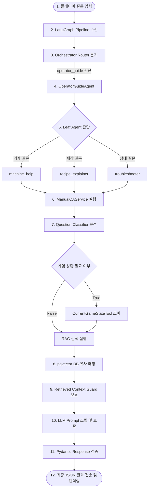

# Operator Guide Agent 폴더 구조 설명

본 문서는 Factory Space의 오퍼레이터 가이드(`operator_guide`) 에이전트 시스템을 처음 보는 개발자가 코드베이스의 구조와 아키텍처, 데이터 흐름을 가장 빠르게 파악할 수 있도록 돕는 종합 안내서입니다.

---

## 1. 문서 목적

오퍼레이터 가이드 에이전트는 플레이어가 공장 시스템, 자원, 레시피, 트러블 상황에 대해 질문할 때 RAG(검색 증강 생성) 기술 및 실시간 게임 상태 조회를 활용하여 자연스러운 튜토리얼 답변을 반환하는 핵심 AI 시스템입니다. 
본 문서는 오퍼레이터 가이드와 관련된 백엔드 소스 코드, 설정 파일, 마스터 계획서, 테스트 코드의 물리적 위치와 역할을 한눈에 파악할 수 있도록 구조화하여 초보 개발자의 온보딩 비용을 줄이는 것을 목적으로 합니다.

---

## 2. 전체 폴더 구조

오퍼레이터 가이드의 핵심 동작과 연동되는 물리적 디렉토리 및 파일 트리 구조는 다음과 같습니다.

```text
c:\factory-space
├── data
│   └── game (기획 데이터 원천)
│       ├── equipment.csv
│       ├── resources.csv
│       ├── recipes.csv
│       ├── troubleshooting_rules.csv
│       ├── action_policy.csv
│       └── tutorial.csv
├── docs
│   └── operator_guide (종합 설계/가이드 마크다운 폴더)
│       ├── 2026-06-05_operator_guide_user_guide.md
│       ├── 2026-06-11_operator_guide_unreal_question_guide_ui_contract.md
│       └── 2026-06-16_operator_guide_system_guide.md
└── backend (백엔드 패키지 루트)
    ├── .env (로컬 환경 변수 설정)
    ├── .env.example (환경 변수 템플릿)
    ├── .env.prod (운영 환경 변수 설정)
    ├── docker-compose.rag.yml (RAG 데이터베이스 컨테이너 구성)
    ├── pyproject.toml (패키지 종속성 정의)
    ├── docs
    │   └── plans
    │       └── operator_guide_rag (RAG 구현 계획 폴더)
    │           ├── operator_guide_rag_master_plan.md
    │           ├── operator_guide_rag_sprint_plan.md
    │           ├── operator_guide_rag_architecture_summary.md
    │           └── operator_guide_state_node_definition.md
    ├── src
    │   └── agents
    │       ├── pipeline (랑그래프 실행 파이프라인 폴더)
    │       │   ├── state.py
    │       │   ├── runtime.py
    │       │   └── graph_edges.py
    │       └── operator_guide (핵심 에이전트 소스 폴더)
    │           ├── agent.py (상위 오케스트레이터)
    │           ├── service.py (컨트롤 타워 서비스)
    │           ├── machine_help.py (장비 도우미 에이전트)
    │           ├── recipe_explainer.py (레시피 설명 에이전트)
    │           ├── troubleshooter.py (문제 해결 에이전트)
    │           ├── question_classifier.py (질문 의도 분류기)
    │           ├── question_decomposer.py (다중 질문 분해기)
    │           ├── manual_context_builder.py (컨텍스트 조립기)
    │           ├── session_memory.py (대화 메모리 및 확인 사실 기록기)
    │           ├── rag_embedding.py (임베딩 프로바이더)
    │           ├── rag_documents.py (RAG 문서 변환기)
    │           ├── rag_ingestion.py (RAG 배치 임베딩 적재기)
    │           ├── rag_schema.py (데이터베이스 스키마 정의)
    │           ├── rag_store.py (DB Upsert/Deactivate 처리)
    │           ├── rag_upsert.py (스토리지 갱신 오케스트레이터)
    │           ├── rag_retriever.py (유사도 검색기)
    │           ├── multi_question_rag_retriever.py (다중 질문 RAG 취합기)
    │           ├── retrieved_context_guard.py (보안 가이드 마커 격리기)
    │           ├── csv_repository.py (CSV 데이터 조회 리포지토리)
    │           ├── schemas.py (통신 데이터 모델)
    │           ├── debug_router.py (매칭 점수 디버그 API)
    │           ├── system_prompt.py (시스템 프롬프트 상수)
    │           └── repository.py (외부 export 호환 레이어)
    └── tests (기능 검증 테스트 폴더)
        ├── test_operator_guide_*.py
        └── test_manual_qa_*.py
```

---

## 3. 핵심 폴더 설명

### (1) `backend/src/agents/operator_guide`
오퍼레이터 가이드 에이전트의 내부 핵심 로직이 들어있는 폴더입니다. 질문을 분석하는 분류기, 질문을 하위 도메인별로 배분하는 오케스트레이터, 데이터베이스 검색을 조율하는 RAG 검색기, 기획 데이터를 메모리에 담아두는 조회 모듈들이 조화롭게 모여 있습니다.

### (2) `backend/src/agents/pipeline`
에이전트가 단독으로 도는 것이 아니라, LangGraph 프레임워크 상에서 다른 도메인 에이전트(예: 퀘스트 생성기 등)와 함께 유기적으로 실행될 수 있도록 워크플로우 그래프 구조와 데이터 전달 상태(`AgentGraphState`)를 제어하는 공통 파이프라인 폴더입니다.

### (3) `data/game`
오퍼레이터 가이드가 답변에 사용하는 "매뉴얼 지식"의 원천 기획 데이터 폴더입니다. 엑셀이나 구글 스프레드시트에서 작성되어 추출된 CSV 포맷의 파일들이며, 이 파일들의 로우(Row)가 백엔드 RAG 인제스천을 거쳐 데이터베이스에 적재됩니다.

### (4) `backend/tests`
에이전트의 로직 변경이나 주석 보강 시 기존 시스템에 버그를 발생시키지 않았는지 자동으로 무결성을 테스트하고 검증하는 테스트 폴더입니다.

### (5) `docs/operator_guide` 및 `backend/docs/plans/operator_guide_rag`
기획서, API 스키마 계약서, RAG 구현 마스터 플랜 및 스프린트 일정이 정리된 문서화 폴더입니다. 코드 해석 전, 시스템의 철학과 배경지식을 얻는 데 매우 중요한 나침반 역할을 수행합니다.

---

## 4. 주요 파일 설명

### [에이전트 코어 계층]

#### 1. agent.py
*   **파일 경로:** [backend/src/agents/operator_guide/agent.py](file:///c:/factory-space/backend/src/agents/operator_guide/agent.py)
*   **파일 역할:** 최상위 오케스트레이터로, 플레이어 질문을 받아 기계/레시피/트러블슈팅 중 어떤 하위 에이전트로 작업을 연결할지 결정합니다.
*   **초보자가 볼 때 집중할 포인트:** `OperatorGuideAgent`의 `build_routing_prompt` 메소드입니다. 하위 에이전트를 선택하기 위해 LLM에 보낼 프롬프트 지시문이 조립되는 구조를 확인해 보세요.
*   **다른 파일과 연결되는 부분:** [service.py](file:///c:/factory-space/backend/src/agents/operator_guide/service.py)의 `PROGRESS_CATALOG` 정보를 통해 UX 진행률 전송을 동기화하고, 랑그래프의 [graph_edges.py](file:///c:/factory-space/backend/src/agents/pipeline/graph_edges.py)와 연결됩니다.

#### 2. service.py
*   **파일 경로:** [backend/src/agents/operator_guide/service.py](file:///c:/factory-space/backend/src/agents/operator_guide/service.py)
*   **파일 역할:** 질문 분석, CSV 조회, RAG 검색, 실시간 게임 상황 도구 연동을 유기적으로 엮어 최종 답변 컨텍스트를 완성하는 컨트롤 타워 역할을 수행합니다.
*   **초보자가 볼 때 집중할 포인트:** `ManualQAService` 클래스의 `build_prompt_context` 메소드입니다. 이 메소드를 따라가면 데이터가 어떻게 흐르고 조립되는지 데이터 파이프라인의 전체 윤곽을 파악할 수 있습니다.
*   **다른 파일과 연결되는 부분:** [prompt_builder.py](file:///c:/factory-space/backend/src/agents/operator_guide/prompt_builder.py)를 호출하여 가이드 프롬프트를 생성하고, RAG 런타임 인터페이스인 `ManualQARagRuntime` 프로토콜을 사용해 검색기 기능을 호출합니다.

#### 3. machine_help.py, recipe_explainer.py, troubleshooter.py
*   **파일 경로:**
    - [machine_help.py](file:///c:/factory-space/backend/src/agents/operator_guide/machine_help.py)
    - [recipe_explainer.py](file:///c:/factory-space/backend/src/agents/operator_guide/recipe_explainer.py)
    - [troubleshooter.py](file:///c:/factory-space/backend/src/agents/operator_guide/troubleshooter.py)
*   **파일 역할:** 각 기계 정보 설명, 레시피 설명, 트러블슈팅 질문 상황에 맞춰 LLM 프롬프트 메시지나 대체 fallback 결과를 빌드하는 하위 리프 에이전트 파일들입니다.
*   **초보자가 볼 때 집중할 포인트:** `build_prompt` 및 `build_prompt_messages` 메소드가 호출되어, 각 도메인 키워드("machine", "recipe", "troubleshooting")에 맞춰 컨트롤 타워로 인자를 전달하는 구조를 비교해 보세요.
*   **다른 파일과 연결되는 부분:** 공통 서비스인 [service.py](file:///c:/factory-space/backend/src/agents/operator_guide/service.py)의 `build_manual_qa_prompt` 및 `build_manual_qa_agent_result`와 강하게 연결됩니다.

---

### [질문 분석 및 전처리 계층]

#### 4. question_classifier.py
*   **파일 경로:** [backend/src/agents/operator_guide/question_classifier.py](file:///c:/factory-space/backend/src/agents/operator_guide/question_classifier.py)
*   **파일 역할:** 사용자의 질문에서 장비, 자원, 레시피 키워드를 매칭하여 질문 카테고리를 식별하고, 실시간 게임 상황 정보가 추가로 필요한지를 판별합니다.
*   **초보자가 볼 때 집중할 포인트:** 규칙 기반 키워드 테이블(`TROUBLESHOOTING_KEYWORDS` 등)과 `ContextNeedClassifier`가 LLM을 호출하여 실시간 게임 데이터 요구 범위(Scopes)를 파악하는 흐름입니다.
*   **다른 파일과 연결되는 부분:** 추출된 Scopes 목록은 [service.py](file:///c:/factory-space/backend/src/agents/operator_guide/service.py)의 `CurrentGameStateTool`로 전달되어 데이터를 필터링합니다.

#### 5. question_decomposer.py
*   **파일 경로:** [backend/src/agents/operator_guide/question_decomposer.py](file:///c:/factory-space/backend/src/agents/operator_guide/question_decomposer.py)
*   **파일 역할:** 질문 문장에 섞여 있는 복합적인 서브 질문(Sub-questions)들을 정확한 RAG 검색을 위해 개별 단위 질문 리스트로 쪼개줍니다.
*   **초보자가 볼 때 집중할 포인트:** `_split_question_candidates` 내부에서 정규식을 이용해 "그리고", "하고", "and" 등 문장 연결 키워드를 감지하여 split하는 단순하고 직관적인 구조를 참고해 보세요.
*   **다른 파일과 연결되는 부분:** 쪼개진 결과는 [multi_question_rag_retriever.py](file:///c:/factory-space/backend/src/agents/operator_guide/multi_question_rag_retriever.py)의 검색 흐름의 입력값으로 바로 투입됩니다.

#### 6. manual_context_builder.py
*   **파일 경로:** [backend/src/agents/operator_guide/manual_context_builder.py](file:///c:/factory-space/backend/src/agents/operator_guide/manual_context_builder.py)
*   **파일 역할:** 추출된 질문 의도(Intent)와 타겟 ID를 가지고 CSV 저장소에서 해당하는 장비, 자원, 레시피, 트러블슈팅 데이터를 조회하여 컨텍스트 객체로 변환해 줍니다.
*   **초보자가 볼 때 집중할 포인트:** `ManualQAContextBuilder` 클래스의 `build` 메소드입니다. 각 인텐트 타겟 ID별로 일치하는 레코드를 딕셔너리로 가공하는 과정을 추적해 보세요.
*   **다른 파일과 연결되는 부분:** 조회한 레코드를 바탕으로 [schemas.py](file:///c:/factory-space/backend/src/agents/operator_guide/schemas.py)의 `ManualQAResult`와 `RecommendedAction` 모델을 채워 넣어 [service.py](file:///c:/factory-space/backend/src/agents/operator_guide/service.py)에 인계합니다.

#### 7. session_memory.py
*   **파일 경로:** [backend/src/agents/operator_guide/session_memory.py](file:///c:/factory-space/backend/src/agents/operator_guide/session_memory.py)
*   **파일 역할:** 서버가 켜져 있는 동안 플레이어의 이전 질문/답변 턴을 임시 보관하고, 플레이어 질문 중 확정된 게임 상황(예: "전력은 정상인데?")을 정규 패턴으로 걸러내 메모리에 상태 사실로 축적합니다.
*   **초보자가 볼 때 집중할 포인트:** `extract_confirmed_facts` 함수와 `update_facts_from_question` 메소드입니다. "전력 부족", "컨베이어가 멈춤" 등 플레이어의 상황을 감지해 메모리를 동적으로 업데이트하는 구조를 관찰해 보세요.
*   **다른 파일과 연결되는 부분:** 메모리에 적재된 최근 대화 및 사실 정보는 [service.py](file:///c:/factory-space/backend/src/agents/operator_guide/service.py)를 경유하여 [prompt_builder.py](file:///c:/factory-space/backend/src/agents/operator_guide/prompt_builder.py)의 `[RECENT_CONVERSATION_CONTEXT]` 및 `[CONFIRMED_FACTS]` 프롬프트 영역으로 삽입됩니다.

---

### [RAG 및 벡터 DB 인프라 계층]

#### 8. rag_documents.py
*   **파일 경로:** [backend/src/agents/operator_guide/rag_documents.py](file:///c:/factory-space/backend/src/agents/operator_guide/rag_documents.py)
*   **파일 역할:** CSV 테이블의 행 레코드를 받아 사람이 이해하기 쉽고 벡터 검색 시 매칭도가 높은 개별 Markdown 형식의 문서(`ManualRagDocument`)로 전환해 줍니다.
*   **초보자가 볼 때 집중할 포인트:** `ManualRagDocumentBuilder` 클래스 내에 선언된 `_equipment_document`나 `_recipe_document` 등 템플릿 스트링 조립 방식을 살펴보세요.
*   **다른 파일과 연결되는 부분:** 파싱된 문서 목록은 [rag_ingestion.py](file:///c:/factory-space/backend/src/agents/operator_guide/rag_ingestion.py)의 입력으로 흘러 들어갑니다.

#### 9. rag_ingestion.py
*   **파일 경로:** [backend/src/agents/operator_guide/rag_ingestion.py](file:///c:/factory-space/backend/src/agents/operator_guide/rag_ingestion.py)
*   **파일 역할:** 변환된 가이드 문서를 임베딩 프로바이더에 넘겨 벡터 데이터를 생성하고, 파일 버전 해시를 결합하여 일괄 Ingestion 배치 데이터 객체를 구성합니다.
*   **초보자가 볼 때 집중할 포인트:** `_build_records_for_documents` 메소드입니다. 대량 일괄 호출(Batch Call) 실패 시 개별로 순차 재시도(Partial Retry)하는 예외 보호 처리를 집중해서 보세요.
*   **다른 파일과 연결되는 부분:** 임베딩 생성 시 [rag_embedding.py](file:///c:/factory-space/backend/src/agents/operator_guide/rag_embedding.py) 프로토콜을 사용하며, 버전 해시 검증 시 로컬 Git의 커밋 버전과 연동됩니다.

#### 10. rag_embedding.py
*   **파일 경로:** [backend/src/agents/operator_guide/rag_embedding.py](file:///c:/factory-space/backend/src/agents/operator_guide/rag_embedding.py)
*   **파일 역할:** 텍스트 문자열 목록을 임베딩 모델(OpenAI 또는 로컬 Ollama/LM Studio)에 요청하여 고차원 숫자 배열 벡터 데이터로 변환합니다.
*   **초보자가 볼 때 집중할 포인트:** `LocalEmbeddingProvider` 클래스입니다. Ollama의 네이티브 엔드포인트 `/api/embeddings` 주소와 OpenAI 호환 엔드포인트 `/v1` 주소를 분류해서 동적 포스팅하는 구조를 보세요.
*   **다른 파일과 연결되는 부분:** 환경 변수 파일인 [.env](file:///c:/factory-space/backend/.env)에서 모델 정보를 주입받아 동작합니다.

#### 11. rag_schema.py
*   **파일 경로:** [backend/src/agents/operator_guide/rag_schema.py](file:///c:/factory-space/backend/src/agents/operator_guide/rag_schema.py)
*   **파일 역할:** pgvector 확장이 설치된 PostgreSQL 환경에서 사용할 `manual_rag_documents` 및 실행 이력, 에러 로그 테이블의 릴레이셔널 스키마와 인덱스를 선언합니다.
*   **초보자가 볼 때 집중할 포인트:** SQLAlchemy Table 선언에서 사용된 `Vector(EMBEDDING_DIMENSIONS)` 타입 컬럼과 IVFFlat 코사인 거리 인덱스(`vector_cosine_ops`) 정의부를 확인해 보세요.
*   **다른 파일과 연결되는 부분:** [rag_store.py](file:///c:/factory-space/backend/src/agents/operator_guide/rag_store.py)가 쿼리를 수행할 때 타겟 테이블 메타데이터로 참조됩니다.

#### 12. rag_store.py & rag_upsert.py
*   **파일 경로:**
    - [rag_store.py](file:///c:/factory-space/backend/src/agents/operator_guide/rag_store.py)
    - [rag_upsert.py](file:///c:/factory-space/backend/src/agents/operator_guide/rag_upsert.py)
*   **파일 역할:** 데이터베이스 트랜잭션을 구동하여, 변환된 임베딩 데이터를 DB에 적재(Upsert)하고, CSV 리소스에서 사라진 기존 문서는 비활성화(is_active=False) 시키는 동기화 업무를 처리합니다.
*   **초보자가 볼 때 집중할 포인트:** `rag_upsert.py`의 `upsert_batch` 메소드입니다. DB에 기존 저장되어 있는 해시값들과 새로 들어온 해시값들을 대조하여 `inserted`, `updated`, `skipped`, `deactivated` 통계를 가르는 로직입니다.
*   **다른 파일과 연결되는 부분:** 데이터베이스 통신을 위해 SQLAlchemy Engine 및 [rag_schema.py](file:///c:/factory-space/backend/src/agents/operator_guide/rag_schema.py)의 Table 정보와 직결됩니다.

#### 13. rag_retriever.py & multi_question_rag_retriever.py
*   **파일 경로:**
    - [rag_retriever.py](file:///c:/factory-space/backend/src/agents/operator_guide/rag_retriever.py)
    - [multi_question_rag_retriever.py](file:///c:/factory-space/backend/src/agents/operator_guide/multi_question_rag_retriever.py)
*   **파일 역할:** 플레이어 질문을 임베딩하고 DB에서 Cosine Distance가 가장 작은 유사 상위 문서들(top_k)을 조회하여, 텍스트 문맥과 신뢰도(Confidence) 점수를 판정합니다.
*   **초보자가 볼 때 집중할 포인트:** `_calculate_confidence` 함수입니다. 검색 스코어가 임계치(예: 0.85) 이상인지, 질문 단어가 문서 제목에 포함되었는지(Direct Match)에 따라 신뢰도를 `high`, `medium`, `low`로 정규화하는 논리 구조를 확인해 보세요.
*   **다른 파일과 연결되는 부분:** 다중 질문 상황에서 [question_decomposer.py](file:///c:/factory-space/backend/src/agents/operator_guide/question_decomposer.py)에 의해 분해된 하위 질문 목록을 순차 전달받아 다중 검색을 수행하고 context로 통합합니다.

#### 14. retrieved_context_guard.py
*   **파일 경로:** [backend/src/agents/operator_guide/retrieved_context_guard.py](file:///c:/factory-space/backend/src/agents/operator_guide/retrieved_context_guard.py)
*   **파일 역할:** RAG 검색을 통해 데이터베이스에서 수집된 문장 정보가 LLM에 주입될 때 발생할 수 있는 보안 침해(Prompt Injection)를 방어하기 위해 문맥 격리 태그로 격리합니다.
*   **초보자가 볼 때 집중할 포인트:** `wrap_retrieved_context` 함수가 반환하는 가드 문장(`RETRIEVED_CONTEXT_GUARD_INSTRUCTION`)과 구분 기호 쌍(`BEGIN_UNTRUSTED_RETRIEVED_CONTEXT` / `END_UNTRUSTED_RETRIEVED_CONTEXT`)의 배치 구조입니다.
*   **다른 파일과 연결되는 부분:** [prompt_builder.py](file:///c:/factory-space/backend/src/agents/operator_guide/prompt_builder.py)에서 RAG 근거 텍스트 영역을 포맷팅할 때 이 가드가 씌워집니다.

---

### [공통 프레임워크 및 기획 데이터 계층]

#### 15. csv_repository.py
*   **파일 경로:** [backend/src/agents/operator_guide/csv_repository.py](file:///c:/factory-space/backend/src/agents/operator_guide/csv_repository.py)
*   **파일 역할:** 공장 매뉴얼 정보의 원천이 되는 6개 CSV 테이블 데이터를 로드하여 메모리에 적재해 두고, 장비명이나 문제 힌트로 관련 상세 구조 데이터 레코드들을 빠르게 추출해 줍니다.
*   **초보자가 볼 때 집중할 포인트:** `@cached_property`로 구성된 각 테이블 로드 로직과 `find_recipe_by_question` 등 단어 매칭 기반 조회 구조입니다.
*   **다른 파일과 연결되는 부분:** 기획 데이터 원본인 [data/game/](file:///c:/factory-space/data/game) 폴더 하위 파일들을 물리적으로 읽어들입니다.

#### 16. schemas.py
*   **파일 경로:** [backend/src/agents/operator_guide/schemas.py](file:///c:/factory-space/backend/src/agents/operator_guide/schemas.py)
*   **파일 역할:** 에이전트 서비스 및 라우터 계층에서 외부 통신 시 전송 무결성을 지키고 직렬화/역직렬화 오류를 막기 위한 Pydantic 데이터 검증 모델 명세서입니다.
*   **초보자가 볼 때 집중할 포인트:** `ManualQAResult`와 `QAChatbotPayload` 클래스 필드 규격입니다. Pydantic의 속성 중 CamelCase로 메타데이터를 전환해주는 `to_metadata` 메소드의 구조를 확인해 보세요.
*   **다른 파일과 연결되는 부분:** 에이전트 [service.py](file:///c:/factory-space/backend/src/agents/operator_guide/service.py)의 실행 결과로 반환되는 원본 스키마 계약으로 사용됩니다.

#### 17. backend/src/agents/pipeline/ (공통 랑그래프 파이프라인)
*   **파일 경로:** [backend/src/agents/pipeline/](file:///c:/factory-space/backend/src/agents/pipeline) (state.py, runtime.py, graph_edges.py)
*   **파일 역할:** LangGraph 상태 머신 컴파일을 구동하고, 에이전트 라우팅 결과에 맞춰 conditional edge 흐름 분기를 제어하는 공통 파이프라인 프레임워크입니다.
*   **초보자가 볼 때 집중할 포인트:** [graph_edges.py](file:///c:/factory-space/backend/src/agents/pipeline/graph_edges.py) 파일의 `wire_agent_graph` 함수와 `route_selected_leaf_agent` 함수입니다. 오퍼레이터 가이드 노드가 파이프라인 실행 경로에 어떻게 연결되고 검증되는지 확인해 보세요.
*   **다른 파일과 연결되는 부분:** 최상위 [agent.py](file:///c:/factory-space/backend/src/agents/operator_guide/agent.py) 에이전트의 `OPERATOR_GUIDE_LEAF_AGENT_IDS` 상수 목록과 파이프라인 라우팅 검증 조건이 연계되어 흐릅니다.

#### 18. backend/tests/ (검증 테스트 코드군)
*   **파일 경로:** [backend/tests/](file:///c:/factory-space/backend/tests) (test_operator_guide_*.py 및 test_manual_qa_*.py)
*   **파일 역할:** 오퍼레이터 가이드 기능들의 단위 로직과 복합 연동 시나리오가 정상으로 통과되는지를 자동화 검증하는 유닛 및 통합 테스트 코드군입니다.
*   **초보자가 볼 때 집중할 포인트:** [test_operator_guide_rag_retriever.py](file:///c:/factory-space/backend/tests/test_operator_guide_rag_retriever.py) 나 [test_manual_qa_agent_smoke.py](file:///c:/factory-space/backend/tests/test_manual_qa_agent_smoke.py) 입니다. Mock(가상 데이터) 객체를 만들어 실제 임베딩 없이 유사도를 매칭하고, 예상한 JSON 답변으로 추출하는 검증 규칙들을 보세요.
*   **다른 파일과 연결되는 부분:** 백엔드 핵심 에이전트 소스 폴더의 모든 클래스와 메소드를 import하여 호출하고 검증합니다.

---

### [설정 파일 및 설계 계획 문서군]

#### 19. .env, .env.example, .env.prod (설정 변수 파일)
*   **파일 경로:**
    - [backend/.env.example](file:///c:/factory-space/backend/.env.example) (설정 템플릿)
    - [backend/.env](file:///c:/factory-space/backend/.env) (로컬 개발용 실제 설정)
    - [backend/.env.prod](file:///c:/factory-space/backend/.env.prod) (운영계 실제 설정)
*   **파일 역할:** 데이터베이스 주소, 임베딩 프로바이더 선택, 로컬 LLM 접속 정보 등 서버 동작 모드를 컨트롤하는 키-값(Key-Value) 모음입니다.
*   **초보자가 볼 때 집중할 포인트:** `FACTORY_EMBEDDING_PROVIDER` 및 `FACTORY_DATABASE_URL` 설정부입니다. RAG와 데이터베이스 연동 활성화 여부를 스위칭하는 주요 구성 옵션입니다.
*   **다른 파일과 연결되는 부분:** [rag_embedding.py](file:///c:/factory-space/backend/src/agents/operator_guide/rag_embedding.py) 및 [rag_store.py](file:///c:/factory-space/backend/src/agents/operator_guide/rag_store.py)가 부팅될 때 해당 값을 인계받아 구동 모델과 저장 위치를 설정합니다.

#### 20. docker-compose.rag.yml
*   **파일 경로:** [backend/docker-compose.rag.yml](file:///c:/factory-space/backend/docker-compose.rag.yml)
*   **파일 역할:** pgvector 확장이 활성화된 PostgreSQL 16 공식 이미지 데이터베이스를 로컬 포트 5433에 즉시 띄우기 위한 컨테이너 명세서입니다.
*   **초보자가 볼 때 집중할 포인트:** PostgreSQL DB 컨테이너 포트 바인딩 설정("5433:5432")과 볼륨 마운트 구조입니다.
*   **다른 파일과 연결되는 부분:** [.env](file:///c:/factory-space/backend/.env) 파일의 `FACTORY_DATABASE_URL` 접속 주소와 포트가 완전히 일치하여 맞물리게 됩니다.

#### 21. operator_guide_rag_master_plan.md & operator_guide_rag_sprint_plan.md
*   **파일 경로:**
    - [operator_guide_rag_master_plan.md](file:///c:/factory-space/backend/docs/plans/operator_guide_rag/operator_guide_rag_master_plan.md) (RAG 마스터 계획서)
    - [operator_guide_rag_sprint_plan.md](file:///c:/factory-space/backend/docs/plans/operator_guide_rag/operator_guide_rag_sprint_plan.md) (RAG 스프린트 마일스톤)
*   **파일 역할:** RAG 아키텍처 도입 계획 및 스프린트별 점진적 고도화 일정을 수록한 오퍼레이터 가이드 RAG 프로젝트의 설계 나침반 문서입니다.
*   **초보자가 볼 때 집중할 포인트:** 마스터 계획서의 데이터 동기화 알고리즘 요약 및 스프린트별 구현 범위 테이블입니다.
*   **다른 파일과 연결되는 부분:** 가이드 문서 중 [2026-06-16_operator_guide_system_guide.md](file:///c:/factory-space/docs/operator_guide/2026-06-16_operator_guide_system_guide.md)의 설계 뼈대와 완벽하게 연결됩니다.

---

## 5. Operator Guide Agent 처리 흐름

플레이어가 Unreal Engine UI 또는 프런트엔드 터미널을 통해 질문을 입력하면, 오퍼레이터 가이드 에이전트 시스템은 다음 흐름에 따라 순차적으로 동작합니다.



### 단계별 상세 흐름
1. **질문 입력:** 플레이어가 대화창에 질문을 작성하여 서버로 전송합니다.
2. **파이프라인 통과:** LangGraph [pipeline](file:///c:/factory-space/backend/src/agents/pipeline)에 의해 데이터 포장이 검증되고 [agent_catalog](file:///c:/factory-space/backend/src/agents/agent_catalog.py) 정보를 참고해 최상위 오케스트레이터가 가이드 에이전트(`operator_guide`)로 가야 할지 판별합니다.
3. **도메인 라우팅:** [agent.py](file:///c:/factory-space/backend/src/agents/operator_guide/agent.py)의 오케스트레이터가 질문 성격을 파악해 기계 정보(`machine_help`), 레시피 정보(`recipe_explainer`), 에러 트러블슈팅(`troubleshooter`) 중 전담 하위 에이전트를 선별합니다.
4. **서비스 런타임 진입:** 선택된 에이전트에서 [service.py](file:///c:/factory-space/backend/src/agents/operator_guide/service.py)의 컨트롤 타워 서비스를 호출합니다.
5. **의도 및 상태 수집:** [question_classifier.py](file:///c:/factory-space/backend/src/agents/operator_guide/question_classifier.py)를 거쳐 질문의 인텐트가 결정되며, 필요한 실시간 게임 정보(inventory, powerStatus 등)를 추출하고 필터링해 줍니다.
6. **RAG 문맥 유사 검색:** 질문 문장이 임베딩되어 pgvector 데이터베이스에서 Cosine Distance가 최소인 유사 매뉴얼 Markdown 조각들을 추출해 옵니다.
7. **가드레일 및 프롬프트 조립:** RAG로 가져온 참고 정보에 injection 차단 마커 가드를 씌운 뒤, 시스템 지침문 및 추천 액션 데이터와 결합하여 LLM에 전달할 최종 프롬프트를 구성해 질의합니다.
8. **규격 응답 검증:** 모델이 반환한 응답이 [schemas.py](file:///c:/factory-space/backend/src/agents/operator_guide/schemas.py) 규격을 완전히 만족하는지 검사하고 캐시에 저장한 뒤, Unreal UI에 최종 JSON 포맷으로 응답합니다.

---

## 6. 처음 보는 사람이 읽는 순서

오퍼레이터 가이드 코드베이스를 빠르게 정복하기 위해 아래 순서로 문서를 공부하고 코드를 추적하는 것을 추천합니다.

1. **설계 설계서 선독:**
   - [operator_guide_rag_master_plan.md](file:///c:/factory-space/backend/docs/plans/operator_guide_rag/operator_guide_rag_master_plan.md)를 통해 전체 RAG 동작 철학을 먼저 머릿속에 넣어둡니다.
2. **종합 시스템 가이드 정독:**
   - [2026-06-16_operator_guide_system_guide.md](file:///c:/factory-space/docs/operator_guide/2026-06-16_operator_guide_system_guide.md)로 시스템이 가지는 다이어그램 연관 관계를 이해합니다.
3. **진입 코드 추적:**
   - [agent.py](file:///c:/factory-space/backend/src/agents/operator_guide/agent.py)를 열어 최상위 오케스트레이터 라우팅 지점을 눈으로 확인합니다.
4. **컨트롤 타워 파악:**
   - [service.py](file:///c:/factory-space/backend/src/agents/operator_guide/service.py)의 `build_prompt_context` 메소드를 정독하여 로직 흐름과 데이터의 결합 단계를 완벽히 파악합니다.
5. **RAG 데이터 파이프라인 분석:**
   - [rag_documents.py](file:///c:/factory-space/backend/src/agents/operator_guide/rag_documents.py) $\rightarrow$ [rag_ingestion.py](file:///c:/factory-space/backend/src/agents/operator_guide/rag_ingestion.py) $\rightarrow$ [rag_store.py](file:///c:/factory-space/backend/src/agents/operator_guide/rag_store.py) $\rightarrow$ [rag_retriever.py](file:///c:/factory-space/backend/src/agents/operator_guide/rag_retriever.py)의 순서로 데이터 인제스천 및 검색 사이클을 추적합니다.
6. **테스트 코드로 실례 확인:**
   - [test_manual_qa_agent_smoke.py](file:///c:/factory-space/backend/tests/test_manual_qa_agent_smoke.py)를 읽어보면서 실제 모듈들이 어떤 예상 데이터와 아웃풋 규격으로 동작하는지 가상 호출 사례를 공부합니다.

---

## 7. 수정 시 주의할 부분

오퍼레이터 가이드 코드를 개발하거나 리팩토링할 때는 아래 수칙을 반드시 명심하고 조심히 작업해야 합니다.

### (1) LLM 출력 포맷 JSON 규칙 (Output Contract)
- [system_prompt.py](file:///c:/factory-space/backend/src/agents/operator_guide/system_prompt.py) 내부 프롬프트 지침에는 LLM이 마크다운 펜스(```)나 임의 주석 없이 **오직 유효한 단일 JSON 객체**만을 출력하도록 명시되어 있습니다. 
- 프롬프트의 이 제약사항을 수정하거나 출력 키값(`final_answer`, `actions` 등)을 임의로 변경할 경우, Unreal 엔진 연동 JSON 파서에서 에러가 발생하므로 절대 스키마 규격을 임의 변경하지 마세요.

### (2) 증분 데이터와 해시 불일치 (RAG Sync)
- 매뉴얼 RAG는 기획 CSV 리소스를 수정할 때마다 전체를 다시 임베딩하지 않고, `content_hash` 비교를 수행하여 변경된 것만 골라 갱신합니다.
- 새로운 CSV 기획 데이터를 임포트하거나 DB 스토어를 수정할 때는 반드시 [rag_store.py](file:///c:/factory-space/backend/src/agents/operator_guide/rag_store.py)와 [rag_upsert.py](file:///c:/factory-space/backend/src/agents/operator_guide/rag_upsert.py)의 해시 증분 갱신 정합성을 검증해야 합니다.

### (3) LangGraph 파이프라인 엣지 (Conditional Edges)
- 오퍼레이터 가이드 에이전트의 Leaf Agent ID 목록(`OPERATOR_GUIDE_LEAF_AGENT_IDS`)을 임의로 추가/수정하는 경우, 공통 파이프라인의 [graph_edges.py](file:///c:/factory-space/backend/src/agents/pipeline/graph_edges.py)에 선언된 `route_selected_leaf_agent` 검증 리스트에도 동일하게 반영해야 합니다. 그렇지 않으면 라우팅 엣지 유효성 검사 단계에서 에러 노드로 이탈하게 됩니다.

### (4) 환경 설정 일치 (.env & docker-compose)
- 로컬에서 RAG 엔진을 검증할 때는 [.env](file:///c:/factory-space/backend/.env)에 설정된 `FACTORY_DATABASE_URL`의 데이터베이스 접속 포트(5433)와 [docker-compose.rag.yml](file:///c:/factory-space/backend/docker-compose.rag.yml)에 선언된 호스트 포트 5433 바인딩이 정확하게 일치하는지 항상 점검하세요.

---

## 8. 요약

오퍼레이터 가이드 에이전트는 **기획 데이터(CSV)의 RAG 임베딩 적재 계층**, **사용자 질문 분석 계층**, **LangGraph 기반 파이프라인 계층**의 3대 핵심 기둥으로 지탱되는 고성능 지식 진단 에이전트입니다.
시스템 동작은 오케스트레이터의 도메인 결정을 시작으로, 컨트롤 타워 서비스에서 분류 및 pgvector 데이터 검색, 격리 가드 보안 처리를 거쳐 정규화된 Pydantic JSON 통신 규격으로 Unreal 엔진에 회신되는 고도로 정돈된 파이프라인 구조를 지니고 있습니다.
새로운 수정 사항이 있을 때는 항상 RAG 데이터 갱신 정합성과 LangGraph의 조건부 분기 목록, JSON 스키마 규약을 준수한 후, 유닛 테스트를 통해 무결성을 확보해야 합니다.
