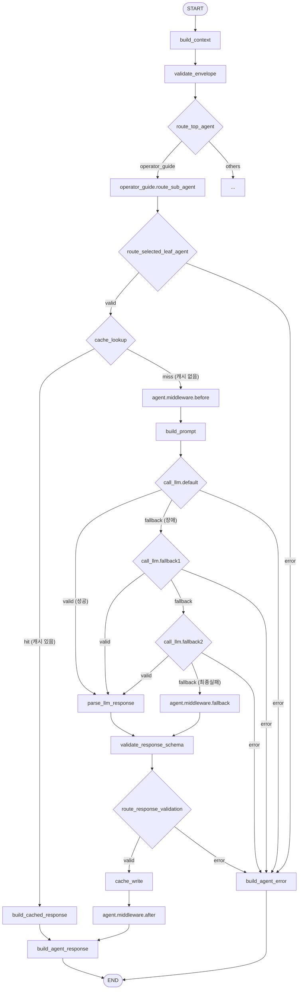

# Operator Guide Agent LangGraph 구조 안내서

이 문서는 `operator_guide` 에이전트가 작동하는 LangGraph 파이프라인의 전체 구조와 작동 흐름을 초보자 수준에서 설명하기 위한 구조 안내서입니다.

> [!NOTE]
> `operator_guide` 에이전트 폴더 내부에는 단독 `graph.py` 파일이 존재하지 않습니다. 대신 공통 에이전트 실행 엔진인 [runtime.py](file:///c:/factory-space/backend/src/agents/pipeline/runtime.py)와 [graph_edges.py](file:///c:/factory-space/backend/src/agents/pipeline/graph_edges.py) 파일에 의해 통합 구축된 LangGraph 파이프라인의 한 부분으로 설계되어 동작합니다.

---

## 1. LangGraph 파이프라인 개요

우리 시스템은 사용자 질문에 따라 적절한 에이전트를 매칭하고 실행하는 단일 **StateGraph**를 공유합니다. 이 파이프라인 안에서 `operator_guide` 에이전트는 사용자의 질문 유형(장비 사용법, 아이템 레시피, 공장 오류 분석)에 따라 최적의 하위 전담 대리인을 매핑하고 답변을 유도하는 중추적인 역할을 맡고 있습니다.

---

## 2. 그래프를 흐르는 상태 데이터 (State)

LangGraph 파이프라인에 소속된 모든 노드(Node)들은 인자(Parameter)를 통해 소통하지 않고, 공통의 상태 보관소인 `AgentGraphState`([state.py](file:///c:/factory-space/backend/src/agents/pipeline/state.py#L21))를 공유하여 데이터를 읽고 씁니다.

### 주요 State 필드

* **`envelope`**: 사용자가 보낸 요청 메시지의 봉투입니다. 질문자 ID, 세션 ID 및 질문 텍스트 원본이 담겨 있습니다.
* **`context`**: 요청 데이터를 에이전트가 처리하기 쉽게 가공한 실행 컨텍스트([AgentContext](file:///c:/factory-space/backend/src/agents/base.py))입니다.
* **`selectedAgent`**: 상위 오케스트레이터가 결정한 대상 도메인 에이전트입니다 (예: `operator_guide`).
* **`selectedLeafAgent`**: 최종적으로 답변을 생성할 하위 에이전트의 ID입니다 (예: `operator_guide.machine_help`).
* **`typedPayload`**: 실질적인 질문 내용이 포함된 JSON 페이로드입니다.
* **`prompt` / `promptMessages`**: 하위 에이전트가 지식을 조립하여 LLM(인공지능)에 보낼 프롬프트와 메시지 목록입니다.
* **`llmRaw`**: AI 모델이 반환한 아직 정제되지 않은 날것의 텍스트 응답입니다.
* **`operatorGuideMemory`**: 이전 대화 히스토리 및 확인된 사실 등 사용자 대화 기억과 연관된 메타데이터입니다.
* **`responsePayload`**: 사용자에게 돌려줄 최종 정돈된 답변 데이터 구조입니다.
* **`error`**: 파이프라인 구동 중 발생한 에러 정보입니다.

---

## 3. 그래프 구조 흐름도 (Mermaid)

사용자의 질문이 인입된 순간부터 답변이 반환될 때까지의 LangGraph 노드 및 조건부 엣지(갈림길)의 흐름은 다음과 같습니다.

---

## 4. 핵심 노드(Node) 동작 상세 분석

사용자 요청이 `operator_guide` 도메인으로 유입되었을 때 실행되는 주요 노드들의 실제 역할과 동작 방식입니다.

### 1) [build_context](file:///c:/factory-space/backend/src/agents/pipeline/runtime.py#L87) (입력 정리)
* **역할**: 입력 데이터인 `envelope`에서 세션 정보와 메타데이터를 발췌하여 통합 실행 컨텍스트(`AgentContext`)를 완성합니다.
* **State 변화**: `envelope`에서 정보를 읽어 `context`, `typedPayload`, `streams` 필드를 새로 생성해 State에 추가합니다.

### 2) [validate_envelope](file:///c:/factory-space/backend/src/agents/pipeline/runtime.py#L186) (검증/판단)
* **역할**: 접수된 메시지가 시스템이 요구하는 형식(`agent.request`)을 준수하는지 유효성 심사를 수행합니다.
* **State 변화**: 형식에 맞지 않다면 `error` 필드에 오류 내용을 작성합니다.

### 3) [route_top_agent](file:///c:/factory-space/backend/src/agents/pipeline/runtime.py#L205) (라우팅)
* **역할**: 오케스트레이터의 라우팅 프롬프트를 바탕으로 AI 추론을 거쳐, 질문에 답할 최상위 담당 에이전트를 지명합니다.
* **State 변화**: LLM의 응답에 맞춰 `selectedAgent` 필드에 대상 도메인(예: `"operator_guide"`)을 기재합니다.

### 4) [operator_guide.route_sub_agent](file:///c:/factory-space/backend/src/agents/pipeline/runtime.py#L292) (라우팅)
* **역할**: 오퍼레이터 가이드 내에서 최종적으로 일할 하위 세부 상담원(리프 에이전트)을 매핑합니다.
  * 만약 사용자가 세부 대상을 직접 명시했다면 즉시 승인합니다.
  * 명시되지 않았다면 `OperatorGuideAgent`가 전용 라우팅 프롬프트를 구성해 다시 AI 모델에 질의하여 매핑합니다.
* **State 변화**: 결정된 세부 담당 에이전트명을 `selectedLeafAgent` 필드에 기재합니다.
  * `operator_guide.recipe_explainer`: 레시피 설명 전담 ([RecipeExplainerAgent](file:///c:/factory-space/backend/src/agents/operator_guide/recipe_explainer.py#L19))
  * `operator_guide.machine_help`: 장비 사용법 전담 ([MachineHelpAgent](file:///c:/factory-space/backend/src/agents/operator_guide/machine_help.py#L19))
  * `operator_guide.troubleshooter`: 공장 정체 해결 전담 ([TroubleshooterAgent](file:///c:/factory-space/backend/src/agents/operator_guide/troubleshooter.py#L19))

### 5) [cache_lookup](file:///c:/factory-space/backend/src/agents/pipeline/runtime.py#L346) (검증/판단)
* **역할**: 동일한 에이전트와 동일한 질문 페이로드 조합으로 과거에 냈던 캐시 답변이 보관소에 있는지 확인합니다.
* **State 변화**: 보관 내역이 있을 시 `cachedPayload` 및 `cachedMetadata` 필드를 채워 다음 캐시 전용 엣지로 흘려보냅니다.

### 6) [build_prompt](file:///c:/factory-space/backend/src/agents/pipeline/runtime.py#L414) (검색 및 RAG 통합)
* **역할**: 사용자와의 이전 대화 내역(`recent_turns`), 플레이어가 승인해 준 공장 상황(`confirmed_facts`) 등의 대화 기억을 주입합니다. 그런 다음 매핑된 리프 에이전트의 프롬프트 구성 메서드를 호출하여 LLM 지시서를 만듭니다.
* **동작 기전**:
  * 내부적으로 `ManualQAService`([service.py](file:///c:/factory-space/backend/src/agents/operator_guide/service.py#L97))가 작동하여 기계 매뉴얼 CSV 원본 검색, RAG(검색기반 생성) 검색을 연이어 수행합니다.
  * 플레이어가 질문한 주제에 맞춰 실시간 게임 내 상황 정보(예: 전력 켜짐/꺼짐 상태 등)가 필요하다고 판단되면 이를 필터링하여 프롬프트 문서의 본문 근거로 병합합니다.
* **State 변화**: 가공 완료된 `prompt` 및 `promptMessages` 리스트를 구성하고, 이번 턴의 기억 데이터(`operatorGuideMemory`)를 갱신합니다.

### 7) [call_llm.default](file:///c:/factory-space/backend/src/agents/pipeline/runtime.py#L440) (LLM 응답 생성 및 폴백 루프)
* **역할**: 준비된 최종 완성형 프롬프트를 기반으로 메인 AI 서비스를 호출합니다.
* **폴백 메커니즘**: 메인 AI 서비스가 타임아웃 혹은 오류를 반환할 때를 대비하여 예비 채널(`fallback1` $\rightarrow$ `fallback2`)로 우회 호출을 연속 진행합니다.
* **State 변화**: 획득한 원시 문자열을 `llmRaw`에 기입하고, 사용한 모델/제공자 정보를 등록합니다.

### 8) [agent.middleware.fallback](file:///c:/factory-space/backend/src/agents/pipeline/runtime.py#L538) (검증/판단 복구)
* **역할**: 모든 인공지능 서버망 호출에 실패했을 때 비상 가동되는 장치입니다. AI의 요약 추론 없이, 하위 에이전트가 앞서 RAG와 CSV를 통해 찾아둔 매뉴얼 지식 정보 원본들을 규격에 맞춰 정형 답변으로 즉시 재조립합니다.
* **State 변화**: 로컬 지식으로 구성된 비상 답변을 `responsePayload`에 입력하고 `fallbackReason`에 `"llm_unavailable"` 사유를 기록합니다.

### 9) [parse_llm_response](file:///c:/factory-space/backend/src/agents/pipeline/runtime.py#L475) (후처리)
* **역할**: AI가 반환한 날것의 문자열에서 찌꺼기 텍스트를 제거하고 정제하여 순수 JSON 데이터 형태로 변환 및 포맷팅합니다.
* **State 변화**: `responsePayload` 및 `responseMetadata` 필드를 구성합니다.

### 10) [cache_write](file:///c:/factory-space/backend/src/agents/pipeline/runtime.py#L587) (후처리 및 메모리 보존)
* **역할**: 최종 확정된 정답을 캐시 DB에 저장하여 속도를 단축할 수 있게 조치하고, 동시에 플레이어 세션 기억 장치([session_memory.py](file:///c:/factory-space/backend/src/agents/operator_guide/session_memory.py))에 이번 대화 내용(`question`, `answer`)을 누적 업데이트합니다.
* **State 변화**: 세션 내부 대화 기억(Memory)을 갱신합니다.

---

## 5. 초보자 핵심 용어 해설

* **State (상태)**: 랑그래프 상에서 작동하는 일종의 '메모장'입니다. 모든 노드가 이 하나의 메모장에 질문 정보, AI 모델 결과, 에러 메시지 등을 적고 읽으며 유기적으로 소통합니다.
* **Node (노드)**: 특정 한 가지 기능(예: 질문 분류하기, AI 호출하기, 임시 메모리 저장하기 등)을 전담하여 처리하는 독립된 함수 또는 실행 단위입니다.
* **Edge (엣지)**: A 노드가 끝나면 B 노드로 가도록 지시하는 고정 통로입니다.
* **Conditional Edge (조건부 엣지)**: 현재 상태 데이터(State)를 검사하여 다른 노드로 안내하는 갈림길입니다. 예를 들어, `cache_lookup` 노드 수행 결과 캐시 히트 상태면 곧바로 답변 송출 노드로 안내하고, 캐시가 없으면(미스 상태) 다음 AI 프롬프트 제작 노드로 우회 안내합니다.
* **Fallback (폴백)**: 메인 AI 서비스 연결이 실패할 때 동작하는 안전 대비책입니다. 예비 모델을 순차 호출하거나, 최종 실패 시 내부 매뉴얼 서적 텍스트를 파싱하여 고정 답변을 안전하게 내놓도록 설계되어 있습니다.
* **RAG (Retrieval-Augmented Generation / 검색 기반 생성)**: 사전에 수집한 대량의 지식 베이스(매뉴얼, 위키 등)에서 질문과 관련된 지식 단편들을 실시간으로 검색해 내어, 이를 AI 프롬프트에 동적으로 첨부하여 대답을 유도하는 기법입니다.
