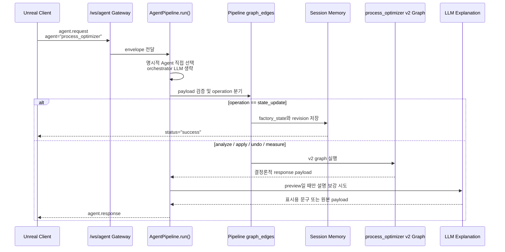
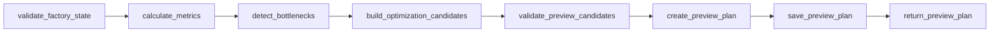
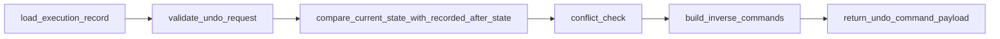
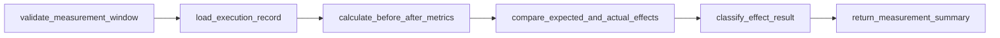
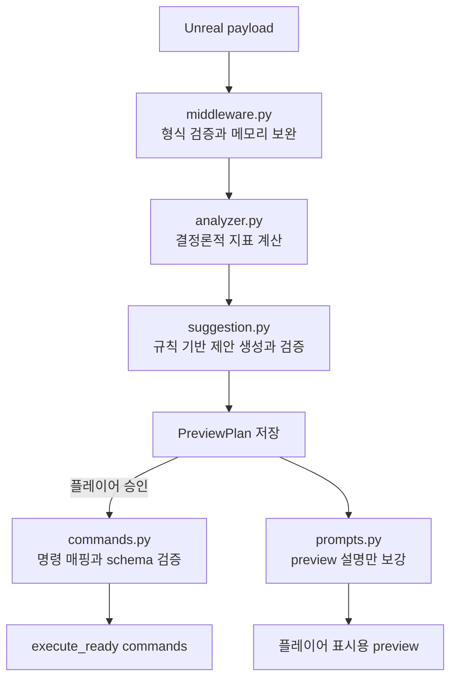

# process_optimizer Agent Structure

> 이 문서는 `C:\factory-space`의 현재 소스 코드를 기준으로 작성한 구조 설명서다.  
> 기획 문서에 적힌 목표가 아니라, 지금 실제로 연결된 public 실행 경로와 구현 범위를 설명한다.

## 1. 개요

`process_optimizer`는 Unreal이 보낸 공장 상태를 분석해 병목을 찾고, 플레이어가 검토할 최적화 제안을 만드는 Agent다. 플레이어가 제안을 승인하면 백엔드는 Unreal이 실행할 구조화된 명령을 준비하며, 이후 Undo 명령 준비와 효과 측정도 지원한다.

현재 구조의 핵심은 **결정론적 분석 및 검증 코드와 LLM 설명 계층을 분리한 것**이다.

- Python 코드가 공장 지표, 병목, 제안, 허용 명령, 승인, revision 충돌을 판단한다.
- LangGraph가 `analyze`, `apply`, `undo`, `measure`의 실행 순서를 관리한다.
- LLM은 `analyze`가 만든 preview의 플레이어용 문구만 보강한다.
- Unreal은 반환된 명령을 실제 월드에 적용하는 최종 실행 주체다.

따라서 이 Agent는 LLM이 공장을 임의로 조작하는 구조가 아니다. **코드가 안전한 후보를 만들고 검증한 뒤, LLM이 그 결과를 이해하기 쉽게 설명하는 구조**다.

## 2. 현재 실행 경로

Unreal의 요청은 `/ws/agent` WebSocket으로 들어온다. `backend/src/websocket_gateway/gateway.py`가 요청을 수신하고 `AgentPipeline.run()`에 전달한다.

요청에 `agent: "process_optimizer"`가 명시되어 있으면 top-level orchestrator LLM으로 Agent를 다시 선택하지 않는다. Pipeline은 해당 Agent를 바로 선택한 뒤 payload를 검증하고 `operation`에 따라 처리 경로를 나눈다.



실제 코드 흐름은 다음과 같다.

```text
Unreal Client
-> /ws/agent
-> websocket_gateway/gateway.py
-> AgentPipeline.run()
-> validate_process_payload
-> route_process_optimizer
   -> state_update: process_optimizer_state_update
   -> analyze/apply/undo/measure: process_optimizer_v2_graph
-> build_agent_response
-> Unreal Client
```

`state_update`는 v2 LangGraph를 실행하지 않는다. 세션별 최신 공장 상태와 revision을 프로세스 메모리에 저장한 뒤 성공 응답만 반환한다.

`analyze`, `apply`, `undo`, `measure`는 `compile_process_optimizer_graph()`가 만든 전용 LangGraph에서 처리된다. 그래프 결과가 반환된 다음 Pipeline runtime이 LLM 설명 보강 함수를 호출한다. 즉, **LLM 호출은 v2 그래프 내부 노드가 아니라 그래프 실행 이후의 후처리**다.

## 3. v1 / v2 관계

`backend/src/agents/process_optimizer/agent.py`의 `ProcessOptimizerAgent`는 초기 v1 구현이다. 현재도 패키지 `__init__.py`에서 export되며, 일부 테스트는 이 클래스를 직접 import해 prompt와 fallback 동작을 검증한다.

그러나 public `agent: "process_optimizer"` 요청은 이 클래스를 실행하지 않는다. 현재 public 경로는 Pipeline이 직접 `process_optimizer_v2_graph`를 호출한다.

| 구분 | legacy v1 `agent.py` | 현재 v2 LangGraph |
| --- | --- | --- |
| public WebSocket 경로 | 사용하지 않음 | 사용 |
| 직접 import 테스트 | 가능 | 가능 |
| 주요 역할 | 초기 prompt/fallback 참고 구현 | 실제 operation 처리 |
| 상태 흐름 | 단일 Agent 응답 중심 | analyze/apply/undo/measure 분기 |
| 문서 기준 | legacy reference | 현재 구현 기준 |

따라서 새 기능이나 Unreal 연동을 설명할 때 v1의 `build_prompt()` 또는 `fallback()`을 현재 public 런타임처럼 소개하면 안 된다.

## 4. 폴더 구조

| 파일 | 역할 | 주요 책임 | 초보자 관점 설명 |
| --- | --- | --- | --- |
| `__init__.py` | 패키지 공개 인터페이스 | legacy Agent, 분석 Tool, 주요 schema export | 다른 모듈이 자주 쓰는 이름을 한곳에서 import하도록 모아 둔다. |
| `agent.py` | legacy v1 Agent | v1 prompt 구성과 deterministic fallback | 현재 public 실행기는 아니며, 이전 구현 비교와 직접 테스트용 코드다. |
| `analyzer.py` | 공장 상태 분석 Tool | 평균 가동률, 입력 부족, 출력 포화, 컨베이어 혼잡, 전력 문제 계산 | LLM 대신 Python 규칙으로 숫자와 병목을 계산한다. |
| `suggestion.py` | 제안 생성 및 검증 Tool | 분석 결과를 최대 3개 제안으로 변환하고 제안 구조와 안전 규칙 검증 | 계산된 문제를 플레이어가 검토할 변경 제안으로 바꾼다. |
| `commands.py` | Unreal 명령 생성 및 검증 | 제안을 허용 명령으로 매핑하고 whitelist 및 Pydantic 검증 | 자연어 제안을 그대로 보내지 않고 정해진 JSON 명령으로 바꾼다. |
| `schemas.py` | 데이터 계약 | FactoryState, 분석 결과, 제안, PreviewPlan, 측정 응답 모델 정의 | 노드 사이에서 오가는 데이터의 필드와 타입을 고정한다. |
| `graph_state.py` | LangGraph 공유 상태 | 요청, 지표, 제안, 명령, 실행 기록, 오류 필드 정의 | 여러 노드가 한 요청을 처리하며 함께 사용하는 작업 메모리 형식이다. |
| `graph.py` | v2 그래프 조립 | operation 분기와 노드 간 edge 연결 | 어떤 검사를 어떤 순서로 실행할지 정한다. |
| `nodes.py` | v2 실행 노드 | analyze/apply/undo/measure 각 단계 구현 | 그래프의 실제 업무 단계를 함수 단위로 구현한 중심 파일이다. |
| `middleware.py` | public 요청 전처리 | payload 검증, `state_update` 저장, 누락 상태를 세션 메모리로 보완 | 그래프에 들어가기 전 요청 형식을 확인하고 최근 상태를 채운다. |
| `prompts.py` | LLM 설명 계층 | preview 설명 prompt 구성과 허용된 표시 필드 병합 | 코드가 만든 결과의 의미는 유지한 채 한국어 설명만 다듬는다. |
| `session_memory.py` | 세션 상태 저장소 | 세션별 최신 factory snapshot과 revision 저장 | 주기 업데이트로 받은 최신 공장 상태를 RAM에 기억한다. |
| `preview_store.py` | preview 저장소 | 세션과 plan ID로 PreviewPlan 저장, 만료 및 revision 충돌 확인 | 분석 결과를 승인 요청 때 다시 찾을 수 있게 5분 동안 보관한다. |
| `execution_record.py` | 실행 기록 저장소 | plan/change별 before, after, revision 저장과 중복 확인 | Undo와 측정을 위해 변경 전후 정보를 RAM에 기록한다. |
| `undo.py` | Undo 도우미 | 현재 상태와 recorded after 비교, 역방향 명령 생성 | 적용 후 플레이어가 다시 수정했는지 확인한 뒤 안전할 때만 되돌림 명령을 만든다. |
| `effect_measurement.py` | 효과 측정 도우미 | 관찰 조건 확인, before 상태 복원, 효과 분류 | 적용 전과 현재 지표를 비교해 성공, 미달, 악화를 판정한다. |

## 5. LangGraph operation 흐름

### 5.1 analyze



1. `FactoryState`와 `factoryRevision`을 검증한다.
2. `FactoryStateAnalyzerTool`로 공장 지표를 계산한다.
3. 계산 결과에서 병목 목록을 정리한다.
4. 규칙 기반으로 최대 3개의 `OptimizationSuggestion`을 만든다.
5. 제안 개수, 필수 설명, confidence 범위 등을 검증한다.
6. 제안과 예상 효과를 `PreviewPlan`으로 묶는다.
7. PreviewPlan을 메모리 저장소에 저장한다. 유효 기간은 5분이다.
8. `status: "preview"` 응답을 만든다.
9. 그래프가 끝난 뒤 LLM이 preview 표시 문구를 보강할 수 있다.

중요한 점은 **analyze에서 실행 명령을 만들지 않는다는 것**이다. 저장되는 PreviewPlan의 `changes`는 제안 목록이며, `commands`가 아니다.

### 5.2 apply

```mermaid
flowchart LR
    A[validate_apply_request] --> B[load_preview_plan]
    B --> C[verify_plan_not_expired]
    C --> D[verify_factory_revision]
    D --> E[validate_approval]
    E --> F[validate_selected_changes]
    F --> G[build_unreal_commands]
    G --> H[validate_command_payloads]
    H --> I[create_execution_record]
    I --> J[return_command_payload]
```



1. `plan_id`, 선택 변경 ID, 공장 상태와 revision을 정규화한다.
2. 세션과 plan ID로 저장된 PreviewPlan을 조회한다.
3. 5분 만료 여부를 확인한다.
4. analyze 시점과 apply 시점의 `factoryRevision`이 같은지 확인한다.
5. `approval`이 정확히 `true`인지 확인한다.
6. 승인된 change ID가 PreviewPlan 안에 있는지 확인한다.
7. 이 단계에서 처음으로 승인된 제안을 Unreal 명령으로 변환한다.
8. 명령 whitelist와 명령별 Pydantic schema를 검증한다.
9. change별 execution record를 메모리에 만든다.
10. `status: "execute_ready"`와 `commands`를 반환한다.

`execute_ready`는 **실행 완료**가 아니다. 백엔드 검증을 통과한 명령이 Unreal 실행을 기다리는 상태다.

apply 요청에 `before_states`와 `after_states`가 있으면 실행 기록에 신뢰 가능한 snapshot으로 저장한다. 없으면 `factory_state`에서 before 상태를 찾고, after 상태는 `requires_unreal_confirmation: true`인 계획 상태로 기록할 수 있다. 이는 실제 Unreal 실행 성공을 확인한 기록과 같지 않다.

### 5.3 undo



1. `plan_id`에 속한 execution record를 조회한다.
2. 최신 `factory_state`가 있는지 확인한다.
3. 각 record의 after 상태와 최신 대상 상태를 비교한다.
4. 하나라도 충돌하면 전체 Undo 명령 준비를 중단한다.
5. 신뢰 가능한 before 상태로 역방향 명령을 만든다.
6. `status: "undo_ready"`와 역방향 `commands`를 반환한다.

`undo_ready`도 실제 Undo 완료가 아니라 Unreal이 실행할 역방향 명령의 준비 완료 상태다.

### 5.4 measure



현재 코드는 다음 **두 조건을 모두** 요구한다.

- execution record 생성 후 최소 30초 경과
- `production_cycles >= 3`

첨부 요청의 “30초 또는 3회”와 달리 실제 `validate_measurement_window()`는 생산 주기를 먼저 검사하고 관찰 시간도 이어서 검사한다. 둘 중 하나라도 부족하면 `measurement_not_ready`를 반환한다.

조건을 통과하면 execution record의 before 상태를 이용해 적용 전 공장 상태를 복원하고, 최신 `factory_state`와 각각 지표를 계산한다.

| 측정 결과 | 의미 | 다음 행동 |
| --- | --- | --- |
| `success` | 실제 해소 건수가 예상치를 충족 | `monitor` |
| `failed` | 악화되지는 않았지만 예상치를 충족하지 못함 | `reanalyze` |
| `degraded` | 가동률이 낮아졌거나 병목 수가 증가 | `reanalyze` |

최종 WebSocket 응답의 바깥 상태는 `measurement_ready`이며, 위 분류는 `measurement_result.status`에 들어간다. 측정 결과가 나빠도 자동 복구 명령은 만들지 않으며 `commands`는 빈 목록이다.

### 5.5 state_update

`state_update`는 v2 graph operation이 아니다. Pipeline의 `process_optimizer_state_update` 노드가 `process_optimizer_memory`에 다음 두 값을 저장한다.

- 세션별 최신 `factory_state`
- 해당 상태의 `factoryRevision`

이 요청은 분석, preview 생성, LLM 호출, 명령 생성을 하지 않는다. 이후 analyze/apply/undo/measure 요청에 상태나 revision이 빠졌을 때 middleware가 같은 세션의 최신 값을 보완할 수 있다.

## 6. Tool / Middleware / LLM 역할 경계



### 결정론적 코드

- `analyzer.py`는 공장 snapshot을 계산 가능한 지표로 바꾼다.
- `suggestion.py`는 분석 결과에서 제안을 만들고 최대 개수와 필수 필드를 검증한다.
- `commands.py`는 승인된 제안을 구조화된 명령으로 매핑한다.
- `middleware.py`는 public payload schema와 factory state를 검사하고 메모리 상태를 보완한다.
- `nodes.py`는 승인, 만료, revision, 선택 항목, Undo 충돌, 측정 조건을 검사한다.

### LLM

`prompts.py`의 설명 계층은 `status == "preview"`이고 변경 제안이 있을 때만 동작한다. LLM은 다음 표시용 필드만 보강할 수 있다.

- `summary`
- `player_message`
- 변경별 `reason`
- 변경별 `priority_explanation`
- 변경별 `expected_effect` 설명 문자열

LLM은 새 change ID, 새 장비, 새 명령, 새 수치, 실행 결과를 만들도록 허용되지 않는다. 모델 응답에서 기존 change ID와 일치하는 설명만 병합한다.

또한 LLM 보강은 저장된 PreviewPlan을 수정하지 않는다. `apply`는 메모리에 저장된 원래 `PreviewPlan.changes`를 조회해 명령을 만들기 때문에, 플레이어에게 보인 LLM 문구가 실제 명령 결정에 사용되지 않는다.

LLM을 사용할 수 없거나 JSON 응답이 잘못되면 결정론적 preview 원본을 그대로 반환하고 metadata에 fallback 정보를 남긴다.

## 7. 상태 저장 구조

현재 세 저장소는 모두 모듈 전역에 한 번 만들어지는 **프로세스 메모리 singleton**이다.

| 저장소 | 키 | 저장 내용 | 주요 사용처 |
| --- | --- | --- | --- |
| `process_optimizer_memory` | `session_id` | 최신 factory state와 revision | `state_update`, 누락 입력 보완 |
| `preview_plan_store` | `(session_id, plan_id)` | PreviewPlan | apply, 예상 효과 조회 |
| `execution_record_store` | `(plan_id, change_id)` | before, after, revision, 생성 시각 | 중복 차단, Undo, measure |

이 구조는 구현과 테스트가 단순하지만 다음 제한이 있다.

- 서버를 재시작하면 모든 상태가 사라진다.
- DB 영속화가 없다.
- 여러 worker 또는 여러 서버 프로세스가 각자 다른 메모리를 가지므로 상태가 자동 공유되지 않는다.
- 장기 실행 기록이나 서버 장애 복구 용도로 사용할 수 없다.

운영 환경에서 여러 프로세스를 사용하려면 PreviewPlan과 execution record를 공유 저장소로 옮기는 후속 설계가 필요하다.

## 8. Command 생성과 검증

명령 종류를 나타내는 필드 이름은 `command_type`이 아니라 **`command`**다.

```json
{
  "command": "set_machine_enabled",
  "machine_id": "smelter_1",
  "enabled": true
}
```

현재 허용 명령은 다음 7개다.

| 명령 | 목적 |
| --- | --- |
| `set_recipe` | 장비 레시피 변경 |
| `set_machine_enabled` | 장비 활성 상태 변경 |
| `connect_conveyor` | 컨베이어 연결 |
| `disconnect_conveyor` | 컨베이어 연결 해제 |
| `move_machine` | 장비 이동 |
| `place_machine` | 장비 배치 |
| `remove_machine` | 장비 제거 |

`build_command_payload()`는 승인된 제안의 `recommended_action`, 제안 ID와 대상 종류를 키워드로 검사해 명령을 선택한다. 그 뒤 `validate_command_payload()`가 다음 순서로 검증한다.

1. `command`가 `ALLOWED_COMMANDS`에 있는지 확인한다.
2. 명령별 Pydantic 모델로 필수 필드와 타입을 확인한다.

현재 매핑에는 기본 ID, 기본 좌표, 기본 레시피처럼 예시 성격의 fallback 값이 포함되어 있다. 따라서 schema를 통과했다는 사실은 Unreal 월드에서 실제 실행 가능하다는 뜻이 아니다.

다음 항목의 최종 검증은 현재 백엔드 코드만으로 확정할 수 없으며 Unreal 구현 확인이 필요하다.

- 대상 장비와 컨베이어의 실제 존재 여부
- 위치 점유와 배치 가능 여부
- 연결 포트 및 방향의 유효성
- 플레이어 보유 자원
- 전력 한도
- 명령 실행 직전의 최신 월드 revision

## 9. Undo와 Effect Measurement 제약

### Undo

Undo는 execution record의 after 상태와 Unreal이 보낸 최신 공장 상태를 비교한다. after snapshot이 authoritative하면 해당 필드를 직접 비교하고, 그렇지 않으면 planned command로 예상 상태를 확인한다.

다음 경우에는 안전한 Undo가 어려워진다.

- 대상 장비나 컨베이어를 최신 snapshot에서 찾을 수 없음
- 기록된 after 상태와 현재 상태가 다름
- before 상태가 `state_known: false`
- 원래 연결, 위치, 레시피 등 역명령에 필요한 값이 없음

현재 Undo 경로는 execution record에 저장된 revision을 응답에 사용하지만, undo 요청의 최신 revision과 기록 revision을 별도 gate에서 엄격히 비교하지 않는다. 따라서 최신 revision 검증은 제한적이다.

### Effect measurement

measure의 신뢰도는 before와 after 상태의 품질에 좌우된다. before 상태가 placeholder라면 측정을 중단한다. 정확한 결과를 위해 Unreal은 apply 시점의 변경 대상별 before snapshot과 measure 시점의 최신 전체 factory state를 제공해야 한다.

현재 측정은 입력 부족, 출력 적체, 컨베이어 혼잡 해소 수와 평균 가동률을 비교한다. 장기 생산량, 실제 분당 생산량, 비용, 에너지 효율 전체를 평가하는 시뮬레이터는 아니다.

성과가 `failed` 또는 `degraded`여도 자동으로 공장을 되돌리지 않는다. 결과에 `reanalyze`를 권장하고 명령 목록은 비워 둔다.

## 10. Unreal JSON 계약에서 주의할 점

공통 요청 envelope의 핵심 형태는 다음과 같다.

```json
{
  "type": "agent.request",
  "request_id": "optimizer-request-001",
  "session_id": "player-session-001",
  "client_id": "unreal-client",
  "agent": "process_optimizer",
  "payload": {
    "operation": "analyze"
  },
  "context": {
    "language": "ko",
    "mode": "gameplay"
  }
}
```

`payload.operation`은 다음 값을 사용한다.

| operation | 필요한 핵심 입력 | 현재 결과 |
| --- | --- | --- |
| `state_update` | `factory_state`, `factoryRevision` | 메모리 갱신 |
| `analyze` | 최신 factory state와 revision | `preview` |
| `apply` | `plan_id`, `approval`, revision, 선택 ID | `execute_ready` 또는 차단 오류 |
| `undo` | `plan_id`, 최신 factory state | `undo_ready` 또는 `undo_conflict` |
| `measure` | `plan_id`, 최신 factory state, `production_cycles`, 관찰 시각 | `measurement_ready` 또는 측정 대기/오류 |

통합 시 특히 구분해야 할 상태는 다음과 같다.

- `preview`: 플레이어 검토용 제안이며 실행 명령이 아니다.
- `execute_ready`: Unreal이 실행할 명령이 준비됐으며 실행 성공은 아니다.
- `undo_ready`: 역방향 명령이 준비됐으며 Undo 성공은 아니다.
- `measurement_ready`: 측정 리포트가 준비된 상태다.

현재 백엔드에는 Unreal이 명령을 실행한 뒤 성공/실패 결과를 별도 callback으로 확정하는 process_optimizer 전용 흐름이 없다. 여러 명령 중 일부만 성공한 결과를 받아 성공한 항목만 record에 반영하는 부분 성공 처리도 없다. 자동 복구 명령 역시 구현되어 있지 않다.

따라서 실제 통합에서는 다음 계약이 추가 확인 또는 후속 구현 대상이다.

1. Unreal이 `execute_ready.commands`를 월드 규칙으로 최종 검증하고 실행하는 방식
2. 각 명령의 성공/실패와 실제 after snapshot을 백엔드에 돌려주는 방식
3. 실행 결과를 execution record에 확정 반영하는 방식
4. 부분 성공 후 재분석을 시작하는 방식

## 11. 기존 문서와 다른 점

아래 표는 기존 파일을 수정하지 않고, 이 문서를 읽을 때 주의해야 할 차이만 정리한다.

| 기존 파일 | 현재 코드 기준 주의할 점 |
| --- | --- |
| `docs/process_optimizer/process_optimizer_v2_runtime_contract.md` | v2 실행 경로와 안전 경계 설명은 대체로 맞지만, “현재 v2 메인 실행 경로는 LLM system prompt에 의존하지 않는다”와 “후속 확장에서 explanation node를 붙일 경우”라는 설명은 현재 상태보다 오래됐다. 지금은 `prompts.py`의 preview 설명 보강이 Pipeline에서 실제 호출된다. |
| `docs/process_optimizer/unreal_websocket_contract.md` | 일부 명령 예시가 `command_type`을 사용하지만 현재 schema 필드는 `command`다. 실행 결과/부분 실패 흐름은 현재 백엔드 구현으로 완료된 계약처럼 해석하면 안 된다. |
| `docs/process_optimizer/process_optimizer_demo_guide.md` | `state_update`를 LangGraph operation처럼 소개한 부분은 현재 runtime과 다르다. 실제로는 Pipeline 전용 노드에서 메모리만 갱신하며 v2 graph를 타지 않는다. |
| `docs/process_optimizer/process_optimizer_portfolio_metrics.md` | v2 전환과 안전 gate 설명은 대체로 맞다. 다만 explanation LLM을 후속 과제로 적은 부분은 현재 구현보다 오래됐고, Unreal command result 및 partial success는 여전히 미구현이다. 과거 테스트 통과 수치는 현재 실행 결과로 다시 확인해야 한다. |
| `backend/docs/unreal_agent_json_examples.md` | operation별 요청 예시는 연동 참고 자료로 유용하다. 다만 `execute_ready` 이후 실제 실행 결과 callback과 부분 성공 처리는 현재 백엔드가 제공하지 않으므로 Unreal과 후속 계약이 필요하다. |
| `backend/docs/agent_test_operator_process_examples.md` | agent-test 호출 순서를 확인하는 예시 문서다. 테스트 UI의 모델 표시는 실제 LLM 사용 여부와 별개일 수 있으며, process_optimizer에서 LLM metadata가 의미 있는 operation은 현재 preview 설명 보강이 적용되는 analyze다. |
| `backend/src/docs_router.py` | process_optimizer를 legacy `ProcessOptimizerAgent.build_prompt`, LLM 호출, fallback 중심으로 소개한다. 현재 public v2 graph, operation 분기, preview-only LLM 후처리를 반영하지 못한다. |

이 문서와 기존 문서가 충돌하면 public 런타임을 설명할 때는 현재 소스 코드와 이 문서의 구분을 우선 확인해야 한다.

## 12. 포트폴리오 어필 포인트

### LangGraph 기반 operation 분리

하나의 긴 함수가 모든 상황을 처리하지 않도록 `analyze`, `apply`, `undo`, `measure`를 각기 다른 노드 흐름으로 구성했다. 요청 상태와 오류를 TypedDict로 공유하며 단계별 책임을 드러냈다.

### LLM 권한 제한

LLM이 병목 수치나 명령을 결정하지 않도록 분석, 제안, 명령 검증을 Python 코드로 분리했다. LLM은 검증이 끝난 preview의 플레이어용 설명만 바꿀 수 있고, 저장된 plan과 실제 command에는 영향을 주지 않는다.

### 승인 기반 실행 준비

분석 결과를 즉시 실행하지 않고 5분짜리 PreviewPlan으로 저장한다. apply에서는 plan 존재 여부, 만료, revision, 명시적 승인, 선택 change ID, command schema를 순서대로 확인한다.

### Undo와 측정 흐름

변경별 before/after 상태를 execution record로 관리하고, 현재 상태가 recorded after와 다르면 Undo를 차단한다. 효과 측정은 최소 관찰 시간과 생산 주기를 모두 확인한 뒤 before/after 지표를 비교한다.

### WebSocket 기반 Unreal 연동

Unreal의 공장 snapshot을 `/ws/agent` 공통 envelope로 받아 Pipeline과 전용 graph에 연결했다. 제안 표시, 실행 명령 준비, Undo 명령 준비, 측정 결과를 구조화된 JSON 상태로 반환한다.

### 현재 한계의 명시

프로세스 메모리 저장소는 재시작과 멀티 프로세스 공유에 취약하다. 또한 `execute_ready` 이후의 실제 Unreal 실행 결과 callback과 부분 성공 처리는 구현되지 않았다. 이 한계를 숨기지 않고 **백엔드의 실행 준비 책임과 Unreal의 실제 실행 책임을 분리해 설명할 수 있다는 점**도 설계 이해도를 보여 준다.

## 13. 현재 구현 범위 요약

| 항목 | 현재 상태 |
| --- | --- |
| public v2 routing | 구현 |
| 주기 상태 메모리 갱신 | 구현, v2 graph 우회 |
| 결정론적 공장 분석 | 구현 |
| 최대 3개 preview 제안 | 구현 |
| preview LLM 설명 보강 | 구현 |
| 명시적 승인 및 revision gate | 구현 |
| whitelist 및 Pydantic 명령 검증 | 구현 |
| `execute_ready` 명령 준비 | 구현 |
| execution record 메모리 저장 | 구현 |
| Undo 충돌 검사와 역명령 준비 | 구현 |
| 30초와 3회 생산 주기 기반 측정 | 구현 |
| DB 영속화 | 미구현 |
| Unreal 실행 결과 callback | 미구현 |
| 부분 성공 확정 처리 | 미구현 |
| 자동 복구 실행 | 미구현 |
| Unreal 월드 규칙 최종 검증 | Unreal 구현 추가 확인 필요 |
