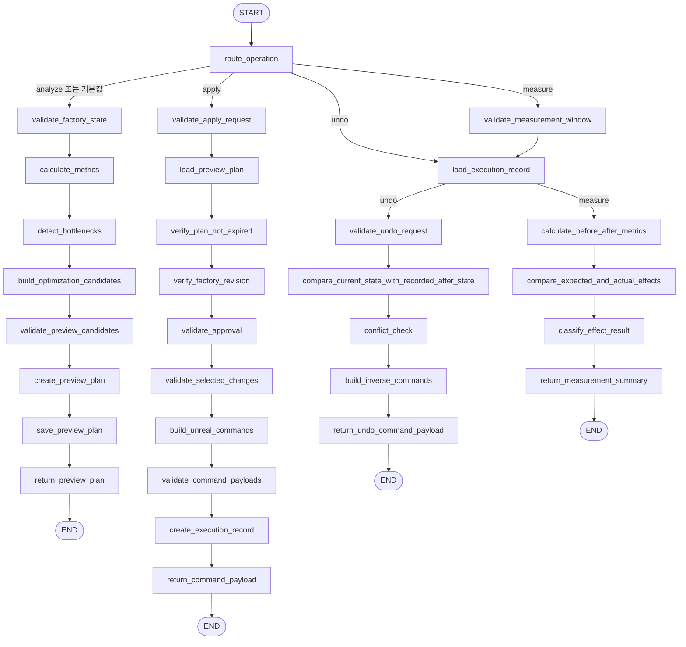
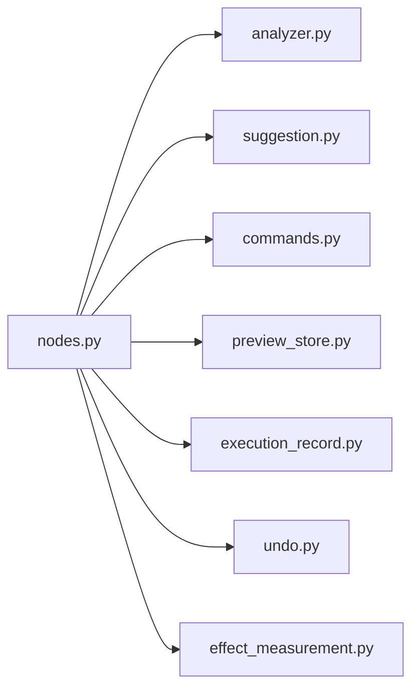

# Process Optimizer LangGraph Structure

> 작성 기준: `backend/src/agents/process_optimizer/graph.py`와 현재 연결된 node, State, Pipeline runtime 소스  
> 문서 유형: 내부 구조 Reference + Explanation

## 1. 문서 목적

이 문서는 `process_optimizer` v2가 LangGraph로 요청을 어떻게 나누고 처리하는지 설명한다.

초보자가 다음 질문에 답할 수 있도록 구성했다.

- 그래프는 어디서 만들어지는가?
- 어떤 node가 등록되어 있는가?
- `analyze`, `apply`, `undo`, `measure`는 어떤 순서로 실행되는가?
- State에는 어떤 데이터가 들어가는가?
- Tool, LLM, RAG는 그래프와 어떻게 연결되는가?

현재 public 요청의 중심은 legacy `ProcessOptimizerAgent`가 아니라 `compile_process_optimizer_graph()`가 만드는 v2 그래프다.

## 2. graph.py의 역할

`backend/src/agents/process_optimizer/graph.py`는 Process Optimizer의 실제 분석이나 명령 생성 로직을 직접 구현하지 않는다. 대신 다음 세 가지를 담당한다.

1. `ProcessOptimizerGraphState`를 사용하는 `StateGraph`를 생성한다.
2. `nodes.py`에 정의된 node 함수 30개를 이름과 함께 등록한다.
3. 요청의 `operation`에 따라 node가 이동할 edge를 연결한다.

```python
workflow = StateGraph(ProcessOptimizerGraphState)
```

LangGraph에서 node는 하나의 처리 단계다. 각 node는 공유 State에서 필요한 값을 읽고, 다음 단계에 추가할 값을 딕셔너리로 반환한다.

```python
def calculate_metrics(state: ProcessOptimizerGraphState) -> dict[str, Any]:
    ...
    return {"metrics": report}
```

LangGraph는 반환된 딕셔너리를 기존 State에 병합하고 다음 node로 이동한다.

## 3. 전체 구성 요소

| 구성 요소 | 현재 구현 |
| --- | --- |
| State 타입 | `ProcessOptimizerGraphState` |
| Graph 생성 | `StateGraph(ProcessOptimizerGraphState)` |
| 등록 node 수 | 30개 |
| 시작점 | `START -> route_operation` |
| 종료점 | operation별 `return_*` node 이후 `END` |
| conditional edge | 2개 |
| 내부 operation | `analyze`, `apply`, `undo`, `measure` |
| 그래프 외부 operation | `state_update` |
| 그래프 내부 LLM node | 없음 |
| 그래프 내부 RAG node | 없음 |
| LangChain `ToolNode` | 없음 |

### 3.1 등록 node 수

| 영역 | 개수 |
| --- | ---: |
| 공통 라우팅 | 1 |
| Analyze | 8 |
| Apply | 10 |
| Undo | 6 |
| Measure | 5 |
| 합계 | 30 |

## 4. State 구조

State 정의는 `backend/src/agents/process_optimizer/graph_state.py`의 `ProcessOptimizerGraphState`다.

```text
ProcessOptimizerGraphState
├─ 요청 입력
│  ├─ payload
│  ├─ context
│  ├─ session_id
│  └─ operation
├─ 공장 상태
│  ├─ factory_state
│  ├─ before_states
│  ├─ after_states
│  ├─ factoryRevision
│  └─ goal
├─ 분석 결과
│  ├─ metrics
│  ├─ suggestions
│  └─ ui_hints
├─ 계획 및 승인
│  ├─ plan_id
│  ├─ expires_at
│  ├─ preview_plan
│  ├─ approved_change_ids
│  └─ approved_changes
├─ 실행 및 Undo
│  ├─ commands
│  ├─ execution_records
│  └─ conflicts
├─ 측정
│  ├─ before_metrics
│  ├─ measurement_result_data
│  └─ measurement_result
└─ 응답 및 오류
   ├─ previewPayload
   ├─ error
   └─ error_type
```

최초 그래프 호출 시 Pipeline은 모든 필드를 채우지 않는다.

```python
compile_process_optimizer_graph().invoke(
    {
        "payload": payload,
        "context": envelope.context,
        "session_id": context.session_id,
    }
)
```

나머지 필드는 node가 순서대로 계산해 State에 추가한다.

### 4.1 현재 State 정의에서 주의할 점

node가 실제로 사용하는 다음 필드는 `ProcessOptimizerGraphState`에 선언되어 있지 않다.

- `bottlenecks`
- `production_cycles`

현재 LangGraph 실행에는 사용할 수 있지만 정적 타입 검사와 코드 탐색의 정확성을 위해서는 추후 State 정의와 실제 사용 필드를 맞출 필요가 있다.

또한 `TypedDict`가 `total=False`로 선언되어 있지 않지만 최초 입력에는 일부 필드만 전달된다. 현재 구현은 LangGraph의 부분 State 병합 방식에 의존한다.

## 5. Router와 Conditional Edge

## 5.1 route_operation node

그래프의 첫 node는 `route_operation`이다.

```python
operation = payload.get("operation") or "analyze"
return {"operation": operation}
```

요청에 operation이 없으면 `analyze`를 기본값으로 사용한다.

`route_operation` 자체는 다음 node를 선택하지 않는다. 실제 선택은 `graph.py`의 `get_next_step()`이 담당한다.

```text
apply   -> validate_apply_request
undo    -> load_execution_record
measure -> validate_measurement_window
기타    -> validate_factory_state
```

public 요청에서는 Pipeline의 Pydantic 검증과 `route_process_optimizer()`가 알 수 없는 operation을 먼저 차단한다. 다만 v2 graph를 직접 호출해 알 수 없는 operation을 전달하면 `get_next_step()`의 기본 분기에 따라 Analyze 흐름으로 이동한다.

## 5.2 load_execution_record 이후 분기

`load_execution_record`는 Undo와 Measure가 함께 사용한다.

```text
operation == measure -> calculate_before_after_metrics
그 외                 -> validate_undo_request
```

Measure는 다음 순서로 이 공유 node에 도달한다.

```text
validate_measurement_window
-> load_execution_record
-> calculate_before_after_metrics
```

Undo는 처음부터 `load_execution_record`로 진입한 뒤 Undo 검증으로 이동한다.

## 5.3 오류 처리 방식

내부 그래프에는 `error` 전용 conditional edge가 없다.

node가 오류를 발견하면 다음과 같이 State에 오류를 기록한다.

```python
return {
    "error": "오류 설명",
    "error_type": "오류 코드",
}
```

이후 node는 보통 `state.get("error")`를 확인하고 추가 처리를 생략한다. edge 자체는 계속 이어지며, operation별 마지막 `return_*` node가 오류 응답을 만든다.

## 6. 전체 그래프 Mermaid



## 7. Analyze 흐름

Analyze는 공장 상태에서 병목을 찾고 플레이어 승인 전 preview를 만드는 흐름이다.

```text
validate_factory_state
-> calculate_metrics
-> detect_bottlenecks
-> build_optimization_candidates
-> validate_preview_candidates
-> create_preview_plan
-> save_preview_plan
-> return_preview_plan
-> END
```

### 7.1 validate_factory_state

| 항목 | 내용 |
| --- | --- |
| 정의 | `nodes.py` |
| 유형 | 입력 정리 + 검증 |
| 읽는 값 | `payload`, `context`, `session_id` |
| 추가하는 값 | `operation`, `factory_state`, `factoryRevision`, `goal`, `session_id`, `error` |
| 다음 node | `calculate_metrics` |

`FactoryState` Pydantic 모델로 snapshot 형식을 검사한다. 장비와 컨베이어가 모두 없으면 오류로 처리한다.

### 7.2 calculate_metrics

| 항목 | 내용 |
| --- | --- |
| 유형 | 도구 실행 |
| 읽는 값 | `factory_state`, `factoryRevision`, `goal`, `error` |
| 추가하는 값 | `metrics` 또는 `error` |
| 호출 도구 | `FactoryStateAnalyzerTool.analyze()` |
| 다음 node | `detect_bottlenecks` |

장비 평균 가동률, 입력 부족, 출력 적체, 컨베이어 혼잡, 전력 문제를 Python 코드로 계산한다. LLM은 사용하지 않는다.

### 7.3 detect_bottlenecks

| 항목 | 내용 |
| --- | --- |
| 유형 | 검증·판단 |
| 읽는 값 | `metrics` |
| 추가하는 값 | `bottlenecks` |
| 다음 node | `build_optimization_candidates` |

분석 리포트에서 병목 관련 필드만 묶는다. 현재 다음 node는 `bottlenecks` 대신 `metrics`를 직접 사용하므로, 이 값은 응답 생성에 직접 소비되지 않는다.

### 7.4 build_optimization_candidates

| 항목 | 내용 |
| --- | --- |
| 유형 | 도구 실행 |
| 읽는 값 | `metrics` |
| 추가하는 값 | `suggestions`, `ui_hints` |
| 호출 도구 | `OptimizationSuggestionTool.generate_suggestions()` |
| 다음 node | `validate_preview_candidates` |

최적화 목표에 따라 병목 우선순위를 정렬하고 최대 3개의 제안을 만든다.

### 7.5 validate_preview_candidates

| 항목 | 내용 |
| --- | --- |
| 유형 | 검증·판단 |
| 읽는 값 | `suggestions`, `error` |
| 추가하는 값 | 실패 시 `error` |
| 호출 도구 | `SuggestionValidationTool.validate_suggestions()` |
| 다음 node | `create_preview_plan` |

제안 개수가 3개를 넘는지 확인하고, 제안 설명에 원시 명령 문자열이나 JSON 명령 주입이 포함됐는지 검사한다.

### 7.6 create_preview_plan

| 항목 | 내용 |
| --- | --- |
| 유형 | 후처리 |
| 읽는 값 | 제안, UI 힌트, revision, goal, session |
| 추가하는 값 | `plan_id`, `expires_at`, `preview_plan` |
| 다음 node | `save_preview_plan` |

검증된 제안을 `PreviewPlan`으로 묶는다. 계획 ID를 생성하고 현재 시각에서 5분 뒤를 만료 시각으로 설정한다.

이 단계에서 저장되는 것은 제안 목록이다. Unreal 실행 명령은 아직 만들지 않는다.

### 7.7 save_preview_plan

| 항목 | 내용 |
| --- | --- |
| 유형 | 저장소 실행 |
| 읽는 값 | `preview_plan` |
| 외부 효과 | `preview_plan_store` 메모리에 저장 |
| 다음 node | `return_preview_plan` |

세션 ID와 plan ID를 키로 preview를 프로세스 메모리에 저장한다.

### 7.8 return_preview_plan

| 항목 | 내용 |
| --- | --- |
| 유형 | 후처리 |
| 읽는 값 | `preview_plan` 또는 `error` |
| 추가하는 값 | `previewPayload` |
| 다음 지점 | `END` |

성공하면 `status: "preview"`를, 실패하면 `status: "error"`를 담은 응답 payload를 만든다.

## 8. Apply 흐름

Apply는 저장된 preview 중 플레이어가 승인한 제안만 Unreal 명령으로 준비한다.

```text
validate_apply_request
-> load_preview_plan
-> verify_plan_not_expired
-> verify_factory_revision
-> validate_approval
-> validate_selected_changes
-> build_unreal_commands
-> validate_command_payloads
-> create_execution_record
-> return_command_payload
-> END
```

| Node | 유형 | 핵심 입력 | 핵심 출력·역할 |
| --- | --- | --- | --- |
| `validate_apply_request` | 입력 정리 | payload, context | plan ID, 승인 ID, before/after 상태, revision 정규화 |
| `load_preview_plan` | 저장소 조회 | session ID, plan ID | 저장된 `preview_plan` |
| `verify_plan_not_expired` | 검증 | preview plan | 5분 만료 여부 |
| `verify_factory_revision` | 검증 | plan revision, 현재 revision | 변경 충돌 여부 |
| `validate_approval` | 검증 | `payload.approval` | `true`가 아니면 `approval_required` |
| `validate_selected_changes` | 검증 | plan changes, 승인 ID | `approved_changes` |
| `build_unreal_commands` | 도구 실행 | 승인 제안 | `commands` |
| `validate_command_payloads` | 검증 | commands | whitelist와 Pydantic schema 확인 |
| `create_execution_record` | 저장소 실행 | 명령, before/after, revision | 변경별 execution record |
| `return_command_payload` | 후처리 | plan, 승인 제안, commands | `execute_ready` 응답 |

`execute_ready`는 Unreal 실행 완료가 아니다. 백엔드에서 실행할 명령의 준비와 schema 검증이 끝났다는 의미다.

## 9. Undo 흐름

Undo는 기록된 적용 후 상태와 현재 공장 상태가 같을 때만 역방향 명령을 준비한다.

```text
load_execution_record
-> validate_undo_request
-> compare_current_state_with_recorded_after_state
-> conflict_check
-> build_inverse_commands
-> return_undo_command_payload
-> END
```

| Node | 유형 | 핵심 역할 |
| --- | --- | --- |
| `load_execution_record` | 저장소 조회 | plan ID에 속한 실행 기록 조회 |
| `validate_undo_request` | 입력 검증 | 최신 factory state 확인 |
| `compare_current_state_with_recorded_after_state` | 도구 실행 | recorded after와 현재 상태 비교 |
| `conflict_check` | 검증·판단 | 충돌이 하나라도 있으면 차단 |
| `build_inverse_commands` | 도구 실행 | before 상태를 이용해 역명령 생성 |
| `return_undo_command_payload` | 후처리 | `undo_ready` 또는 오류 응답 생성 |

`undo_ready` 역시 Unreal에서 Undo가 끝났다는 뜻이 아니다. Unreal이 실행할 역방향 명령이 준비된 상태다.

## 10. Measure 흐름

Measure는 일정 관찰 시간이 지난 뒤 적용 전후 지표를 비교한다.

```text
validate_measurement_window
-> load_execution_record
-> calculate_before_after_metrics
-> compare_expected_and_actual_effects
-> classify_effect_result
-> return_measurement_summary
-> END
```

| Node | 유형 | 핵심 역할 |
| --- | --- | --- |
| `validate_measurement_window` | 검증 | 최소 30초와 3회 생산 주기를 모두 확인 |
| `load_execution_record` | 저장소 조회 | before 상태가 있는 record 조회 |
| `calculate_before_after_metrics` | 도구 실행 | before 상태 복원 후 양쪽 지표 계산 |
| `compare_expected_and_actual_effects` | 검증·판단 | 예상 개선량과 실제 개선량 비교 |
| `classify_effect_result` | 검증·판단 | `success`, `failed`, `degraded` 분류 |
| `return_measurement_summary` | 후처리 | `measurement_ready` 또는 오류 응답 생성 |

측정 결과가 나빠도 자동 복구 명령은 만들지 않는다. `classify_effect_result`는 `commands: []`를 명시하고 재분석 여부만 안내한다.

## 11. Node 유형 분류

| 유형 | 해당 node |
| --- | --- |
| 입력 정리 | `validate_factory_state`, `validate_apply_request`, `validate_undo_request` |
| 라우팅 | `route_operation` |
| 검색/RAG | 없음 |
| 도구 실행 | `calculate_metrics`, `build_optimization_candidates`, 저장소 조회·저장 node, 명령 생성, Undo 비교·역명령, before/after 계산 |
| LLM 응답 생성 | 그래프 내부에는 없음 |
| 검증/판단 | preview, 만료, revision, 승인, 선택 항목, 명령, 충돌, 측정 조건과 결과 검증 node |
| 후처리 | `create_preview_plan`, operation별 `return_*` node |
| 종료 | LangGraph의 `END` |

파일에서 `Tool`이라는 이름을 사용하는 클래스는 일반 Python 클래스다. LLM이 tool-calling으로 선택하는 LangChain `ToolNode`가 아니다.

## 12. Tool 연결

`nodes.py`는 다음 helper 모듈을 직접 호출한다.



| 모듈 | 그래프에서 사용하는 기능 |
| --- | --- |
| `analyzer.py` | 결정론적 공장 지표 계산 |
| `suggestion.py` | 제안 생성과 안전 검증 |
| `commands.py` | `recommended_action` 기반 명령 매핑과 schema 검증 |
| `preview_store.py` | PreviewPlan 저장, 조회, 만료, revision 검사 |
| `execution_record.py` | 변경별 before/after 기록 저장과 조회 |
| `undo.py` | Undo 충돌 검사와 역명령 생성 |
| `effect_measurement.py` | 관찰 조건, before 복원, 효과 평가 |

## 13. LLM과 Prompt 연결

v2 LangGraph 내부에는 LLM node가 없다.

Pipeline runtime은 그래프 실행이 끝난 뒤 다음 함수를 호출한다.

```python
graph_result = compile_process_optimizer_graph().invoke(...)
response_payload = graph_result.get("previewPayload")
response_payload, response_metadata = (
    apply_process_optimizer_llm_explanation(response_payload, llm_slots)
)
```

`apply_process_optimizer_llm_explanation()`은 다음 조건에서만 LLM을 호출한다.

- 응답의 `status`가 `preview`
- `changes`가 비어 있지 않음

LLM은 다음 표시용 설명만 보강한다.

- `summary`
- `player_message`
- `reason`
- `priority_explanation`
- `expected_effect` 설명 문자열

저장된 PreviewPlan이나 `apply`에서 생성할 command는 수정하지 않는다. LLM 응답을 사용할 수 없으면 원래 preview를 그대로 반환한다.

## 14. RAG 연결

현재 `process_optimizer` v2 그래프에는 다음 기능이 없다.

- 문서 검색 node
- embedding 생성
- vector database 조회
- RAG context 조립

공장 상태 분석은 Unreal이 보낸 `factory_state`와 Python 규칙만 사용한다.

## 15. Pipeline 바깥 분기

public 요청은 내부 그래프에 들어오기 전에 Pipeline graph에서 한 번 더 분기된다.

```text
validate_process_payload
-> route_process_optimizer
   ├─ state_update -> process_optimizer_state_update
   ├─ analyze      -> process_optimizer_v2_graph
   ├─ apply        -> process_optimizer_v2_graph
   ├─ undo         -> process_optimizer_v2_graph
   ├─ measure      -> process_optimizer_v2_graph
   └─ error        -> build_agent_error
```

`state_update`는 내부 v2 LangGraph를 타지 않는다. `middleware.py`의 `build_state_update_response()`가 세션 메모리만 갱신한다.

## 16. 초보자 권장 학습 순서

1. `graph_state.py`에서 node들이 공유하는 데이터 이름을 확인한다.
2. `graph.py`에서 node 등록과 edge만 읽는다.
3. Analyze 흐름을 따라 `nodes.py`를 읽는다.
4. Apply, Undo, Measure 순서로 확장한다.
5. node가 호출하는 helper 모듈을 확인한다.
6. 마지막으로 `pipeline/runtime.py`를 읽어 외부 LLM 후처리를 확인한다.

처음부터 `nodes.py` 전체를 읽기보다 그래프 edge를 지도처럼 사용하면 흐름을 놓치지 않기 쉽다.

## 17. 현재 구조에서 주의할 점

1. `state_update`는 내부 LangGraph operation이 아니다.
2. `detect_bottlenecks`가 만든 `bottlenecks`는 현재 후속 node가 직접 사용하지 않는다.
3. State 타입에 `bottlenecks`와 `production_cycles` 선언이 빠져 있다.
4. 내부 그래프는 알 수 없는 operation을 기본 Analyze 흐름으로 보낸다.
5. 오류 전용 edge 없이 State의 `error` 필드를 마지막 node까지 전달한다.
6. `execute_ready`와 `undo_ready`는 실행 완료가 아니다.
7. 실제 Unreal 명령 실행과 결과 callback은 이 그래프에 포함되지 않는다.
8. LLM과 RAG는 그래프 내부에 있지 않다.

Unreal의 실제 월드 검증, 명령 실행, 실행 결과 반환 방식은 이 Python 그래프만으로 확정할 수 없으므로 추가 확인이 필요하다.
