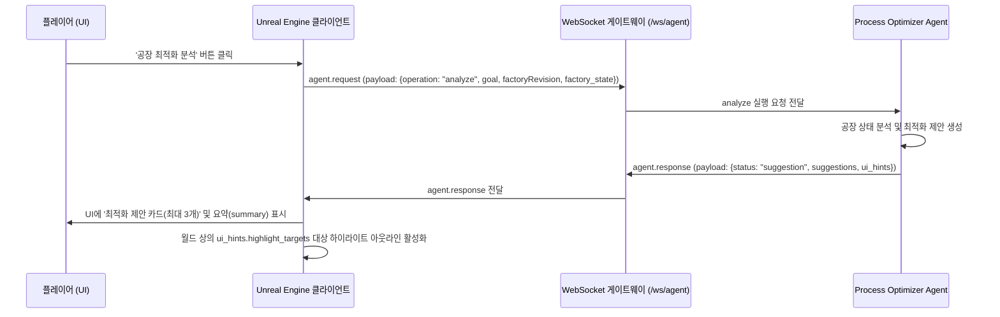

# Unreal Engine WebSocket 연동 계약 사양서 (Process Optimizer)

본 문서는 Unreal Engine 클라이언트와 백엔드 WebSocket 게이트웨이(`/ws/agent`) 간의 최적화 Agent (`process_optimizer`) 연동 통신 스펙 및 NPC 메뉴 흐름을 정의합니다.

---

## 1. 공통 Envelope 구조
모든 요청(Request)과 응답(Response)은 다음 공통 Envelope 구조를 감싸서 전달됩니다.

### 1.1 공통 요청 Envelope
```json
{
  "type": "agent.request",
  "request_id": "string (UUID 또는 고유 키)",
  "session_id": "string",
  "client_id": "string",
  "agent": "process_optimizer",
  "payload": {
    "operation": "state_update | analyze",
    "goal": "balance | throughput | power_saving | congestion_relief",
    "factoryRevision": 12,
    "factory_state": {
      "machines": [],
      "conveyors": [],
      "power_grid": {}
    }
  },
  "context": {
    "language": "ko",
    "mode": "gameplay"
  }
}
```

### 1.2 공통 응답 Envelope
```json
{
  "type": "agent.response",
  "request_id": "string (요청의 request_id와 일치)",
  "agent": "process_optimizer",
  "payload": {
    "status": "success | suggestion | error",
    "factoryRevision": 12,
    "goal": "balance",
    "summary": "string (LLM 윤색 또는Fallback 요약 코멘트)",
    "suggestions": [],
    "ui_hints": {}
  }
}
```

---

## 2. 시나리오별 상세 메시지 규격

### 2.1 최적화 분석 요청 및 제안 응답 (operation: analyze)

#### [Unreal ➡️ 백엔드] 분석 요청
Unreal에서 플레이어가 NPC 메뉴를 통해 '공장 최적화 분석'을 실행하면 현재 공장의 버전(`factoryRevision`) 및 상세 머신/컨베이어/전력 상태(`factory_state`) 정보를 페이로드에 포함하여 전송합니다.

```json
{
  "type": "agent.request",
  "request_id": "optimizer-analysis-req-001",
  "session_id": "session-player-abc",
  "client_id": "unreal-client-1",
  "agent": "process_optimizer",
  "payload": {
    "operation": "analyze",
    "goal": "balance",
    "factoryRevision": 12,
    "factory_state": {
      "machines": [
        {
          "id": "smelter_1",
          "type": "smelter",
          "status": "operating",
          "operating_rate": 0.2,
          "inputs": [
            {
              "item_id": "iron_ore",
              "amount": 0.0,
              "max_amount": 100.0
            }
          ],
          "outputs": [],
          "power_consumption": 15.0
        }
      ],
      "conveyors": [
        {
          "id": "conv_02",
          "congestion_rate": 0.85
        }
      ],
      "power_grid": {
        "produced": 200.0,
        "consumed": 150.0
      }
    }
  },
  "context": {
    "language": "ko",
    "mode": "gameplay"
  }
}
```

#### [백엔드 ➡️ Unreal] 제안 응답
백엔드는 분석 툴과 LLM의 윤색 결과를 취합하여, 적용 전 preview 상태의 최적화 제안 목록을 전송합니다.

```json
{
  "type": "agent.response",
  "request_id": "optimizer-analysis-req-001",
  "agent": "process_optimizer",
  "payload": {
    "status": "suggestion",
    "factoryRevision": 12,
    "goal": "balance",
    "summary": "수석 매니저의 진단 결과입니다. 현재 원자재 고갈로 멈춰 서 있는 제련 장비와 부하가 큰 이송용 컨베이어 벨트를 개선하기 위한 2가지 최적화 제안을 생성했습니다. 확인 후 적용해 주십시오.",
    "suggestions": [
      {
        "id": "suggest_input_smelter_1",
        "target": {
          "type": "machine",
          "id": "smelter_1"
        },
        "problem": "smelter_1 설비의 원자재 입력 재고가 고갈되었습니다.",
        "recommended_action": "공급 라인의 컨베이어 벨트 연결과 상류 설비의 생산 상태를 점검하십시오.",
        "expected_effect": "설비 가동율이 복구되어 정상 공정이 가동됩니다.",
        "risk": "low",
        "confidence": 1.0
      },
      {
        "id": "suggest_conveyor_conv_02",
        "target": {
          "type": "conveyor",
          "id": "conv_02"
        },
        "problem": "conv_02 컨베이어 벨트가 혼잡 상태입니다.",
        "recommended_action": "이송 경로를 다각화하거나 더 빠른 등급의 컨베이어 벨드로 업그레이드하십시오.",
        "expected_effect": "이송 병목이 해소되어 원자재 유입 속도가 향상됩니다.",
        "risk": "low",
        "confidence": 0.8
      }
    ],
    "ui_hints": {
      "highlight_targets": [
        "smelter_1",
        "conv_02"
      ]
    }
  }
}
```

---

## 3. UI 및 월드 하이라이트 매핑 규칙

1. **하이라이트 대상 매핑 (`ui_hints.highlight_targets`)**:
   - 백엔드는 미리보기 응답 시 `ui_hints.highlight_targets` 필드에 변경 혹은 개선이 추천되는 대상 ID(예: `["smelter_1", "conv_02"]`)를 제공합니다.
   - Unreal Engine 클라이언트는 플레이어가 최적화 제안 창을 열거나 특정 제안 항목에 마우스를 오버할 때, 월드 상의 해당 ID를 가진 장비/컨베이어 액터 주변에 외곽선 하이라이트(Highlight Outline)를 표시하여 플레이어가 문제 지점을 직관적으로 인지할 수 있도록 유도합니다.

2. **NPC 메뉴 연동 규칙**:
   - NPC 대화 메뉴는 '일반 질문하기(operator_guide)'와 '공장 최적화 제안(process_optimizer)'이 시각적으로 분리되어 제공되어야 합니다.
   - 플레이어가 '최적화 버튼'을 누르면 `analyze` 웹소켓 요청이 백엔드로 전송되며, 응답 수신 시 플레이어에게 계획 요약(`summary`)과 함께 최대 3개의 제안 리스트 카드가 표시됩니다.
   - 제안 카드는 직접적인 공장 변경을 유도하는 실행 페이로드를 포함하지 않으며, 위치 보기 및 대상 컴포넌트 하이라이트 연동으로 동작합니다.

---

## 4. NPC 연동 시퀀스 다이어그램



---

## 5. Unreal Engine UI 표시 체크리스트

- [ ] **대화 메뉴 분리**: NPC 대화창에서 '일반 질문하기'와 '공장 최적화 제안'을 구분할 수 있는 독립된 선택 메뉴를 제공하는가?
- [ ] **친근한 설명 노출**: 분석 완료 응답 시, `summary` 텍스트를 NPC 대화 상자에 정중하고 자연스러운 한국어 문장으로 표시하는가?
- [ ] **제안 리스트 카드화**: 수신된 `suggestions` 배열 내의 아이템(최대 3개)을 시각적으로 구별되는 카드 형태로 랜더링하는가?
- [ ] **카드 내용 세부 분할**: 각 제안 카드 내에 문제 기술(`problem`), 추천 조치(`recommended_action`), 기대 효과(`expected_effect`)를 정렬하여 보여주는가?
- [ ] **위험성/신뢰성 시각화**: `risk` 수준 및 `confidence` 지표를 뱃지 혹은 수치 그래프 형태로 시각화하는가?
- [ ] **하이라이트 아웃라인 연동**: `ui_hints.highlight_targets`에 포함된 ID 목록을 탐색하여, 인게임 3D 월드 상의 매칭되는 머신/컨베이어 액터에 외곽선 강조(Highlight Outline) 이벤트를 트리거하는가?
- [ ] **하이라이트 해제**: 제안 UI 창을 닫거나 NPC와의 대화를 종료했을 때 월드 내 활성화된 모든 하이라이트 강조가 깨끗이 소거되는가?
