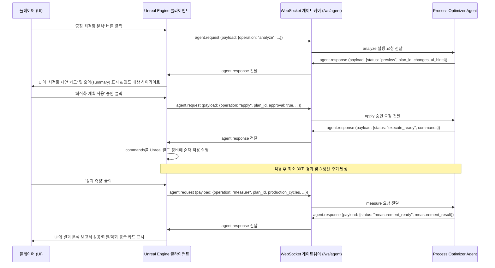

# Unreal Engine WebSocket 연동 계약 사양서 (Process Optimizer v2)

본 문서는 Unreal Engine 클라이언트와 백엔드 WebSocket 게이트웨이(`/ws/agent`) 간의 최적화 Agent (`process_optimizer`) 연동 통신 스펙 및 NPC 메뉴 흐름을 정의합니다.

---

## 1. 공통 Envelope 구조
모든 요청(Request)과 응답(Response)은 다음 공통 Envelope 구조를 감싸서 전달됩니다.

### 1.1 공통 요청 Envelope
```json
{
  "type": "agent.request",
  "request_id": "string (UUID 또는 고유 키)",
  "session_id": "string",
  "client_id": "string",
  "agent": "process_optimizer",
  "payload": {
    "operation": "state_update | analyze | apply | undo | measure",
    "goal": "balance | throughput | power_saving | congestion_relief",
    "factoryRevision": 12,
    "plan_id": "string (apply/undo/measure 요청 시 필수)",
    "approval": true,
    "approved_change_ids": ["suggest_input_smelter_1"],
    "before_states": {
      "suggest_input_smelter_1": {
        "id": "smelter_1",
        "type": "smelter",
        "status": "operating"
      }
    },
    "production_cycles": 5,
    "current_time": "2026-06-25T11:30:00Z",
    "factory_state": {
      "machines": [],
      "conveyors": [],
      "power_grid": {}
    }
  },
  "context": {
    "language": "ko",
    "mode": "gameplay"
  }
}
```

### 1.2 공통 응답 Envelope
```json
{
  "type": "agent.response",
  "request_id": "string (요청의 request_id와 일치)",
  "agent": "process_optimizer",
  "payload": {
    "status": "success | preview | execute_ready | undo_ready | measurement_ready | measurement_not_ready | plan_not_found | plan_expired | revision_conflict | approval_required | undo_conflict | error",
    "factoryRevision": 12,
    "goal": "balance",
    "summary": "string (LLM 윤색 또는 Fallback 요약 코멘트)",
    "plan_id": "string (생성된 최적화 계획 ID)",
    "expires_at": "string (ISO-8601 만료 일시)",
    "changes": [],
    "approved_changes": [],
    "commands": [],
    "ui_hints": {},
    "measurement_result": {}
  }
}
```

---

## 2. 시나리오별 상세 메시지 규격

### 2.0 주기 상태 업데이트 (operation: state_update)

Unreal은 기본적으로 공장의 경량 상태를 주기적으로 백엔드에 전송할 수 있습니다. 이 요청은 최적화 준비를 위한 최신 상태 저장용이며, 백엔드는 공장을 변경하지 않고 session memory만 갱신합니다.

주기 업데이트는 NPC가 병목 징후를 감지하거나, 플레이어가 최적화 버튼을 눌렀을 때 빠르게 분석을 시작하기 위한 캐시 역할입니다. 단, 실제 분석/적용/되돌리기/측정처럼 정확성이 중요한 요청에서는 최신 `factory_state`와 `factoryRevision`을 다시 보내는 것을 권장합니다.

#### [Unreal ➡️ 백엔드] 상태 업데이트 요청

```json
{
  "type": "agent.request",
  "request_id": "optimizer-state-update-001",
  "session_id": "session-player-abc",
  "client_id": "unreal-client-1",
  "agent": "process_optimizer",
  "payload": {
    "operation": "state_update",
    "goal": "balance",
    "factoryRevision": 42,
    "factory_state": {
      "machines": [],
      "conveyors": [],
      "power_grid": {
        "produced": 200.0,
        "consumed": 150.0
      }
    }
  },
  "context": {
    "language": "ko",
    "mode": "gameplay"
  }
}
```

#### [백엔드 ➡️ Unreal] 상태 업데이트 응답

```json
{
  "type": "agent.response",
  "request_id": "optimizer-state-update-001",
  "agent": "process_optimizer",
  "payload": {
    "status": "success",
    "factoryRevision": 42,
    "goal": "balance",
    "optimization_alert": {
      "needed": true,
      "severity": "medium",
      "reason": "smelter_1의 입력 재고가 부족합니다.",
      "target": {
        "type": "machine",
        "id": "smelter_1"
      },
      "suggested_subquest": {
        "title": "제련기 입력 라인 복구",
        "objective": "smelter_1에 철광석 공급이 다시 들어오도록 컨베이어와 상류 설비를 확인하세요.",
        "target": {
          "type": "machine",
          "id": "smelter_1"
        },
        "severity": "medium",
        "next_request": {
          "agent": "process_optimizer",
          "operation": "analyze",
          "goal": "balance",
          "request_source": "subquest",
          "target": {
            "type": "machine",
            "id": "smelter_1"
          }
        }
      }
    }
  }
}
```

`state_update`는 자동 최적화 실행을 의미하지 않습니다. Unreal/NPC는 이 상태를 바탕으로 “최적화 분석을 실행할까요?” 같은 제안 UI를 띄울 수 있지만, 실제 변경은 `analyze` preview와 플레이어의 `apply` 승인 이후에만 가능합니다.

### 2.1 최적화 분석 요청 및 제안 응답 (operation: analyze)

#### [Unreal ➡️ 백엔드] 분석 요청
Unreal에서 플레이어가 NPC 메뉴를 통해 '공장 최적화 분석'을 실행하면 현재 공장의 버전(`factoryRevision`) 및 상세 머신/컨베이어/전력 상태(`factory_state`) 정보를 페이로드에 포함하여 전송합니다.

백엔드는 같은 `session_id`의 최근 `state_update`를 기억할 수 있지만, 분석 정확도를 위해 플레이어가 최적화 버튼을 누른 시점의 최신 전체 snapshot을 함께 보내는 방식을 기본으로 권장합니다.

```json
{
  "type": "agent.request",
  "request_id": "optimizer-analysis-req-001",
  "session_id": "session-player-abc",
  "client_id": "unreal-client-1",
  "agent": "process_optimizer",
  "payload": {
    "operation": "analyze",
    "goal": "balance",
    "factoryRevision": 12,
    "factory_state": {
      "machines": [
        {
          "id": "smelter_1",
          "type": "smelter",
          "status": "operating",
          "operating_rate": 0.2,
          "inputs": [
            {
              "item_id": "iron_ore",
              "amount": 0.0,
              "max_amount": 100.0
            }
          ],
          "outputs": [],
          "power_consumption": 15.0
        }
      ],
      "conveyors": [],
      "power_grid": {
        "produced": 200.0,
        "consumed": 150.0
      }
    }
  }
}
```

#### [백엔드 ➡️ Unreal] 제안 응답 (preview)
백엔드는 분석 툴과 LLM의 윤색 결과를 취합하여, 적용 전 preview 상태의 최적화 제안 목록을 전송하고 이를 임시 저장소에 보관합니다.

```json
{
  "type": "agent.response",
  "request_id": "optimizer-analysis-req-001",
  "agent": "process_optimizer",
  "payload": {
    "status": "preview",
    "plan_id": "plan-bf67a123",
    "expires_at": "2026-06-25T11:35:00Z",
    "factoryRevision": 12,
    "goal": "balance",
    "summary": "수석 매니저의 진단 결과입니다. 현재 원자재 고갈로 멈춰 서 있는 제련 장비를 개선하기 위한 최적화 제안을 생성했습니다. 승인 후 적용해 주십시오.",
    "changes": [
      {
        "id": "suggest_input_smelter_1",
        "target": {
          "type": "machine",
          "id": "smelter_1"
        },
        "problem": "smelter_1 설비의 원자재 입력 재고가 고갈되었습니다.",
        "recommended_action": "Set recipe to iron_ingot and turn on",
        "expected_effect": "설비 가동율이 복구되어 정상 공정이 가동됩니다.",
        "risk": "low",
        "confidence": 1.0
      }
    ],
    "ui_hints": {
      "highlight_targets": ["smelter_1"]
    }
  }
}
```

---

### 2.2 최적화 승인 적용 요청 (operation: apply)

#### [Unreal ➡️ 백엔드] apply 요청
플레이어가 UI에서 카드를 선택하고 '적용'을 누릅니다. `approval: true` 와 선택한 `approved_change_ids` 목록을 보냅니다.

`before_states`는 선택 항목이지만 권장합니다. Unreal이 승인 직전의 변경 대상 상태를 `change_id`별로 보내면 백엔드가 실행 기록에 정확한 before 값을 저장할 수 있어, 이후 `measure`와 `undo`가 더 안정적으로 동작합니다. 실행 직후 실제 상태를 백엔드에 함께 알려줄 수 있는 경우에는 같은 구조의 `after_states`도 보낼 수 있습니다.

```json
{
  "type": "agent.request",
  "request_id": "optimizer-apply-req-002",
  "session_id": "session-player-abc",
  "client_id": "unreal-client-1",
  "agent": "process_optimizer",
  "payload": {
    "operation": "apply",
    "plan_id": "plan-bf67a123",
    "factoryRevision": 12,
    "approval": true,
    "approved_change_ids": ["suggest_input_smelter_1"],
    "factory_state": {
      "machines": [{"id": "smelter_1", "type": "smelter", "status": "operating"}],
      "conveyors": []
    },
    "before_states": {
      "suggest_input_smelter_1": {
        "id": "smelter_1",
        "type": "smelter",
        "status": "operating",
        "operating_rate": 0.2,
        "inputs": [
          {
            "item_id": "iron_ore",
            "amount": 0.0,
            "max_amount": 100.0
          }
        ]
      }
    }
  }
}
```

#### [백엔드 ➡️ Unreal] 실행 명령 준비 완료 응답 (execute_ready)
백엔드는 플레이어 승인을 확인한 뒤, Unreal에서 실행할 수 있는 결정론적 실행 명령 목록(`commands`)과 함께 응답합니다.

```json
{
  "type": "agent.response",
  "request_id": "optimizer-apply-req-002",
  "agent": "process_optimizer",
  "payload": {
    "status": "execute_ready",
    "plan_id": "plan-bf67a123",
    "factoryRevision": 12,
    "goal": "balance",
    "summary": "최적화 계획 실행 준비가 완료되었습니다.",
    "changes": [],
    "approved_changes": [
      {
        "id": "suggest_input_smelter_1",
        "target": {"type": "machine", "id": "smelter_1"},
        "problem": "smelter_1 설비의 원자재 입력 재고가 고갈되었습니다.",
        "recommended_action": "Set recipe to iron_ingot and turn on",
        "expected_effect": "설비 가동율이 복구되어 정상 공정이 가동됩니다."
      }
    ],
    "commands": [
      {
        "command_type": "set_recipe",
        "machine_id": "smelter_1",
        "recipe_id": "iron_ingot"
      },
      {
        "command_type": "set_machine_enabled",
        "machine_id": "smelter_1",
        "enabled": true
      }
    ]
  }
}
```

---

### 2.3 최적화 계획 되돌리기 요청 (operation: undo)

#### [Unreal ➡️ 백엔드] undo 요청
플레이어가 이전에 적용된 최적화 계획을 되돌리고자 할 때 `plan_id`와 현재의 `factory_state`를 담아 전송합니다.

```json
{
  "type": "agent.request",
  "request_id": "optimizer-undo-req-003",
  "session_id": "session-player-abc",
  "client_id": "unreal-client-1",
  "agent": "process_optimizer",
  "payload": {
    "operation": "undo",
    "plan_id": "plan-bf67a123",
    "factory_state": {
      "machines": [
        {
          "id": "smelter_1",
          "type": "smelter",
          "status": "operating",
          "recipe_id": "iron_ingot"
        }
      ],
      "conveyors": []
    }
  }
}
```

#### [백엔드 ➡️ Unreal] 되돌리기 명령 준비 완료 응답 (undo_ready)
백엔드는 적용 전(before) 상태와 대조하여 플레이어에 의한 임의 수정이 없음을 확인한 뒤, 역행하는 복구 명령을 리턴합니다.

```json
{
  "type": "agent.response",
  "request_id": "optimizer-undo-req-003",
  "agent": "process_optimizer",
  "payload": {
    "status": "undo_ready",
    "plan_id": "plan-bf67a123",
    "factoryRevision": 12,
    "summary": "되돌리기 계획 준비가 완료되었습니다.",
    "commands": [
      {
        "command_type": "set_recipe",
        "machine_id": "smelter_1",
        "recipe_id": "none"
      }
    ]
  }
}
```

---

### 2.4 최적화 성과 측정 요청 (operation: measure)

#### [Unreal ➡️ 백엔드] measure 요청
최적화 적용 후 관찰 지표가 쌓이면 Unreal에서 플레이어가 '결과 측정'을 요청하여 생산 주기 수(`production_cycles`)와 경과 시간 등을 전송합니다.

```json
{
  "type": "agent.request",
  "request_id": "optimizer-measure-req-004",
  "session_id": "session-player-abc",
  "client_id": "unreal-client-1",
  "agent": "process_optimizer",
  "payload": {
    "operation": "measure",
    "plan_id": "plan-bf67a123",
    "production_cycles": 5,
    "current_time": "2026-06-25T11:30:00Z",
    "factory_state": {
      "machines": [
        {
          "id": "smelter_1",
          "type": "smelter",
          "status": "operating",
          "operating_rate": 1.0,
          "inputs": [{"item_id": "iron_ore", "amount": 10.0, "max_amount": 10.0}]
        }
      ],
      "conveyors": []
    }
  }
}
```

#### [백엔드 ➡️ Unreal] 측정 완료 응답 (measurement_ready)
백엔드는 성과를 분석하여 성공(success), 미달(failed), 악화(degraded) 상태를 리턴합니다.

```json
{
  "type": "agent.response",
  "request_id": "optimizer-measure-req-004",
  "agent": "process_optimizer",
  "payload": {
    "status": "measurement_ready",
    "plan_id": "plan-bf67a123",
    "summary": "최적화 적용 결과 분석 완료. 공정 가동률이 100%로 상승하여 병목이 완벽히 해결되었습니다.",
    "measurement_result": {
      "status": "success",
      "next_action": "monitor",
      "expected_effect": {
        "resolved_input_shortages_count": 1,
        "resolved_output_blocks_count": 0,
        "resolved_conveyor_congestions_count": 0
      },
      "actual_effect": {
        "resolved_input_shortages_count": 1,
        "resolved_output_blocks_count": 0,
        "resolved_conveyor_congestions_count": 0,
        "average_operating_rate_before": 0.2,
        "average_operating_rate_after": 1.0
      },
      "observation_duration_seconds": 65.0,
      "production_cycles": 5
    }
  }
}
```

---

## 3. UI 및 월드 하이라이트 매핑 규칙

1. **하이라이트 대상 매핑 (`ui_hints.highlight_targets`)**:
   - 백엔드는 미리보기 응답 시 `ui_hints.highlight_targets` 필드에 변경 혹은 개선이 추천되는 대상 ID(예: `["smelter_1"]`)를 제공합니다.
   - Unreal Engine 클라이언트는 플레이어가 최적화 제안 창을 열거나 특정 제안 항목에 마우스를 오버할 때, 월드 상의 해당 ID를 가진 장비/컨베이어 액터 주변에 외곽선 하이라이트(Highlight Outline)를 표시하여 플레이어가 문제 지점을 직관적으로 인지할 수 있도록 유도합니다.

2. **NPC 메뉴 연동 규칙**:
   - NPC 대화 메뉴는 '일반 질문하기(operator_guide)'와 '공장 최적화 제안(process_optimizer)'이 시각적으로 분리되어 제공되어야 합니다.
   - 플레이어가 '최적화 버튼'을 누르면 `analyze` 웹소켓 요청이 백엔드로 전송되며, 응답 수신 시 플레이어에게 계획 요약(`summary`)과 함께 제안 리스트 카드가 표시됩니다.
   - 제안 카드를 확인하고 '적용'을 누르면 `apply` 요청을 날려서 돌려받은 `commands` 목록을 Unreal 월드 상에서 실행합니다.

---

## 4. NPC 연동 시퀀스 다이어그램



---

## 5. Unreal 구현 체크리스트

### 5.1 주기 상태 업데이트

- Unreal은 공장 상태가 바뀌었거나 일정 주기가 지났을 때 `operation: "state_update"` 요청을 보냅니다.
- 이 요청은 백엔드 session memory 갱신용이므로, 응답 `status: "success"`만 확인하면 됩니다.
- 너무 잦은 전송을 피하기 위해 dirty flag, 최소 전송 간격, 변경량 threshold 중 하나를 둡니다.
- `factoryRevision`은 Unreal이 관리하며, 플레이어가 직접 설비/컨베이어를 변경할 때 증가시킵니다.

### 5.2 분석 요청

- NPC 또는 UI가 병목 징후를 감지하면 자동 적용하지 않고 “최적화 분석을 실행할까요?”를 표시합니다.
- 플레이어가 최적화 버튼을 누르면 `operation: "analyze"` 요청을 보냅니다.
- 이때 가능한 한 최신 전체 `factory_state`와 `factoryRevision`을 함께 보냅니다.
- 응답이 `status: "preview"`이면 `plan_id`, `changes`, `ui_hints.highlight_targets`, `expires_at`을 UI 상태에 저장합니다.

### 5.3 미리보기 UI

- `changes` 배열을 제안 카드로 표시합니다.
- 각 카드에는 문제, 추천 조치, 예상 효과, 위험도, 신뢰도를 표시합니다.
- `ui_hints.highlight_targets`에 포함된 ID를 월드 액터와 매핑해 하이라이트합니다.
- 이 단계에서는 Unreal 월드 상태를 변경하지 않습니다.

### 5.4 승인 적용

- 플레이어가 전체 적용 또는 선택 적용을 누른 경우에만 `operation: "apply"` 요청을 보냅니다.
- 요청에는 `plan_id`, `approval: true`, `approved_change_ids`, 최신 `factoryRevision`, 최신 변경 대상 snapshot을 포함합니다.
- 가능하면 `before_states`에 승인 직전 대상 상태를 `change_id`별로 포함합니다. 이 값은 백엔드 실행 기록과 안전한 Undo/Measure의 기준이 됩니다.
- 명령 실행 직후 실제 상태를 별도로 보고할 수 있다면 `after_states`를 같은 형식으로 포함할 수 있습니다. 없으면 백엔드는 계획된 command를 after 기준으로 사용합니다.
- 응답이 `status: "execute_ready"`이면 Unreal은 `commands`를 실행하기 전에 월드 기준 검증을 한 번 더 수행합니다.
- 검증해야 할 항목은 대상 존재 여부, 위치 점유 여부, 연결 가능 여부, 필요 자원, 전력 한도, revision 충돌입니다.

### 5.5 효과 측정과 되돌리기

- 적용 후 최소 30초와 3 production cycle이 모두 충족되면 `operation: "measure"` 요청을 보냅니다.
- 측정 결과가 기대보다 낮아도 자동으로 되돌리지 않고, UI에서 재분석 또는 모니터링을 안내합니다.
- 플레이어가 되돌리기를 누른 경우에만 `operation: "undo"` 요청을 보냅니다.
- Undo 응답이 `undo_conflict`이면 플레이어가 적용 후 직접 수정한 것으로 보고 자동 복구를 막습니다.
## Sprint 3 서브퀘스트 후보 연동 규칙

Sprint 3부터 `state_update` 응답의 `optimization_alert.suggested_subquest`는 Unreal UI가 플레이어에게 보여줄 수 있는 서브퀘스트 후보 계약으로 사용한다. 이 후보는 자동 실행 지시가 아니며, 플레이어가 후보를 선택했을 때만 다음 단계로 이어진다.

Unreal 처리 순서:

```text
1. state_update 응답에서 optimization_alert.needed=true 여부를 확인한다.
2. suggested_subquest.title/objective/severity/target을 UI 후보 카드로 표시한다.
3. 플레이어가 후보를 선택하면 suggested_subquest.next_request를 기반으로 analyze 요청을 만든다.
4. 이때 Unreal은 최신 factoryRevision과 최신 factory_state를 반드시 다시 붙인다.
5. analyze 응답은 preview이므로 commands를 실행하지 않는다.
6. 플레이어가 preview를 승인한 뒤 apply approval=true 요청을 보낸다.
7. apply 응답의 commands는 Unreal 월드 규칙으로 최종 검증한 뒤 실행한다.
```

`suggested_subquest.next_request`에 포함될 수 있는 기본 필드:

```json
{
  "agent": "process_optimizer",
  "operation": "analyze",
  "goal": "balance",
  "request_source": "subquest",
  "target": {
    "type": "machine",
    "id": "smelter_1"
  }
}
```
