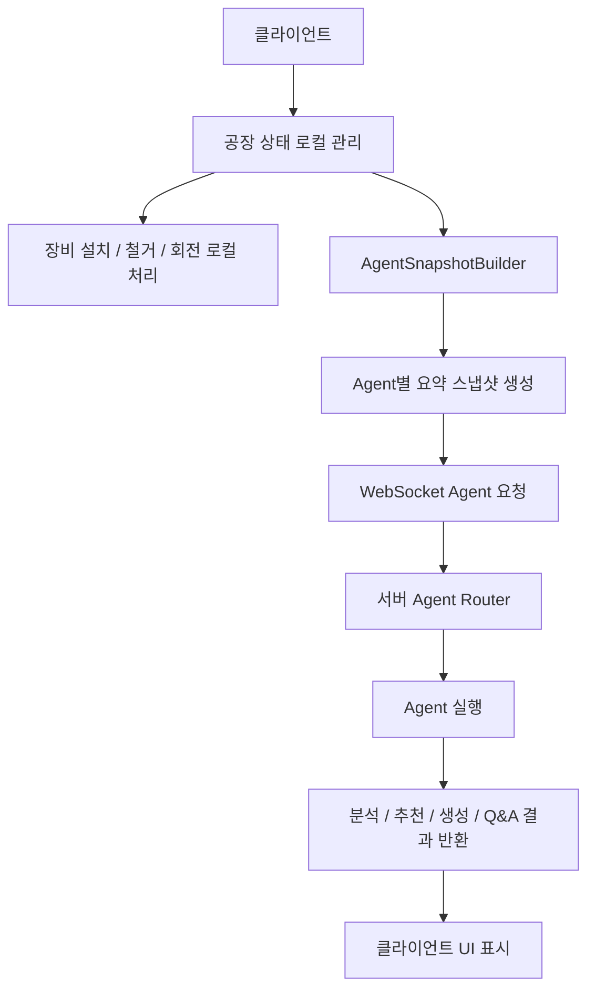
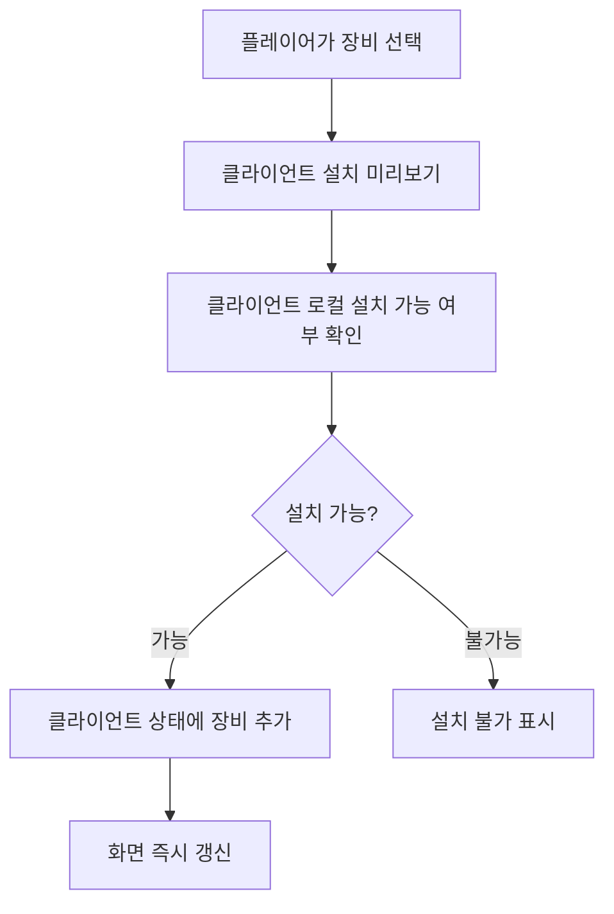
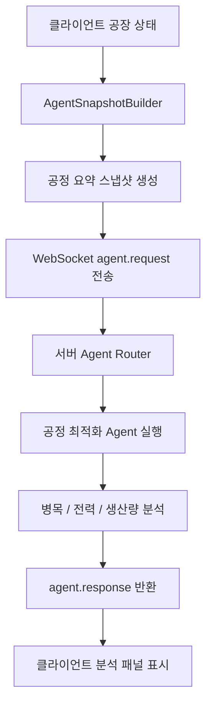
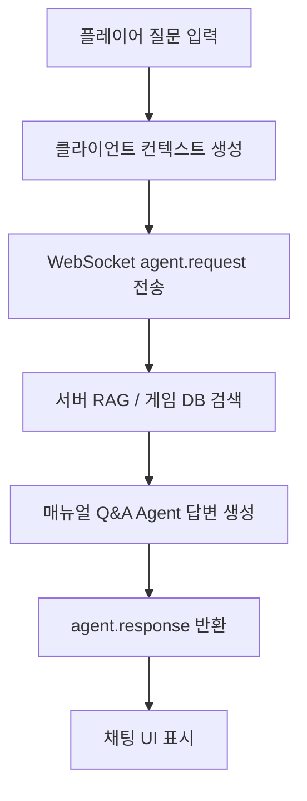
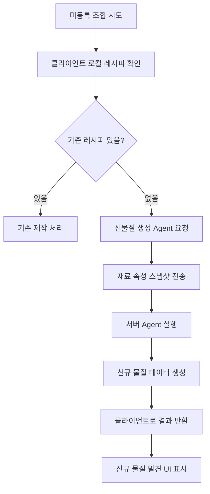
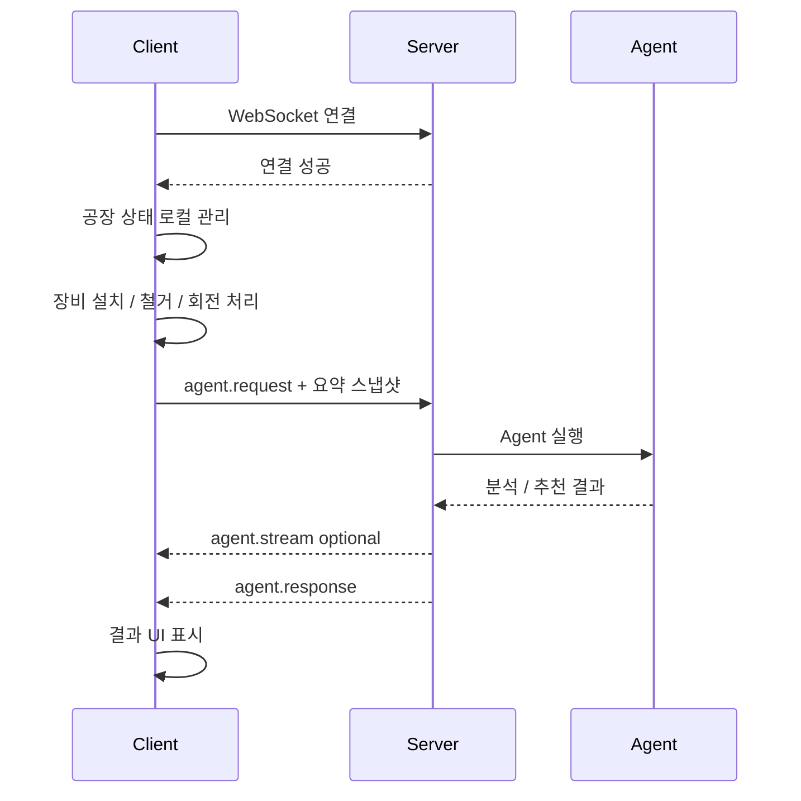
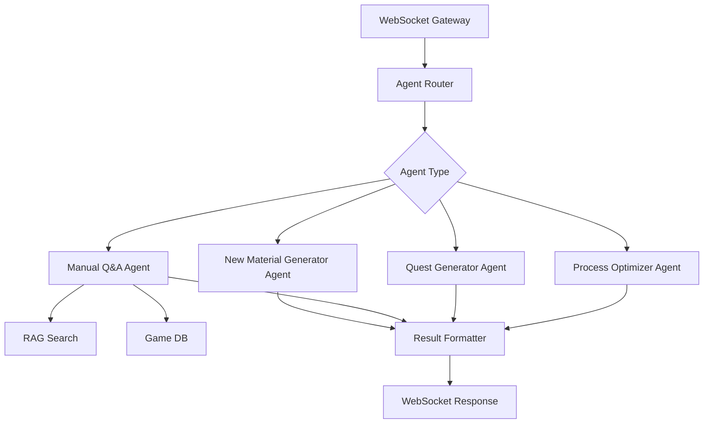
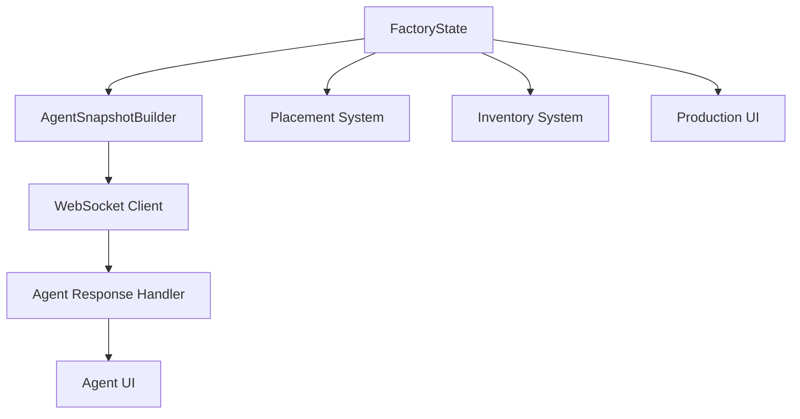
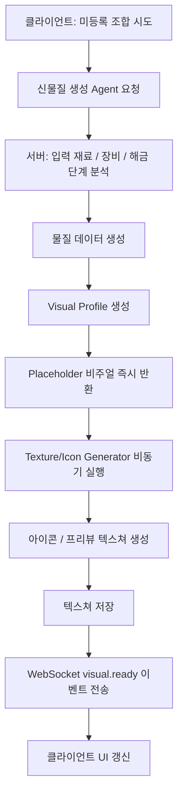
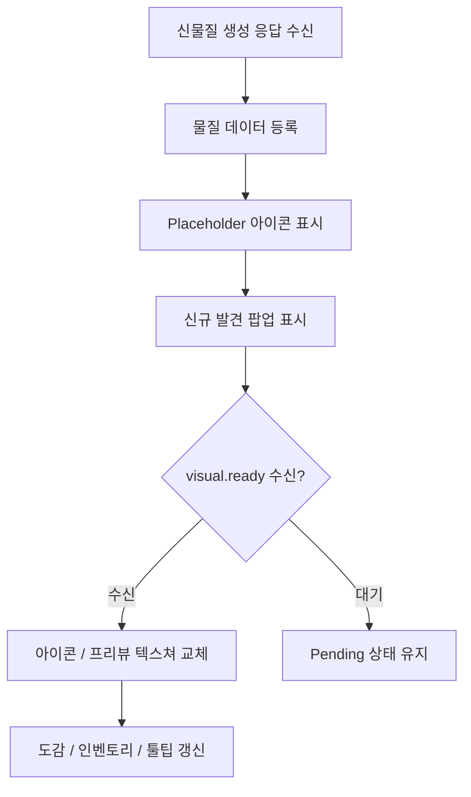

# 공장 게임 서버 / 클라이언트 / Agent 통신 구조 기획서

## 1. 문서 목적

이 문서는 공장 자동화 게임의 MVP 단계에서 서버와 클라이언트의 역할을 분리하고, WebSocket 기반 Agent 통신 구조를 정의하기 위한 기획서다.

MVP에서는 장비 설치, 철거, 회전, 배치 판단을 클라이언트에서 처리한다.  
서버는 실시간 게임 상태 동기화나 설치 검증을 담당하지 않고, 클라이언트가 필요할 때 호출하는 Agent 처리 서버 역할을 담당한다.

---

## 2. MVP 기준 핵심 결정

| 항목 | 결정 |
|---|---|
| 장비 설치 처리 | 클라이언트에서 즉시 처리 |
| 장비 설치 서버 검증 | 하지 않음 |
| 장비 설치 실시간 동기화 | 하지 않음 |
| 서버 상시 시뮬레이션 | 하지 않음 |
| 클라이언트 상태 관리 | 클라이언트가 담당 |
| 서버 역할 | Agent 실행, 분석, 추천, 질의응답 |
| 통신 방식 | WebSocket 사용 |
| 서버로 보내는 데이터 | 전체 상태가 아니라 Agent별 요약 스냅샷 |
| 멀티플레이 공동 건설 | MVP 제외 |

---

## 3. 전체 구조 요약



---

## 4. 클라이언트 역할

클라이언트는 실제 플레이 상태와 즉각적인 조작을 담당한다.

### 주요 역할

- 현재 공장 상태 관리
- 장비 설치 처리
- 장비 철거 처리
- 장비 회전 처리
- 그리드 충돌 판단
- 인벤토리 상태 관리
- 저장고 상태 관리
- 생산 상태 표시
- 설치 가능 여부 로컬 판단
- Agent 호출 시 필요한 상태 요약 생성
- WebSocket으로 Agent 요청 전송
- Agent 결과 UI 표시

---

## 5. 서버 역할

서버는 실시간 게임 서버가 아니라 WebSocket 기반 Agent 처리 서버로 설계한다.

### 주요 역할

- WebSocket 연결 관리
- Agent 요청 메시지 수신
- 요청 타입 판별
- 클라이언트 요약 스냅샷 파싱
- 공정 최적화 Agent 실행
- 퀘스트 생성 Agent 실행
- 매뉴얼 Q&A Agent 실행
- 신물질 생성 Agent 실행
- RAG / 게임 DB 조회
- Agent 결과 반환
- Agent 응답 스트리밍

### 서버가 하지 않는 일

- 장비 설치 검증
- 장비 철거 검증
- 공장 상태 실시간 동기화
- 컨베이어 tick 계산
- 전체 공장 상시 시뮬레이션
- 멀티플레이 공동 건설 처리
- 클라이언트 UI 상태 관리

---

## 6. 장비 설치 처리 방식

장비 설치는 클라이언트 내부에서 즉시 처리한다.



### 클라이언트 설치 판단 항목

- 그리드 범위 안인지
- 다른 장비와 겹치지 않는지
- 장비 크기와 회전값이 유효한지
- 설치 가능한 지형인지
- 필요한 자원이 있는지
- 해당 장비가 해금되어 있는지
- 입구 / 출구 방향이 올바른지

---

## 7. WebSocket 사용 목적

MVP에서는 WebSocket을 사용하되, 공장 상태 동기화 목적이 아니라 Agent 요청/응답 채널로 사용한다.

| 항목 | 설명 |
|---|---|
| 사용 목적 | Agent 요청 / 응답 |
| 적합한 기능 | 공정 분석, Q&A, 퀘스트 생성, 신물질 생성 |
| 장점 | 스트리밍 응답, 채팅형 UI, 양방향 메시지 처리 |
| 제외 기능 | 설치 동기화, 서버 검증, 멀티 공동 건설 |

### WebSocket Endpoint 예시

```txt
/ws/agent
```

로컬 개발:

```txt
ws://localhost:8000/ws/agent
```

배포 환경:

```txt
wss://api.example.com/ws/agent
```

---

## 8. WebSocket 메시지 타입

| 메시지 타입 | 방향 | 설명 |
|---|---|---|
| `agent.request` | 클라이언트 → 서버 | Agent 실행 요청 |
| `agent.stream` | 서버 → 클라이언트 | Agent 중간 응답 |
| `agent.response` | 서버 → 클라이언트 | Agent 최종 응답 |
| `agent.error` | 서버 → 클라이언트 | 오류 응답 |
| `ping` | 클라이언트 → 서버 | 연결 유지 |
| `pong` | 서버 → 클라이언트 | 연결 유지 응답 |

---

## 9. 기본 메시지 구조

### 클라이언트 → 서버

```json
{
  "type": "agent.request",
  "requestId": "req_001",
  "agent": "process_optimizer",
  "snapshotType": "summary",
  "snapshotHash": "fac_9ab23c",
  "payload": {}
}
```

### 서버 → 클라이언트

```json
{
  "type": "agent.response",
  "requestId": "req_001",
  "agent": "process_optimizer",
  "status": "success",
  "payload": {}
}
```

---

## 10. 전체 상태 전송을 피해야 하는 이유

공장이 커질수록 전체 상태를 한 번에 서버로 보내는 방식은 병목이 생길 수 있다.

| 병목 지점 | 이유 |
|---|---|
| 전송량 증가 | 장비, 저장고, 컨베이어, 생산량 데이터를 매번 통째로 보내면 payload가 커짐 |
| 서버 파싱 비용 | 서버가 매 요청마다 전체 worldSnapshot을 파싱해야 함 |
| Agent 입력 토큰 증가 | LLM Agent에 상태를 그대로 넣으면 토큰 비용과 응답 시간이 증가 |
| 동시 요청 증가 | 여러 플레이어가 분석 요청하면 Agent 처리 큐가 밀림 |
| 중복 계산 | 바뀌지 않은 데이터까지 매번 다시 분석함 |

---

## 11. 추천 데이터 전송 방식

서버에는 전체 공장 상태를 보내지 않고, Agent가 판단하는 데 필요한 데이터만 요약해서 보낸다.

### 데이터 전송 단계

| 단계 | 설명 | 사용 시점 |
|---|---|---|
| 1단계: 요약 데이터 | 생산량, 소비량, 전력, 병목 후보 등 요약 | 일반 Agent 호출 |
| 2단계: 관련 구역 데이터 | 특정 생산 라인이나 선택 영역 데이터 | 상세 분석 요청 |
| 3단계: 전체 상태 데이터 | 세이브, 디버그, 전체 공장 분석 | 특수 상황 |

---

## 12. AgentSnapshotBuilder

클라이언트에는 Agent 호출용 데이터를 만드는 `AgentSnapshotBuilder`를 둔다.

```txt
FactoryState
 ├─ MachineState
 ├─ StorageState
 ├─ ProductionStats
 ├─ PowerStats
 └─ AgentSnapshotBuilder
```

### AgentSnapshotBuilder 역할

```txt
AgentSnapshotBuilder
 ├─ buildProcessOptimizationSnapshot()
 ├─ buildQuestSnapshot()
 ├─ buildManualQaContext()
 ├─ buildNewMaterialSnapshot()
 └─ buildDebugFullSnapshot()
```

Agent별로 필요한 데이터만 선별해 WebSocket 메시지 payload를 구성한다.

---

## 13. Agent별 필요한 데이터

### 13.1 공정 최적화 Agent

공정 최적화 Agent는 전체 맵 데이터가 아니라 생산량 요약 중심으로 호출한다.

#### 필요한 데이터

- 아이템별 생산량
- 아이템별 소비량
- 아이템별 재고량
- 장비 타입별 개수
- 장비 타입별 평균 가동률
- 전력 생산량
- 전력 소비량
- 현재 경고 상태
- 병목 후보
- 선택된 생산 라인 정보

#### 보낼 필요 없는 데이터

- 모든 그리드 좌표
- 모든 컨베이어 개별 상태
- 장비 애니메이션 상태
- 카메라 위치
- UI 상태

#### 요청 예시

```json
{
  "type": "agent.request",
  "requestId": "req_process_001",
  "agent": "process_optimizer",
  "snapshotType": "summary",
  "snapshotHash": "fac_9ab23c",
  "payload": {
    "factorySummary": {
      "powerStatus": "near_limit",
      "bottleneckCandidates": ["iron_powder"],
      "machineGroups": [
        {
          "type": "miner",
          "count": 3,
          "avgUtilization": 0.85
        },
        {
          "type": "crusher",
          "count": 1,
          "avgUtilization": 1.0
        }
      ],
      "itemFlows": [
        {
          "itemId": "iron_powder",
          "producedPerMinute": 20,
          "consumedPerMinute": 35,
          "stock": 12
        }
      ],
      "warnings": [
        "iron_powder_shortage",
        "power_near_limit"
      ]
    }
  }
}
```

#### 응답 예시

```json
{
  "type": "agent.response",
  "requestId": "req_process_001",
  "agent": "process_optimizer",
  "status": "success",
  "payload": {
    "summary": "철 가루 생산량이 부족해 조립기가 대기 중입니다.",
    "bottlenecks": [
      {
        "type": "item_flow",
        "targetId": "iron_powder",
        "reason": "철 가루 소비량이 생산량보다 높습니다."
      }
    ],
    "suggestions": [
      {
        "type": "add_machine",
        "machineType": "crusher",
        "message": "분쇄기를 1대 추가하면 철 가루 생산량이 증가합니다.",
        "expectedEffect": "철 가루 생산량 약 30% 증가"
      }
    ]
  }
}
```

---

### 13.2 퀘스트 생성 Agent

#### 필요한 데이터

- 현재 진행도
- 해금 장비
- 해금 레시피
- 최근 생산한 아이템
- 부족한 자원
- 아직 사용하지 않은 시스템
- 보유 재화
- 최근 완료 퀘스트

#### 보낼 필요 없는 데이터

- 장비 좌표
- 컨베이어 상세
- 저장고 내부 전체 목록
- 생산 tick 데이터

#### 요청 예시

```json
{
  "type": "agent.request",
  "requestId": "req_quest_001",
  "agent": "quest_generator",
  "snapshotType": "summary",
  "payload": {
    "progress": {
      "stage": 3,
      "unlockedMachines": ["miner", "crusher", "assembler_basic"],
      "unlockedRecipes": ["iron_powder", "iron_part"],
      "recentlyProducedItems": ["iron_ore", "iron_powder"],
      "unusedSystems": ["trade"],
      "currency": 1200,
      "completedQuestIds": ["quest_intro_001", "quest_miner_001"]
    }
  }
}
```

---

### 13.3 매뉴얼 Q&A Agent

#### 필요한 데이터

- 질문
- 현재 해금 상태
- 선택한 장비 ID
- 현재 화면
- 관련 아이템 ID
- 플레이어 레벨 / 진행도

#### 보낼 필요 없는 데이터

- 전체 공장 상태
- 모든 저장고 데이터
- 모든 장비 목록

#### 요청 예시

```json
{
  "type": "agent.request",
  "requestId": "req_manual_001",
  "agent": "manual_qa",
  "snapshotType": "context",
  "payload": {
    "question": "철 부품은 어떻게 만들어?",
    "context": {
      "currentScreen": "factory",
      "selectedMachineId": "assembler_basic",
      "unlockedRecipes": ["iron_powder", "iron_part"],
      "unlockedMachines": ["crusher", "assembler_basic"],
      "playerStage": 3
    }
  }
}
```

---

### 13.4 신물질 생성 Agent

#### 필요한 데이터

- 입력 재료 목록
- 입력 재료 속성
- 사용 장비
- 기존 레시피 존재 여부
- 현재 해금 단계
- 생성 규칙 버전

#### 보낼 필요 없는 데이터

- 전체 공장 배치
- 전력 상태
- 컨베이어 상태
- 상점 가격 전체표

#### 요청 예시

```json
{
  "type": "agent.request",
  "requestId": "req_material_001",
  "agent": "new_material_generator",
  "snapshotType": "material_inputs",
  "payload": {
    "machineType": "synthesizer",
    "ruleVersion": "v1",
    "playerStage": 4,
    "knownRecipeExists": false,
    "inputs": [
      {
        "itemId": "iron_powder",
        "amount": 10,
        "properties": ["metal", "powder", "conductive"]
      },
      {
        "itemId": "compressed_gas",
        "amount": 5,
        "properties": ["gas", "compressed", "reactive"]
      }
    ]
  }
}
```

#### 응답 예시

```json
{
  "type": "agent.response",
  "requestId": "req_material_001",
  "agent": "new_material_generator",
  "status": "success",
  "payload": {
    "created": true,
    "material": {
      "id": "porous_iron_material",
      "name": "다공성 철소재",
      "type": "solid",
      "rarity": "uncommon",
      "properties": ["lightweight", "durable"],
      "description": "압축 가스가 철 가루 내부에 미세 기공을 만든 신소재입니다."
    },
    "recipe": {
      "id": "recipe_porous_iron_material",
      "inputs": [
        { "itemId": "iron_powder", "amount": 10 },
        { "itemId": "compressed_gas", "amount": 5 }
      ],
      "output": {
        "itemId": "porous_iron_material",
        "amount": 1
      }
    }
  }
}
```

---

## 14. Agent 호출 흐름

### 공정 최적화 Agent



### 매뉴얼 Q&A Agent



### 신물질 생성 Agent



---

## 15. Agent 스트리밍 응답

Agent 응답이 길거나 시간이 걸리는 경우 `agent.stream` 메시지로 중간 결과를 보낼 수 있다.

### 스트리밍 예시

```json
{
  "type": "agent.stream",
  "requestId": "req_process_001",
  "agent": "process_optimizer",
  "payload": {
    "message": "현재 생산량 데이터를 분석 중입니다."
  }
}
```

```json
{
  "type": "agent.stream",
  "requestId": "req_process_001",
  "agent": "process_optimizer",
  "payload": {
    "message": "철 가루 생산량 부족이 감지되었습니다."
  }
}
```

```json
{
  "type": "agent.response",
  "requestId": "req_process_001",
  "agent": "process_optimizer",
  "status": "success",
  "payload": {
    "summary": "분쇄기 병목이 발생했습니다.",
    "suggestions": [
      {
        "type": "add_machine",
        "machineType": "crusher",
        "expectedEffect": "생산량 약 30% 증가"
      }
    ]
  }
}
```

---

## 16. 병목 방지 전략

### 16.1 요청 제한

Agent 호출은 특정 이벤트 기준으로만 실행한다.

| Agent | 호출 시점 |
|---|---|
| 공정 최적화 Agent | 분석 버튼 클릭 시 |
| 퀘스트 생성 Agent | 퀘스트 완료 후 또는 수동 갱신 |
| 매뉴얼 Q&A Agent | 질문 입력 시 |
| 신물질 생성 Agent | 미등록 조합 시도 시 |

매 tick마다 Agent를 호출하지 않는다.

---

### 16.2 디바운스 / 쿨타임

| Agent | 호출 제한 |
|---|---|
| 공정 최적화 Agent | 10~30초 쿨타임 |
| 퀘스트 생성 Agent | 퀘스트 완료 후 또는 수동 갱신 |
| 매뉴얼 Q&A Agent | 질문 입력 시 |
| 신물질 생성 Agent | 미등록 조합 시도 시 |

---

### 16.3 캐싱

같은 상태에서 같은 요청이면 이전 결과를 재사용한다.

캐시 키 예시:

```txt
agentType + snapshotHash + question
```

---

### 16.4 상태 해시

클라이언트가 요약 스냅샷에 대한 hash를 함께 보낸다.

```json
{
  "agent": "process_optimizer",
  "snapshotHash": "fac_9ab23c",
  "snapshotType": "summary",
  "payload": {}
}
```

서버는 동일한 `snapshotHash`와 동일한 요청에 대해서 캐시된 결과를 반환할 수 있다.

---

### 16.5 요청 크기 제한

Agent 요청 payload는 가능한 작게 유지한다.

| 요청 타입 | 권장 크기 |
|---|---|
| 매뉴얼 Q&A | 매우 작음 |
| 퀘스트 생성 | 작음 |
| 신물질 생성 | 작음 |
| 공정 최적화 요약 | 중간 |
| 전체 디버그 스냅샷 | 큼, 예외적 사용 |

---

## 17. WebSocket 연결 흐름



---

## 18. 서버 내부 구조



### 서버 모듈 예시

```txt
server
 ├─ websocket
 │   ├─ agent_gateway
 │   └─ message_schema
 ├─ agents
 │   ├─ process_optimizer
 │   ├─ quest_generator
 │   ├─ manual_qa
 │   └─ new_material_generator
 ├─ rag
 │   ├─ retriever
 │   └─ documents
 ├─ game_db
 │   ├─ items
 │   ├─ machines
 │   ├─ recipes
 │   └─ quests
 └─ cache
     └─ agent_result_cache
```

---

## 19. 클라이언트 내부 구조



### 클라이언트 모듈 예시

```txt
client
 ├─ factory
 │   ├─ FactoryState
 │   ├─ MachineState
 │   ├─ StorageState
 │   ├─ ProductionStats
 │   └─ PowerStats
 ├─ placement
 │   ├─ PlacementSystem
 │   ├─ GridValidator
 │   └─ PlacementPreview
 ├─ agent
 │   ├─ AgentSnapshotBuilder
 │   ├─ AgentWebSocketClient
 │   ├─ AgentResponseHandler
 │   └─ AgentPanel
 └─ ui
     ├─ InventoryUI
     ├─ StorageUI
     ├─ ProductionUI
     └─ TradeUI
```

---

---

## 20. 신물질 생성 Agent 비주얼 생성 확장

신물질 생성 Agent는 물질의 이름, 속성, 레시피만 생성해서는 충분하지 않다.  
클라이언트에서 플레이어에게 어떤 물질인지 직관적으로 보여주기 위해 아이콘, 프리뷰 텍스쳐, 색상, 표면 특징 같은 비주얼 데이터도 함께 생성해야 한다.

MVP에서는 완전한 월드용 3D 머티리얼까지 생성하지 않고, 우선 UI 표시용 아이콘과 프리뷰 텍스쳐를 생성하는 것을 목표로 한다.

---

### 20.1 핵심 결정

| 항목 | 결정 |
|---|---|
| 신물질 데이터 생성 | 포함 |
| 비주얼 프로파일 생성 | 포함 |
| 아이콘 생성 | 포함 |
| 프리뷰 텍스쳐 생성 | 포함 |
| 월드용 고급 머티리얼 | 후순위 |
| 텍스쳐 생성 방식 | 비동기 처리 추천 |
| Placeholder 표시 | 포함 |
| WebSocket 후속 알림 | `visual.ready` 이벤트 사용 |

---

### 20.2 생성 결과 구성

신물질 생성 결과는 크게 두 가지 데이터로 나뉜다.

#### 1. 게임 데이터

- 물질 ID
- 이름
- 설명
- 타입
- 속성
- 희귀도
- 레시피
- 활용처
- 판매가 기준

#### 2. 비주얼 데이터

- 아이콘 URL
- 프리뷰 텍스쳐 URL
- 도감용 썸네일 URL
- 대표 색상
- 보조 색상
- 표면 타입
- 패턴
- 거칠기
- 반사도
- 투명도
- 발광 여부
- 형태 힌트

---

### 20.3 비주얼 프로파일

신물질 Agent는 텍스쳐를 바로 생성하기 전에 먼저 `visualProfile`을 생성한다.

`visualProfile`은 텍스쳐 생성기와 클라이언트 UI가 참고할 수 있는 시각적 설계 데이터다.

#### 예시

```json
{
  "materialId": "porous_iron_material",
  "name": "다공성 철소재",
  "type": "solid",
  "rarity": "uncommon",
  "properties": ["lightweight", "durable"],
  "description": "압축 가스가 철 가루 내부에 미세 기공을 만든 신소재입니다.",
  "visualProfile": {
    "baseColor": "#8A8F95",
    "secondaryColor": "#BFC5CC",
    "surface": "porous_metal",
    "reflectance": 0.35,
    "roughness": 0.6,
    "transparency": 0.0,
    "pattern": "micro_holes",
    "glow": false,
    "shapeHint": "compressed_chunk"
  }
}
```

---

### 20.4 비주얼 프로파일 필드

| 필드 | 설명 |
|---|---|
| `baseColor` | 물질의 대표 색상 |
| `secondaryColor` | 보조 색상 |
| `surface` | 금속, 액체, 결정, 가루 등 표면 타입 |
| `pattern` | 기공, 균열, 층상, 결정무늬 등 패턴 |
| `roughness` | 표면 거칠기 |
| `reflectance` | 반사도 |
| `transparency` | 투명도 |
| `glow` | 발광 여부 |
| `shapeHint` | 덩어리, 병, 결정, 가스통 등 표시 형태 |

---

### 20.5 타입별 표시 방식

#### 고체

- 덩어리형 아이콘
- 표면 질감 중요
- 금속, 광물, 분말, 결정 구분
- 예시 형태: 광석 조각, 압축 덩어리, 결정 조각, 금속 판

#### 액체

- 병, 캡슐, 샘플 튜브 형태
- 색, 점도, 투명도 중요
- 예시 형태: 액체병, 비커, 탱크 샘플

#### 기체

- 가스통, 캔ister, 연기형 표현
- 색조, 밀도, 발광 여부 중요
- 예시 형태: 압축 가스통, 흐릿한 구름, 에너지 캡슐

---

### 20.6 서버 처리 흐름



---

### 20.7 서버 모듈 구조 추가

```txt
server
 ├─ agents
 │   └─ new_material_generator
 ├─ visual
 │   ├─ material_visual_profile_builder
 │   ├─ material_icon_generator
 │   ├─ material_texture_generator
 │   ├─ material_prompt_builder
 │   └─ texture_storage
 ├─ websocket
 │   └─ agent_gateway
 └─ game_db
     ├─ items
     ├─ recipes
     └─ generated_materials
```

---

### 20.8 비동기 텍스쳐 생성 방식

신물질 생성 시 텍스쳐까지 동기 처리하면 응답이 느려질 수 있다.  
따라서 MVP에서는 다음 흐름을 추천한다.

1. 신물질 데이터 생성
2. `visualProfile` 생성
3. Placeholder 아이콘과 함께 1차 응답
4. 서버에서 아이콘 / 프리뷰 텍스쳐 비동기 생성
5. 생성 완료 후 WebSocket으로 `visual.ready` 이벤트 전송
6. 클라이언트가 Placeholder를 실제 이미지로 교체

---

### 20.9 1차 응답 예시

신물질 생성 Agent는 우선 물질 데이터와 Placeholder 비주얼을 반환한다.

```json
{
  "type": "agent.response",
  "requestId": "req_material_001",
  "agent": "new_material_generator",
  "status": "success",
  "payload": {
    "created": true,
    "material": {
      "id": "porous_iron_material",
      "name": "다공성 철소재",
      "type": "solid",
      "rarity": "uncommon",
      "properties": ["lightweight", "durable"],
      "description": "압축 가스가 철 가루 내부에 미세 기공을 만든 신소재입니다."
    },
    "visual": {
      "status": "pending",
      "placeholderIcon": "/assets/materials/placeholders/solid_unknown.png",
      "visualProfile": {
        "baseColor": "#8A8F95",
        "secondaryColor": "#BFC5CC",
        "surface": "porous_metal",
        "pattern": "micro_holes",
        "roughness": 0.6,
        "reflectance": 0.35,
        "transparency": 0.0,
        "glow": false,
        "shapeHint": "compressed_chunk"
      }
    },
    "recipe": {
      "id": "recipe_porous_iron_material",
      "inputs": [
        { "itemId": "iron_powder", "amount": 10 },
        { "itemId": "compressed_gas", "amount": 5 }
      ],
      "output": {
        "itemId": "porous_iron_material",
        "amount": 1
      }
    }
  }
}
```

---

### 20.10 WebSocket 후속 알림

텍스쳐 생성이 완료되면 서버는 WebSocket으로 `visual.ready` 이벤트를 전송한다.

```json
{
  "type": "agent.stream",
  "requestId": "req_material_001",
  "agent": "new_material_generator",
  "event": "visual.ready",
  "payload": {
    "materialId": "porous_iron_material",
    "visual": {
      "status": "ready",
      "iconUrl": "/assets/materials/porous_iron_material/icon.png",
      "previewTextureUrl": "/assets/materials/porous_iron_material/preview.png",
      "swatchUrl": "/assets/materials/porous_iron_material/swatch.png",
      "baseColor": "#8A8F95",
      "surface": "porous_metal",
      "pattern": "micro_holes"
    }
  }
}
```

---

### 20.11 클라이언트 표시 위치

클라이언트는 신물질 비주얼 데이터를 다음 UI에 사용한다.

- 신규 물질 발견 팝업
- 인벤토리 아이콘
- 도감 / 연구 UI
- 제작 결과창
- 거래 아이템 목록
- 툴팁 상세 정보
- 물질 상세 카드
- 합성 결과 미리보기

---

### 20.12 클라이언트 처리 흐름



---

### 20.13 클라이언트 모듈 추가

```txt
client
 ├─ agent
 │   ├─ AgentWebSocketClient
 │   ├─ AgentResponseHandler
 │   └─ NewMaterialResponseHandler
 ├─ material
 │   ├─ GeneratedMaterialRegistry
 │   ├─ MaterialVisualCache
 │   ├─ MaterialIconLoader
 │   └─ MaterialTooltipBuilder
 └─ ui
     ├─ NewMaterialPopup
     ├─ MaterialCodexUI
     ├─ InventoryUI
     └─ CraftingResultUI
```

---

### 20.14 텍스쳐 생성 스타일 규칙

텍스쳐와 아이콘은 생성 결과가 들쭉날쭉하지 않도록 게임 전용 스타일 규칙을 적용한다.

#### 기본 스타일

- 산업풍
- 약간의 SF 느낌
- 채도 낮음
- 소재 식별 위주
- 아이콘은 단색 배경 + 중앙 오브젝트
- 텍스쳐는 타일성보다 대표 재질감 위주
- UI에서 작게 보여도 구분 가능해야 함

#### 타입별 아이콘 규칙

| 타입 | 아이콘 스타일 |
|---|---|
| 고체 | 덩어리, 광석, 금속 조각, 결정 |
| 액체 | 병, 비커, 캡슐, 액체 샘플 |
| 기체 | 가스통, 캡슐, 흐릿한 구름, 압축 실린더 |

---

### 20.15 동기 처리와 비동기 처리 비교

| 방식 | 장점 | 단점 | 추천 여부 |
|---|---|---|---|
| 동기 처리 | 구현 단순, 한 번에 결과 반환 | 응답이 느려질 수 있음 | 초기 테스트용 |
| 비동기 처리 | UX 유지, 서버 처리 분산 가능 | 이벤트 처리 필요 | MVP 추천 |

---

### 20.16 신물질 생성 Agent 응답 확장 결정

기존 신물질 생성 Agent 응답에는 `visual` 필드를 추가한다.

| 필드 | 설명 |
|---|---|
| `visual.status` | `pending`, `ready`, `failed` |
| `visual.placeholderIcon` | 텍스쳐 생성 전 표시할 기본 아이콘 |
| `visual.iconUrl` | 생성된 아이콘 URL |
| `visual.previewTextureUrl` | 상세 화면용 프리뷰 텍스쳐 URL |
| `visual.swatchUrl` | 도감 / 연구 UI용 색상 샘플 |
| `visual.visualProfile` | 비주얼 생성 기준 데이터 |

---

### 20.17 최종 결정

| 항목 | 결정 |
|---|---|
| 신물질 데이터 생성 | 포함 |
| 신물질 비주얼 프로파일 생성 | 포함 |
| 아이콘 생성 | 포함 |
| 프리뷰 텍스쳐 생성 | 포함 |
| Placeholder 표시 | 포함 |
| WebSocket `visual.ready` 이벤트 | 포함 |
| 월드용 3D 머티리얼 | 후순위 |
| 비동기 텍스쳐 생성 | 추천 |
| 클라이언트 비주얼 캐시 | 포함 |

---

### 20.18 한 줄 요약

> 신물질 생성은 레시피와 속성 데이터만 만드는 것이 아니라, 클라이언트에서 즉시 보여줄 수 있는 아이콘, 프리뷰 텍스쳐, 비주얼 프로파일까지 함께 생성하는 구조로 설계한다.


## 21. MVP 제외 범위

MVP에서는 다음 기능을 제외한다.

- 장비 설치 서버 검증
- 장비 설치 실시간 동기화
- 컨베이어 tick 서버 동기화
- 서버 상시 공장 시뮬레이션
- 멀티플레이 공동 건설
- 방문자 권한 기반 설치 반영
- 전체 공장 상태 상시 전송
- Agent 매 tick 자동 호출
- 월드용 고급 3D 머티리얼 자동 생성

---

## 22. MVP 포함 범위

MVP에서는 다음 기능을 포함한다.

- 클라이언트 로컬 장비 설치
- 클라이언트 로컬 장비 철거
- 클라이언트 로컬 장비 회전
- 클라이언트 공장 상태 관리
- WebSocket 연결
- Agent 요청 메시지 전송
- Agent 결과 수신
- Agent 스트리밍 응답 선택 적용
- Agent별 요약 스냅샷 생성
- 공정 최적화 Agent
- 매뉴얼 Q&A Agent
- 퀘스트 생성 Agent
- 신물질 생성 Agent 기본 구조
- 신물질 비주얼 프로파일 생성
- 신물질 아이콘 / 프리뷰 텍스쳐 생성 요청
- WebSocket `visual.ready` 후속 이벤트 처리

---

## 23. 최종 결론

MVP 서버는 실시간 게임 서버가 아니라 **WebSocket 기반 Agent 서버**로 설계한다.

클라이언트는 공장 상태를 로컬에서 관리하고, 장비 설치와 배치 판단을 즉시 처리한다.  
서버는 클라이언트가 보낸 Agent별 요약 스냅샷을 기반으로 분석, 추천, 퀘스트 생성, 매뉴얼 Q&A, 신물질 생성을 수행한다.

전체 공장 상태를 매번 서버로 보내지 않고, Agent가 판단하는 데 필요한 요약 데이터만 전송한다.  
이를 통해 서버 병목, 네트워크 부담, LLM 토큰 비용을 줄이고 MVP 개발 속도를 높일 수 있다.

한 줄 요약:

> 클라이언트는 공장 상태를 관리하고, 서버에는 Agent가 판단하는 데 필요한 요약 스냅샷만 WebSocket으로 보낸다.
